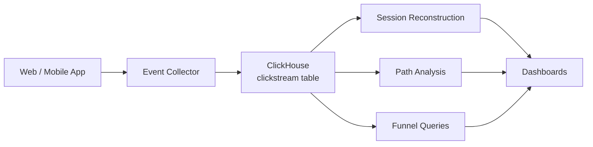

# How to Use ClickHouse for Clickstream Analysis

Author: [nawazdhandala](https://www.github.com/nawazdhandala)

Tags: ClickHouse, Clickstream, Analytics, Session, Funnel, User

Description: Learn how to use ClickHouse for clickstream analysis including session reconstruction, path analysis, funnel queries, and drop-off identification from raw click event data.

---

Clickstream analysis turns raw user interaction events into behavioral insights: where users go, where they drop off, and which paths lead to conversion. ClickHouse's `windowFunnel`, `sequenceMatch`, and window functions make it a purpose-built engine for this type of analysis.

## Architecture



## Clickstream Table

```sql
CREATE TABLE clickstream
(
    event_id    UUID                           CODEC(LZ4),
    user_id     UInt64                         CODEC(LZ4),
    session_id  UInt64                         CODEC(LZ4),
    event_type  LowCardinality(String)         CODEC(LZ4),
    url         String                         CODEC(ZSTD(3)),
    referrer    String                         CODEC(ZSTD(3)),
    device      LowCardinality(String)         CODEC(LZ4),
    browser     LowCardinality(String)         CODEC(LZ4),
    country     LowCardinality(FixedString(2)) CODEC(LZ4),
    ts          DateTime64(3)                  CODEC(DoubleDelta, LZ4)
)
ENGINE = MergeTree()
PARTITION BY toYYYYMM(ts)
ORDER BY (user_id, session_id, ts)
TTL toDateTime(ts) + INTERVAL 1 YEAR
SETTINGS index_granularity = 8192;
```

## Session Reconstruction

Group events into sessions using a 30-minute inactivity gap:

```sql
SELECT
    user_id,
    session_id,
    min(ts)                              AS session_start,
    max(ts)                              AS session_end,
    dateDiff('second', min(ts), max(ts)) AS duration_seconds,
    count()                              AS page_views,
    uniqExact(url)                       AS unique_pages
FROM clickstream
WHERE event_type = 'page_view'
  AND ts >= now() - INTERVAL 7 DAY
GROUP BY user_id, session_id
HAVING duration_seconds > 0
ORDER BY duration_seconds DESC
LIMIT 20;
```

## Most Visited Pages

```sql
SELECT
    url,
    count()            AS views,
    uniqExact(user_id) AS unique_visitors,
    round(avg(dateDiff('second', min(ts), max(ts))), 0) AS avg_time_on_page
FROM clickstream
WHERE event_type = 'page_view'
  AND ts >= now() - INTERVAL 7 DAY
GROUP BY url
ORDER BY views DESC
LIMIT 20;
```

## Bounce Rate (Single-Page Sessions)

```sql
SELECT
    round(100.0 * countIf(page_count = 1) / count(), 2) AS bounce_rate_pct
FROM (
    SELECT
        session_id,
        count() AS page_count
    FROM clickstream
    WHERE event_type = 'page_view'
      AND ts >= now() - INTERVAL 7 DAY
    GROUP BY session_id
);
```

## Funnel: Landing to Purchase

```sql
SELECT
    level,
    count() AS users_at_level
FROM (
    SELECT
        user_id,
        windowFunnel(3600)(
            ts,
            event_type = 'page_view' AND url LIKE '%/products%',
            event_type = 'product_view',
            event_type = 'add_to_cart',
            event_type = 'checkout_start',
            event_type = 'purchase'
        ) AS level
    FROM clickstream
    WHERE ts >= now() - INTERVAL 30 DAY
    GROUP BY user_id
)
GROUP BY level
ORDER BY level;
```

## Sequence Analysis with sequenceMatch

Find users who viewed the pricing page before signing up within 7 days:

```sql
SELECT count() AS users
FROM (
    SELECT
        user_id,
        sequenceMatch('(?1).*(?2)')(
            ts,
            url LIKE '%/pricing%',
            event_type = 'signup'
        ) AS matched
    FROM clickstream
    WHERE ts >= now() - INTERVAL 30 DAY
    GROUP BY user_id
)
WHERE matched = 1;
```

## Top Entry Pages

```sql
SELECT
    url,
    count()            AS entries,
    uniqExact(user_id) AS unique_users
FROM (
    SELECT
        user_id,
        session_id,
        argMin(url, ts) AS url
    FROM clickstream
    WHERE event_type = 'page_view'
      AND ts >= now() - INTERVAL 7 DAY
    GROUP BY user_id, session_id
)
GROUP BY url
ORDER BY entries DESC
LIMIT 10;
```

## Top Exit Pages

```sql
SELECT
    url,
    count()            AS exits,
    uniqExact(user_id) AS unique_users
FROM (
    SELECT
        user_id,
        session_id,
        argMax(url, ts) AS url
    FROM clickstream
    WHERE event_type = 'page_view'
      AND ts >= now() - INTERVAL 7 DAY
    GROUP BY user_id, session_id
)
GROUP BY url
ORDER BY exits DESC
LIMIT 10;
```

## User Path Analysis (Most Common Next Page)

```sql
SELECT
    current_page,
    next_page,
    count() AS transitions
FROM (
    SELECT
        user_id,
        url                                          AS current_page,
        leadInFrame(url) OVER (
            PARTITION BY user_id, session_id
            ORDER BY ts
        )                                            AS next_page
    FROM clickstream
    WHERE event_type = 'page_view'
      AND ts >= now() - INTERVAL 7 DAY
)
WHERE next_page != ''
  AND next_page IS NOT NULL
GROUP BY current_page, next_page
ORDER BY transitions DESC
LIMIT 30;
```

## Conversion Rate by Referrer

```sql
SELECT
    argMin(referrer, ts)                   AS entry_referrer,
    count()                                AS sessions,
    countIf(converted)                     AS conversions,
    round(100.0 * conversions / sessions, 2) AS cvr_pct
FROM (
    SELECT
        session_id,
        argMin(referrer, ts)              AS referrer,
        max(event_type = 'purchase')      AS converted
    FROM clickstream
    WHERE ts >= now() - INTERVAL 30 DAY
    GROUP BY session_id
)
GROUP BY entry_referrer
ORDER BY sessions DESC
LIMIT 20;
```

## Summary

ClickHouse handles clickstream analysis with `windowFunnel` for conversion funnels, `sequenceMatch` for behavioral pattern detection, and window functions like `leadInFrame` for path analysis. A MergeTree table ordered by `(user_id, session_id, ts)` enables efficient per-user scans while LowCardinality columns on device and event type fields reduce storage by 10-15x compared to plain String columns.
