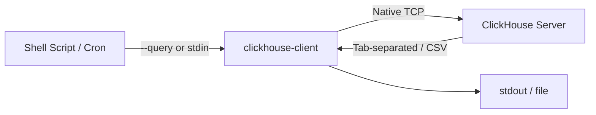

# How to Use clickhouse-client Batch Mode for Scripting

Author: [nawazdhandala](https://www.github.com/nawazdhandala)

Tags: ClickHouse, CLI, Automation, Shell, DevOps

Description: Learn how to use clickhouse-client in batch (non-interactive) mode to run queries, import files, export data, and automate ClickHouse workflows from shell scripts.

---

## Introduction

`clickhouse-client` has two modes: interactive (REPL) and batch (non-interactive). Batch mode is essential for automation, ETL pipelines, cron jobs, and CI/CD workflows. In batch mode, queries are passed via `--query`, piped from stdin, or read from a file, and the process exits with a non-zero code on failure.

## Architecture Overview



## Running a Single Query

```bash
clickhouse-client --query "SELECT count() FROM system.tables"
```

The result is printed to stdout. The client exits with code 0 on success, non-zero on error.

## Non-Interactive with Multiple Queries

Separate multiple statements with semicolons:

```bash
clickhouse-client --query "
    CREATE TABLE IF NOT EXISTS tmp_events
    (user_id UInt64, event String, ts DateTime)
    ENGINE = MergeTree() ORDER BY ts;
    INSERT INTO tmp_events VALUES (1, 'login', now());
    SELECT count() FROM tmp_events;
"
```

Or use `--multiquery` for long scripts:

```bash
clickhouse-client --multiquery < /path/to/migration.sql
```

## Reading Queries from a File

```bash
clickhouse-client --queries-file /path/to/report.sql
```

`report.sql`:

```sql
SELECT
    toDate(ts)       AS day,
    count()          AS events,
    uniq(user_id)    AS unique_users
FROM analytics.events
WHERE day >= today() - 7
GROUP BY day
ORDER BY day;
```

## Piping Queries via Stdin

```bash
echo "SELECT version()" | clickhouse-client
```

Useful in scripts:

```bash
QUERY="SELECT sum(revenue) FROM orders WHERE toDate(created_at) = today()"
TOTAL=$(echo "$QUERY" | clickhouse-client --host localhost)
echo "Today's revenue: $TOTAL"
```

## Output Formats

Batch mode defaults to `TabSeparated`. Override with `--format`:

```bash
# CSV with header
clickhouse-client \
    --query "SELECT user_id, event, ts FROM events LIMIT 100" \
    --format CSVWithNames \
    > events.csv

# JSON
clickhouse-client \
    --query "SELECT user_id, event FROM events LIMIT 10" \
    --format JSON

# JSONEachRow (one JSON object per line)
clickhouse-client \
    --query "SELECT * FROM events LIMIT 10" \
    --format JSONEachRow \
    > events.jsonl

# Vertical (one column per line, good for wide rows)
clickhouse-client \
    --query "SELECT * FROM system.settings LIMIT 3" \
    --format Vertical
```

## Importing Data in Batch Mode

### From CSV

```bash
clickhouse-client \
    --query "INSERT INTO events FORMAT CSVWithNames" \
    < events.csv
```

### From TSV

```bash
clickhouse-client \
    --query "INSERT INTO events (user_id, event, ts) FORMAT TabSeparated" \
    < events.tsv
```

### From JSONL (JSONEachRow)

```bash
clickhouse-client \
    --query "INSERT INTO events FORMAT JSONEachRow" \
    < events.jsonl
```

### From a compressed file

```bash
gunzip -c events.csv.gz | clickhouse-client \
    --query "INSERT INTO events FORMAT CSVWithNames"
```

## Exporting to a File

```bash
clickhouse-client \
    --query "SELECT * FROM events WHERE toDate(ts) = '2024-01-15'" \
    --format CSVWithNames \
    > /data/exports/events_2024-01-15.csv
```

## Error Handling in Scripts

```bash
#!/usr/bin/env bash
set -euo pipefail

clickhouse-client \
    --host localhost \
    --user default \
    --password "" \
    --query "INSERT INTO events FORMAT CSVWithNames" \
    < /data/events.csv

if [ $? -eq 0 ]; then
    echo "Import succeeded"
else
    echo "Import failed" >&2
    exit 1
fi
```

## Using Environment Variables for Credentials

Avoid hardcoding passwords in scripts:

```bash
export CH_HOST=localhost
export CH_USER=default
export CH_PASS=secret

clickhouse-client \
    --host "$CH_HOST" \
    --user "$CH_USER" \
    --password "$CH_PASS" \
    --query "SELECT count() FROM events"
```

Or use a config file to keep credentials out of script arguments entirely (see the config file guide).

## Practical: Daily Export Script

```bash
#!/usr/bin/env bash
set -euo pipefail

DATE=$(date -u +%Y-%m-%d --date="yesterday")
OUTDIR="/data/daily-exports"
mkdir -p "$OUTDIR"

clickhouse-client \
    --config-file ~/.clickhouse/prod.xml \
    --query "
        SELECT
            user_id,
            event,
            formatDateTime(ts, '%Y-%m-%d %H:%i:%S') AS ts
        FROM analytics.events
        WHERE toDate(ts) = '$DATE'
        FORMAT CSVWithNames
    " \
    > "$OUTDIR/events_${DATE}.csv"

echo "Exported events for $DATE to $OUTDIR/events_${DATE}.csv"
```

## Practical: Run a Migration Script

```bash
#!/usr/bin/env bash
set -euo pipefail

clickhouse-client \
    --config-file ~/.clickhouse/prod.xml \
    --multiquery \
    --queries-file /migrations/0012_add_session_id_column.sql

echo "Migration applied successfully"
```

`/migrations/0012_add_session_id_column.sql`:

```sql
ALTER TABLE analytics.events ADD COLUMN IF NOT EXISTS session_id String DEFAULT '';
ALTER TABLE analytics.events ADD INDEX IF NOT EXISTS idx_session (session_id) TYPE bloom_filter GRANULARITY 1;
```

## Controlling Output with --format_csv_delimiter

```bash
clickhouse-client \
    --query "SELECT user_id, event FROM events LIMIT 5" \
    --format CSV \
    --format_csv_delimiter "|"
```

## Suppressing Progress Output

By default, `clickhouse-client` prints progress info to stderr. Suppress it:

```bash
clickhouse-client \
    --query "SELECT count() FROM events" \
    --progress 0 \
    2>/dev/null
```

## Summary

`clickhouse-client` batch mode is a versatile tool for scripting, ETL, and automation. Key patterns:
- Use `--query` for one-liners and `--queries-file` for multi-statement SQL scripts.
- Pipe data directly to INSERT statements for fast, format-aware ingestion.
- Use `--format` to control output format (CSV, JSON, Parquet, etc.).
- Always use `set -euo pipefail` in shell scripts and check exit codes.
- Store credentials in a config file or environment variables rather than script arguments.
