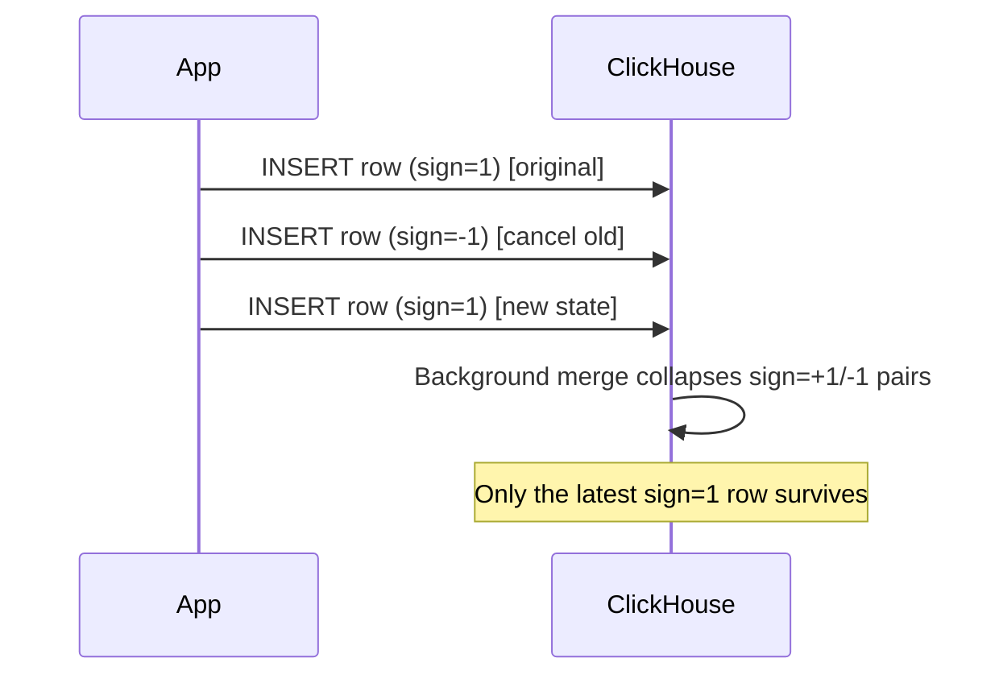

# How to Use CollapsingMergeTree Engine in ClickHouse

Author: [nawazdhandala](https://www.github.com/nawazdhandala)

Tags: ClickHouse, SQL, CollapsingMergeTree, Engine, MergeTree, CDC

Description: Learn how to use CollapsingMergeTree in ClickHouse to efficiently update and delete rows using sign-based row collapsing, enabling mutable data patterns in an append-only engine.

---

`CollapsingMergeTree` is a ClickHouse table engine that supports row-level updates and deletes without physical mutation. Instead of modifying existing data, it uses a `sign` column: inserting a row with `sign = 1` adds a record, and inserting a row with `sign = -1` cancels a previously written row with matching sort key values. During background merges, pairs of `+1` and `-1` rows collapse and disappear, keeping the table compact.

## How CollapsingMergeTree Works



The engine requires that cancel rows have identical values for all columns except those that changed, and the `sign` column must be `-1`. The sort key (ORDER BY) determines which rows are considered pairs.

## Syntax

```sql
CREATE TABLE table_name
(
    -- columns --
    sign Int8
)
ENGINE = CollapsingMergeTree(sign)
ORDER BY (sort_key_columns);
```

The `sign` column must be of type `Int8`. Positive `1` means "this row exists" and `-1` means "cancel the matching row".

## Complete Working Example

This example tracks user session state. Each time a session is updated, a `-1` cancel row and a new `+1` row are inserted.

```sql
CREATE TABLE user_sessions
(
    session_id  String,
    user_id     UInt32,
    page_views  UInt32,
    duration_s  UInt32,
    updated_at  DateTime,
    sign        Int8
)
ENGINE = CollapsingMergeTree(sign)
ORDER BY session_id;

-- Initial insert: session starts
INSERT INTO user_sessions VALUES
    ('sess_001', 101, 1, 30, '2026-03-31 10:00:00', 1);

-- Session updated: cancel old row, insert new state
INSERT INTO user_sessions VALUES
    ('sess_001', 101, 1, 30, '2026-03-31 10:00:00', -1),
    ('sess_001', 101, 5, 180, '2026-03-31 10:03:00', 1);

-- Another session
INSERT INTO user_sessions VALUES
    ('sess_002', 102, 3, 90, '2026-03-31 10:05:00', 1);
```

### Querying with FINAL

The `FINAL` keyword forces ClickHouse to collapse rows at query time, even if the background merge has not happened yet:

```sql
SELECT
    session_id,
    user_id,
    page_views,
    duration_s,
    updated_at
FROM user_sessions
FINAL
WHERE sign = 1
ORDER BY session_id;
```

```text
session_id | user_id | page_views | duration_s | updated_at
-----------+---------+------------+------------+--------------------
sess_001   | 101     | 5          | 180        | 2026-03-31 10:03:00
sess_002   | 102     | 3          | 90         | 2026-03-31 10:05:00
```

### Querying Without FINAL (sum sign pattern)

Before merges occur, both old and new rows coexist. Use aggregation with `sign` as a multiplier to get the correct result:

```sql
SELECT
    session_id,
    sum(page_views * sign) AS page_views,
    sum(duration_s * sign) AS duration_s
FROM user_sessions
GROUP BY session_id
HAVING sum(sign) > 0
ORDER BY session_id;
```

This pattern works correctly even when cancellation rows are present in memory before merging.

## Deleting a Row

To delete a record from a `CollapsingMergeTree` table, insert a cancel row with all matching column values and `sign = -1`:

```sql
-- Delete sess_002
INSERT INTO user_sessions VALUES
    ('sess_002', 102, 3, 90, '2026-03-31 10:05:00', -1);

-- Verify deletion
SELECT session_id, sum(sign) AS net_sign
FROM user_sessions
GROUP BY session_id;
```

```text
session_id | net_sign
-----------+---------
sess_001   | 1
sess_002   | 0
```

## CollapsingMergeTree vs ReplacingMergeTree

```text
Feature                 | CollapsingMergeTree  | ReplacingMergeTree
------------------------+---------------------+--------------------
Update mechanism        | Cancel/reinsert pair | Version-based dedup
Delete support          | Yes (sign=-1)        | Only by TTL or mutation
Query-time collapse     | FINAL or sum(sign)   | FINAL
Order dependency        | Strict               | Less strict
Use case                | Mutable state, CDC   | Deduplication
```

## Practical Use Cases

### Real-Time Order Book

Financial applications use `CollapsingMergeTree` to maintain a live order book where prices and quantities change frequently.

```sql
CREATE TABLE order_book
(
    instrument String,
    price      Float64,
    quantity   Float64,
    side       Enum8('buy'=1, 'sell'=2),
    updated_at DateTime,
    sign       Int8
)
ENGINE = CollapsingMergeTree(sign)
ORDER BY (instrument, side, price);
```

### User Profile Updates

```sql
CREATE TABLE user_profiles
(
    user_id    UInt64,
    email      String,
    plan       String,
    updated_at DateTime,
    sign       Int8
)
ENGINE = CollapsingMergeTree(sign)
ORDER BY user_id;
```

## Important Limitations

- The cancel row (`sign = -1`) must have exactly the same values for all ORDER BY columns as the original row.
- If the cancel row arrives before the original row (out-of-order ingestion), collapsing may not work correctly. Use `VersionedCollapsingMergeTree` for out-of-order scenarios.
- Until a background merge occurs, queries without `FINAL` will see uncollapsed rows. Always use either `FINAL` or the `sum(sign)` pattern for accurate results.

## Summary

`CollapsingMergeTree` enables update and delete semantics in ClickHouse's append-only architecture by using a `sign` column to mark cancellation rows. Pairs of `+1` and `-1` rows with matching sort keys collapse during background merges. For correct query-time results before merges occur, use `FINAL` or the `sum(column * sign)` aggregation pattern. For scenarios with out-of-order ingestion, prefer `VersionedCollapsingMergeTree` which handles ordering issues by using an additional `version` column.
