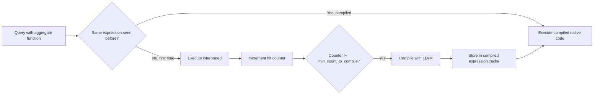

# How to Configure ClickHouse Compiled Expression Cache

Author: OneUptime Team

Tags: ClickHouse, Configuration, Performance, Cache, JIT

Description: Learn how to configure ClickHouse's compiled expression cache (JIT compilation) to speed up repeated aggregate and filter computations.

---

ClickHouse can JIT-compile frequently used expressions - aggregation functions, filter predicates, and arithmetic operations - into native machine code using LLVM. The compiled code is cached so subsequent queries with the same expression execute significantly faster. This feature is called the compiled expression cache (also called compiled aggregate functions cache).

## Enabling JIT Compilation

JIT compilation is controlled by query-level settings. Enable it per session or in user profiles:

```sql
SET compile_expressions = 1;
SET compile_aggregate_expressions = 1;
SET min_count_to_compile_expression = 3;
SET min_count_to_compile_aggregate_expression = 3;
```

Or set defaults for all users in `users.xml`:

```xml
<profiles>
    <default>
        <compile_expressions>1</compile_expressions>
        <compile_aggregate_expressions>1</compile_aggregate_expressions>
        <min_count_to_compile_expression>3</min_count_to_compile_expression>
        <min_count_to_compile_aggregate_expression>3</min_count_to_compile_aggregate_expression>
    </default>
</profiles>
```

## Compiled Expression Cache Size

The server-level setting controls how much memory the compiled code cache can use:

```xml
<!-- /etc/clickhouse-server/config.d/compiled-cache.xml -->
<clickhouse>
    <!-- Size of the compiled expression cache in bytes -->
    <compiled_expression_cache_size>134217728</compiled_expression_cache_size>

    <!-- Maximum number of entries in the cache -->
    <compiled_expression_cache_elements_size>10000</compiled_expression_cache_elements_size>
</clickhouse>
```

The default for `compiled_expression_cache_size` is `134217728` (128 MB). On servers with complex recurring queries, increase to 256-512 MB.

## How JIT Compilation Works



## min_count_to_compile Thresholds

These settings control how many times an expression must be seen before compilation is triggered:

| Setting | Default | Description |
|---|---|---|
| `min_count_to_compile_expression` | `3` | Times a general expression is seen |
| `min_count_to_compile_aggregate_expression` | `3` | Times an aggregate expression is seen |
| `min_count_to_compile_sort_description` | `3` | Times a sort key is seen |

Lower values compile more aggressively but increase LLVM overhead. In steady-state workloads with repeated queries, keep the default of `3`. For ad-hoc query workloads, raise to `10` or higher.

## Monitoring Compilation Activity

```sql
-- Check compiled expression cache usage
SELECT
    metric,
    value
FROM system.metrics
WHERE metric IN (
    'CompiledExpressionCacheCount',
    'CompiledExpressionCacheBytes'
);
```

```sql
-- Check for query_log compile flags
SELECT
    query_id,
    query_duration_ms,
    ProfileEvents['CompileExpressionsMicroseconds'] AS compile_us,
    query
FROM system.query_log
WHERE type = 'QueryFinish'
  AND ProfileEvents['CompileExpressionsMicroseconds'] > 0
ORDER BY event_time DESC
LIMIT 20;
```

## Queries That Benefit Most from JIT

JIT compilation helps most with:

- Aggregations over many rows (`sum`, `avg`, `count`, `max`, `min` on numeric columns).
- Arithmetic expressions in WHERE clauses repeated across many blocks.
- Sort comparisons on numeric columns.

It has little effect on:
- Queries that scan only a few rows.
- String-heavy operations.
- One-off analytical queries.

## Expected Speedup

For aggregation-heavy analytical queries on large tables, JIT can provide 10-50% speedup after the warm-up period. The first few executions are slower due to compilation overhead.

```sql
-- Profile a single query to measure JIT impact
SELECT
    sum(revenue),
    avg(latency_ms),
    count() AS events
FROM events
WHERE ts >= today() - 30
SETTINGS compile_aggregate_expressions = 1;
```

## Disabling JIT in Specific Contexts

If JIT causes unexpected behavior in a specific query, disable it for that query:

```sql
SELECT sum(value)
FROM my_table
SETTINGS compile_aggregate_expressions = 0;
```

## Summary

Configure the compiled expression cache size with `compiled_expression_cache_size` in config.xml (default 128 MB, increase for high-query-variety servers). Enable `compile_aggregate_expressions` and `compile_expressions` in user profiles for analytical workloads. Monitor cache usage with `system.metrics` and compile overhead with `system.query_log` ProfileEvents. JIT compilation delivers the most benefit for repeated analytical queries with numeric aggregations over large datasets.
