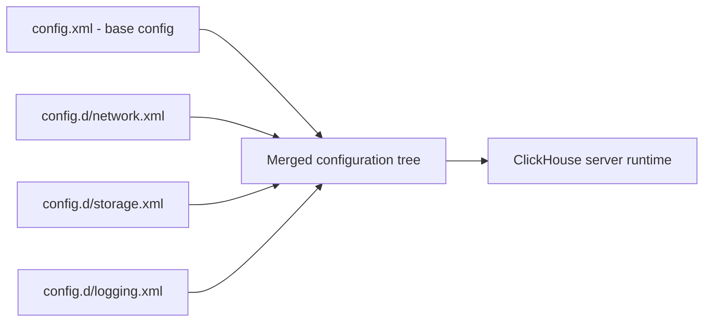

# How to Use config.xml vs config.d Directory in ClickHouse

Author: OneUptime Team

Tags: ClickHouse, Configuration, Server, BestPractice, Administration

Description: Learn the difference between ClickHouse's main config.xml and the config.d drop-in directory, and how to structure configuration for maintainability.

---

ClickHouse supports two ways to provide server configuration: a monolithic `config.xml` file and a drop-in directory `config.d/` where individual XML files are merged together at startup. Understanding when to use each approach is essential for maintainable, upgrade-safe ClickHouse deployments.

## File Locations

```text
/etc/clickhouse-server/
    config.xml              (main server configuration)
    config.d/               (drop-in configuration fragments)
        network.xml
        storage.xml
        logging.xml
        ...
    users.xml               (main user/profile configuration)
    users.d/                (drop-in user configuration fragments)
        custom-profiles.xml
        ldap.xml
        ...
```

## How config.d Merging Works

At startup, ClickHouse reads `config.xml` first, then reads all `*.xml` files in `config.d/` in alphabetical order. Each drop-in file is merged into the main configuration tree. If a key appears in both `config.xml` and a drop-in file, the drop-in file's value wins.



## Why Use config.d Instead of Editing config.xml

When you install or upgrade ClickHouse with a package manager, the package may overwrite `config.xml` with the new default. Any custom changes you made to `config.xml` are lost. Drop-in files in `config.d/` are preserved across upgrades because the package manager owns only `config.xml`.

## Structure of a config.d File

Every drop-in file must be a valid XML document with the same root element as `config.xml`:

```xml
<!-- /etc/clickhouse-server/config.d/network.xml -->
<?xml version="1.0"?>
<clickhouse>
    <listen_host>0.0.0.0</listen_host>
    <listen_host>::</listen_host>
    <listen_try>1</listen_try>
    <http_port>8123</http_port>
    <tcp_port>9000</tcp_port>
</clickhouse>
```

```xml
<!-- /etc/clickhouse-server/config.d/logging.xml -->
<?xml version="1.0"?>
<clickhouse>
    <logger>
        <level>information</level>
        <log>/var/log/clickhouse-server/clickhouse-server.log</log>
        <size>1000M</size>
        <count>10</count>
    </logger>
</clickhouse>
```

## Removing a Default Setting with the remove Attribute

Use `remove="1"` to delete a key that exists in the base `config.xml`:

```xml
<!-- Disable the query_thread_log that is enabled by default -->
<clickhouse>
    <query_thread_log remove="1"/>
</clickhouse>
```

This is cleaner than setting the value to empty because it truly removes the element from the merged tree.

## Replacing an Array Element

For array-type settings (like `<listen_host>`), use `replace="1"` to replace all existing values:

```xml
<!-- Replace default listen_host list with custom values -->
<clickhouse>
    <listen_host replace="1">10.0.0.5</listen_host>
</clickhouse>
```

Without `replace="1"`, the new `<listen_host>` elements are appended to the existing list.

## Recommended config.d Structure

Organize drop-in files by concern:

```text
config.d/
    01-network.xml          (listen_host, ports)
    02-tls.xml              (openSSL certificates)
    03-logging.xml          (logger, query_log TTL)
    04-storage.xml          (storage_configuration)
    05-merge-tree.xml       (merge_tree defaults)
    06-limits.xml           (max_connections, max_concurrent_queries)
    07-keeper.xml           (zookeeper / keeper coordinates)
    08-cluster.xml          (remote_servers)
    09-macros.xml           (shard/replica macros)
```

Prefixing with numbers ensures predictable merge order.

## Using Environment Variables in Configuration

ClickHouse supports `from_env` attributes to inject environment variables:

```xml
<clickhouse>
    <interserver_http_host from_env="HOSTNAME"/>
    <macros>
        <shard from_env="SHARD_ID"/>
        <replica from_env="REPLICA_ID"/>
    </macros>
</clickhouse>
```

This is particularly useful in Kubernetes/Docker where environment variables are injected by the orchestrator.

## Validating Your Configuration

Check configuration before restarting:

```bash
clickhouse-server --config=/etc/clickhouse-server/config.xml --check-config
```

View the merged configuration that ClickHouse is currently using:

```bash
clickhouse-client --query "SELECT name, value FROM system.server_settings ORDER BY name"
```

## config.xml vs users.xml Drop-ins

The same pattern applies to user configuration:

| File | Purpose | Drop-in directory |
|---|---|---|
| `config.xml` | Server settings | `config.d/` |
| `users.xml` | Users, profiles, quotas | `users.d/` |

```xml
<!-- /etc/clickhouse-server/users.d/custom-profiles.xml -->
<?xml version="1.0"?>
<clickhouse>
    <profiles>
        <analytics>
            <max_memory_usage>10737418240</max_memory_usage>
            <max_execution_time>300</max_execution_time>
        </analytics>
    </profiles>
</clickhouse>
```

## Summary

Use `config.d/` drop-in files for all custom ClickHouse configuration and leave `config.xml` at its package default. This approach survives upgrades and keeps your configuration modular. Use `remove="1"` to delete defaults, `replace="1"` to replace array elements, and `from_env` to inject environment variables. Validate the merged configuration with `--check-config` before applying to production.
