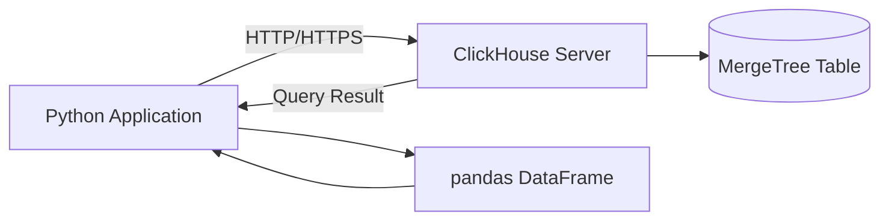

# How to Use the ClickHouse HTTP Python Client (clickhouse-connect)

Author: [nawazdhandala](https://www.github.com/nawazdhandala)

Tags: ClickHouse, Python, Client, Integration, Analytics

Description: Learn how to use clickhouse-connect, the official ClickHouse HTTP Python client, to query, insert, and stream data with async support and pandas integration.

---

## Introduction

`clickhouse-connect` is the official Python client maintained by ClickHouse, Inc. It uses the HTTP interface (rather than the native TCP protocol) and supports both synchronous and asynchronous usage. It integrates natively with pandas DataFrames and Apache Arrow, making it a strong choice for data engineering and analytics workflows.

This guide walks through installation, connection setup, querying, inserting data, streaming, and working with DataFrames.

## Architecture Overview



## Installation

```bash
pip install clickhouse-connect
```

For pandas and Arrow support (recommended):

```bash
pip install clickhouse-connect[arrow]
```

## Connecting to ClickHouse

### Basic connection

```python
import clickhouse_connect

client = clickhouse_connect.get_client(
    host='localhost',
    port=8123,
    username='default',
    password='',
    database='default'
)
```

### TLS / ClickHouse Cloud

```python
client = clickhouse_connect.get_client(
    host='abc123.us-east-1.aws.clickhouse.cloud',
    port=8443,
    username='default',
    password='your_password',
    secure=True
)
```

### Connection pool settings

```python
client = clickhouse_connect.get_client(
    host='localhost',
    port=8123,
    username='default',
    password='',
    connect_timeout=10,
    send_receive_timeout=300,
    max_connection_age=600
)
```

## Running Queries

### SELECT and iterate rows

```python
result = client.query('SELECT user_id, event, toDate(ts) AS day FROM events LIMIT 10')

for row in result.result_rows:
    print(row)
```

### Named tuple access

```python
result = client.query(
    'SELECT user_id, sum(amount) AS total FROM orders GROUP BY user_id ORDER BY total DESC LIMIT 5'
)

for row in result.named_results():
    print(row['user_id'], row['total'])
```

### Scalar value

```python
count = client.command('SELECT count() FROM events')
print(f'Total events: {count}')
```

### Parameterized queries (safe interpolation)

```python
result = client.query(
    'SELECT * FROM events WHERE user_id = {uid:UInt64} AND event = {evt:String}',
    parameters={'uid': 42, 'evt': 'purchase'}
)
```

## Inserting Data

### Insert list of rows

```python
client.insert(
    'events',
    data=[
        [101, 'page_view', '2024-01-15 10:00:00'],
        [102, 'click',     '2024-01-15 10:01:00'],
        [101, 'purchase',  '2024-01-15 10:02:00'],
    ],
    column_names=['user_id', 'event', 'ts']
)
```

### Insert from a list of dicts

```python
rows = [
    {'user_id': 201, 'event': 'login',  'ts': '2024-01-16 08:00:00'},
    {'user_id': 202, 'event': 'logout', 'ts': '2024-01-16 08:05:00'},
]

client.insert(
    'events',
    data=[[r['user_id'], r['event'], r['ts']] for r in rows],
    column_names=['user_id', 'event', 'ts']
)
```

## Pandas Integration

### Query to DataFrame

```python
df = client.query_df('SELECT * FROM events WHERE toDate(ts) = today() LIMIT 1000')
print(df.head())
print(df.dtypes)
```

### Insert from DataFrame

```python
import pandas as pd

df = pd.DataFrame({
    'user_id': [301, 302, 303],
    'event':   ['signup', 'purchase', 'refund'],
    'ts':      pd.to_datetime(['2024-01-17 09:00', '2024-01-17 09:05', '2024-01-17 09:10'])
})

client.insert_df('events', df)
```

### Query with Arrow output

```python
arrow_table = client.query_arrow('SELECT user_id, count() AS cnt FROM events GROUP BY user_id')
print(arrow_table.schema)
```

## Streaming Large Result Sets

For large datasets, use `query_row_block_stream` to avoid loading everything into memory:

```python
with client.query_row_block_stream(
    'SELECT * FROM large_table WHERE date >= today() - 7'
) as stream:
    for block in stream:
        for row in block:
            process(row)
```

Stream as a DataFrame in chunks:

```python
with client.query_df_stream(
    'SELECT * FROM large_table ORDER BY ts'
) as stream:
    for df_chunk in stream:
        df_chunk.to_parquet(f'/tmp/chunk_{hash(str(df_chunk.index[0]))}.parquet')
```

## DDL and Command Execution

```python
# Create table
client.command('''
    CREATE TABLE IF NOT EXISTS page_views
    (
        user_id    UInt64,
        url        String,
        ts         DateTime
    )
    ENGINE = MergeTree()
    ORDER BY (user_id, ts)
''')

# Drop table
client.command('DROP TABLE IF EXISTS page_views')

# Truncate
client.command('TRUNCATE TABLE page_views')
```

## Session-Level Settings

```python
# Per-query settings
result = client.query(
    'SELECT * FROM events',
    settings={'max_threads': 4, 'max_block_size': 65536}
)

# Client-level defaults
client = clickhouse_connect.get_client(
    host='localhost',
    settings={'readonly': 1}
)
```

## Async Support

`clickhouse-connect` provides an async client for use with `asyncio`:

```python
import asyncio
import clickhouse_connect

async def main():
    client = await clickhouse_connect.get_async_client(
        host='localhost',
        port=8123,
        username='default',
        password=''
    )

    result = await client.query('SELECT count() FROM events')
    print(result.result_rows)
    await client.close()

asyncio.run(main())
```

## Error Handling

```python
from clickhouse_connect.driver.exceptions import ClickHouseError, DatabaseError

try:
    client.command('SELECT * FROM nonexistent_table')
except DatabaseError as e:
    print(f'Query error: {e}')
except ClickHouseError as e:
    print(f'Client error: {e}')
```

## Comparison with clickhouse-driver

| Feature | clickhouse-connect | clickhouse-driver |
|---|---|---|
| Protocol | HTTP | Native TCP |
| pandas support | Built-in | Via extra |
| Arrow support | Built-in | No |
| Async | Yes | Limited |
| Maintained by | ClickHouse, Inc. | Community |
| TLS | Standard HTTPS | Custom cert config |

Use `clickhouse-connect` for data engineering, BI tools, and analytics. Use `clickhouse-driver` when you need the native protocol for very high-throughput ingestion or advanced features unavailable over HTTP.

## Summary

`clickhouse-connect` is the recommended Python client for ClickHouse when working with HTTP, pandas, or Arrow. Key takeaways:
- Install with `pip install clickhouse-connect[arrow]` for full feature support.
- Use `query_df` and `insert_df` for seamless pandas integration.
- Use `query_row_block_stream` or `query_df_stream` to handle large result sets without memory pressure.
- Parameterized queries via `{name:Type}` syntax prevent SQL injection.
- The async client integrates with `asyncio` for non-blocking workloads.
