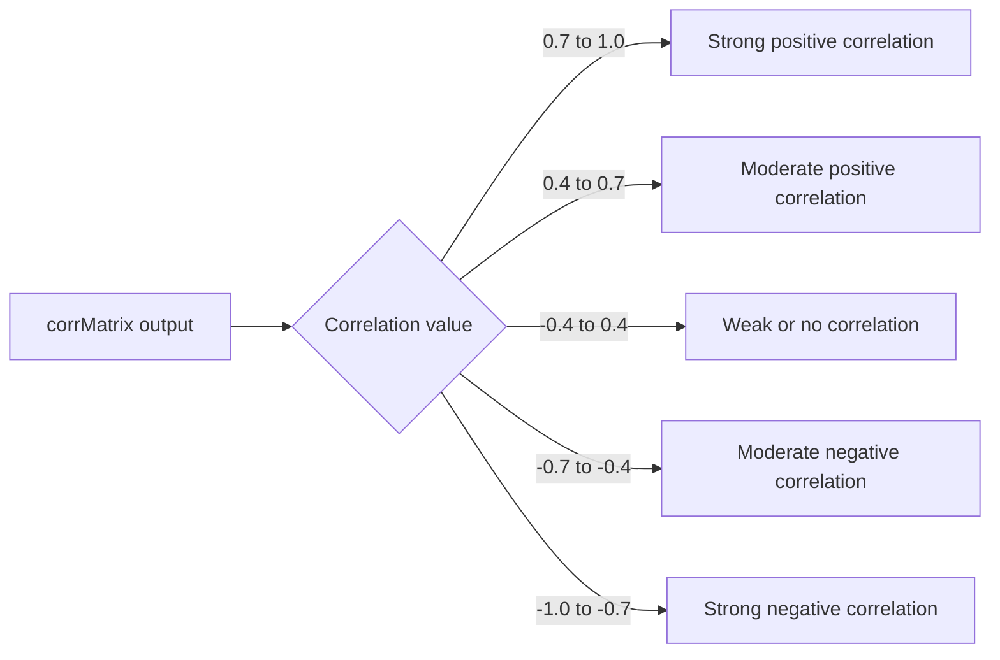

# How to Use corrMatrix() in ClickHouse

Author: [nawazdhandala](https://www.github.com/nawazdhandala)

Tags: ClickHouse, SQL, Aggregate Function, Correlation, Statistics

Description: Learn how to use corrMatrix() in ClickHouse to compute a full Pearson correlation matrix across multiple numeric columns in a single query pass.

---

`corrMatrix(col1, col2, ..., colN)` is a variadic aggregate function in ClickHouse that computes the Pearson correlation coefficient for every pair of the supplied columns simultaneously. Instead of writing N*(N-1)/2 individual `corr()` calls, `corrMatrix` returns the entire matrix in one scan, which is both more convenient and more efficient for wide tables.

## Syntax

```sql
-- Returns an Array(Array(Float64)) - the N x N correlation matrix
SELECT corrMatrix(col1, col2, col3) FROM table_name;
```

The output is a two-dimensional array where element `[i][j]` is the Pearson correlation between column `i` and column `j`. Diagonal entries are always 1.0.

## Basic Example

```sql
-- Correlations among four service metrics
SELECT corrMatrix(
    avg_latency_ms,
    error_rate,
    cpu_percent,
    memory_percent
) AS corr_mat
FROM (
    SELECT
        toStartOfMinute(timestamp)            AS minute,
        avg(response_time_ms)                 AS avg_latency_ms,
        countIf(status_code >= 500) / count() AS error_rate,
        avg(cpu_percent)                      AS cpu_percent,
        avg(memory_percent)                   AS memory_percent
    FROM host_metrics
    WHERE metric_time >= now() - INTERVAL 6 HOUR
    GROUP BY minute
);
```

## Unpacking the Matrix

The raw matrix is hard to read. Use `arrayEnumerate` and `arrayJoin` to flatten it into rows.

```sql
WITH
    metrics AS (
        SELECT
            toStartOfMinute(timestamp) AS minute,
            avg(response_time_ms)      AS latency,
            avg(cpu_percent)           AS cpu,
            avg(memory_percent)        AS mem,
            avg(disk_io_util)          AS disk_io
        FROM host_metrics
        WHERE metric_time >= now() - INTERVAL 24 HOUR
        GROUP BY minute
    ),
    mat AS (
        SELECT corrMatrix(latency, cpu, mem, disk_io) AS m
        FROM metrics
    )
SELECT
    ['latency', 'cpu', 'mem', 'disk_io'][row_idx]    AS metric_a,
    ['latency', 'cpu', 'mem', 'disk_io'][col_idx]    AS metric_b,
    round(m[row_idx][col_idx], 4)                    AS correlation
FROM mat
ARRAY JOIN arrayEnumerate(m) AS row_idx
ARRAY JOIN arrayEnumerate(m[row_idx]) AS col_idx
WHERE row_idx < col_idx   -- upper triangle only, avoid redundancy
ORDER BY abs(correlation) DESC;
```

## Interpreting the Results



## Per-Service Correlation Matrices

```sql
-- Compute separate correlation matrices for each service
SELECT
    service_name,
    corrMatrix(
        avg_latency_ms,
        error_rate,
        request_rate,
        cpu_percent
    ) AS service_corr_matrix
FROM (
    SELECT
        service_name,
        toStartOfMinute(timestamp)            AS minute,
        avg(response_time_ms)                 AS avg_latency_ms,
        countIf(status_code >= 500) / count() AS error_rate,
        count()                               AS request_rate,
        avg(cpu_percent)                      AS cpu_percent
    FROM request_logs
    WHERE log_date >= today() - 7
    GROUP BY service_name, minute
)
GROUP BY service_name;
```

## Comparing Correlation Matrices Across Time Periods

```sql
-- Are the correlations between metrics stable week over week?
SELECT
    toStartOfWeek(minute)                         AS week,
    corrMatrix(latency, cpu, mem)[1][2]           AS r_latency_cpu,
    corrMatrix(latency, cpu, mem)[1][3]           AS r_latency_mem,
    corrMatrix(latency, cpu, mem)[2][3]           AS r_cpu_mem
FROM (
    SELECT
        toStartOfMinute(timestamp) AS minute,
        avg(response_time_ms)      AS latency,
        avg(cpu_percent)           AS cpu,
        avg(memory_percent)        AS mem
    FROM host_metrics
    WHERE metric_time >= now() - INTERVAL 28 DAY
    GROUP BY minute
)
GROUP BY week
ORDER BY week;
```

## Using -State and -Merge for Incremental Computation

```sql
CREATE TABLE corr_matrix_state
(
    stat_hour DateTime,
    service   String,
    corr_state AggregateFunction(corrMatrix, Float64, Float64, Float64, Float64)
)
ENGINE = AggregatingMergeTree()
ORDER BY (stat_hour, service);

CREATE MATERIALIZED VIEW mv_corr_matrix
TO corr_matrix_state
AS
SELECT
    toStartOfHour(timestamp) AS stat_hour,
    service_name             AS service,
    corrMatrixState(
        toFloat64(response_time_ms),
        toFloat64(cpu_percent),
        toFloat64(memory_percent),
        toFloat64(error_rate)
    ) AS corr_state
FROM host_metrics
GROUP BY stat_hour, service;

-- Query merged state
SELECT
    stat_hour,
    service,
    corrMatrixMerge(corr_state)[1][2] AS r_latency_cpu
FROM corr_matrix_state
GROUP BY stat_hour, service
ORDER BY stat_hour DESC;
```

## Summary

`corrMatrix(col1, ..., colN)` computes the full Pearson correlation matrix across N numeric columns in a single aggregation pass, returning an `Array(Array(Float64))` where `result[i][j]` is the Pearson r between columns i and j. Use `arrayJoin` with `arrayEnumerate` to flatten the matrix into readable rows. It is more efficient than calling `corr()` separately for each pair and is especially useful for exploratory correlation analysis across monitoring metrics, feature engineering pipelines, and detecting multicollinearity in analytical models.
