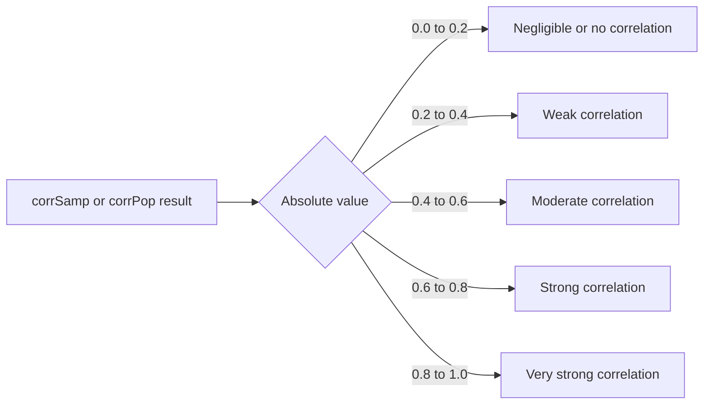

# How to Use corrSamp() and corrPop() in ClickHouse

Author: [nawazdhandala](https://www.github.com/nawazdhandala)

Tags: ClickHouse, SQL, Aggregate Function, Correlation, Statistics

Description: Learn how to use corrSamp() and corrPop() in ClickHouse to compute scale-free Pearson correlation coefficients for samples and full populations.

---

ClickHouse provides two Pearson correlation aggregate functions: `corrSamp(x, y)` for sample correlation (applies Bessel's correction) and `corrPop(x, y)` for population correlation (divides by N). Both return a Float64 in the range -1 to 1, where 1 is perfect positive correlation, -1 is perfect negative correlation, and 0 is no linear relationship. Unlike `covarSamp`/`covarPop`, correlation is scale-free and directly comparable across different metric pairs.

## Syntax

```sql
-- Sample correlation (use when data is a sample from a larger population)
SELECT corrSamp(x_column, y_column) FROM table_name;

-- Population correlation (use when data is the complete population)
SELECT corrPop(x_column, y_column) FROM table_name;
```

## Key Difference from corr()

ClickHouse also has a built-in `corr(x, y)` function. `corr()` computes the population correlation (equivalent to `corrPop()`). The `corrSamp()` variant uses Bessel's correction and is the statistically appropriate choice when your data is a sample.

```sql
-- These two produce the same result
SELECT
    corr(cpu_percent, response_time_ms)    AS corr_legacy,
    corrPop(cpu_percent, response_time_ms) AS corr_pop
FROM host_metrics
WHERE metric_time >= now() - INTERVAL 1 HOUR;
```

## Basic Example

```sql
-- Does higher CPU correlate with higher latency?
SELECT
    corrSamp(cpu_percent, response_time_ms) AS r_cpu_latency,
    corrSamp(memory_percent, response_time_ms) AS r_mem_latency,
    count() AS n
FROM host_metrics
WHERE metric_time >= now() - INTERVAL 1 HOUR;
```

## Interpreting Correlation Strength



## Pairwise Correlations Across Multiple Metrics

```sql
-- Compute several pairwise correlations in one query
SELECT
    corrSamp(latency_ms, cpu_pct)      AS r_latency_cpu,
    corrSamp(latency_ms, mem_pct)      AS r_latency_mem,
    corrSamp(latency_ms, error_rate)   AS r_latency_error,
    corrSamp(cpu_pct, mem_pct)         AS r_cpu_mem,
    corrSamp(cpu_pct, error_rate)      AS r_cpu_error
FROM (
    SELECT
        toStartOfMinute(timestamp)            AS minute,
        avg(response_time_ms)                 AS latency_ms,
        avg(cpu_percent)                      AS cpu_pct,
        avg(memory_percent)                   AS mem_pct,
        countIf(status_code >= 500) / count() AS error_rate
    FROM host_metrics
    JOIN request_logs USING (host_name)
    WHERE metric_time >= now() - INTERVAL 24 HOUR
    GROUP BY minute
);
```

## Per-Service Correlation Analysis

```sql
-- Which services show strong CPU-latency correlation?
SELECT
    service_name,
    round(corrSamp(avg_latency, avg_cpu), 4) AS r_latency_cpu,
    count() AS sample_size
FROM (
    SELECT
        service_name,
        toStartOfMinute(timestamp) AS minute,
        avg(response_time_ms)      AS avg_latency,
        avg(cpu_percent)           AS avg_cpu
    FROM request_logs
    WHERE log_date >= today() - 7
    GROUP BY service_name, minute
)
GROUP BY service_name
HAVING sample_size > 100
ORDER BY abs(r_latency_cpu) DESC;
```

## corrSamp vs corrPop: When the Difference Matters

```sql
-- Compare sample and population correlation on small datasets
SELECT
    n,
    round(corrSamp(x, y), 6) AS r_sample,
    round(corrPop(x, y), 6)  AS r_pop
FROM (
    SELECT
        toStartOfMinute(metric_time) AS minute,
        avg(cpu_percent)             AS x,
        avg(response_time_ms)        AS y,
        count()                      AS n
    FROM host_metrics
    WHERE metric_time >= now() - INTERVAL 1 HOUR
    GROUP BY minute
    HAVING n >= 5
)
ORDER BY n ASC
LIMIT 20;
```

For N > 100, `corrSamp` and `corrPop` converge. For small N, use `corrSamp`.

## Correlation Over Rolling Windows

```sql
-- Track how correlation between CPU and latency changes hour by hour
SELECT
    toStartOfHour(minute) AS hour,
    corrSamp(avg_latency, avg_cpu) AS r_latency_cpu
FROM (
    SELECT
        toStartOfMinute(timestamp) AS minute,
        avg(response_time_ms)      AS avg_latency,
        avg(cpu_percent)           AS avg_cpu
    FROM host_metrics
    WHERE metric_time >= now() - INTERVAL 7 DAY
    GROUP BY minute
)
GROUP BY hour
ORDER BY hour DESC;
```

## Incremental Aggregation with -State and -Merge

```sql
CREATE TABLE hourly_corr
(
    stat_hour  DateTime,
    service    String,
    corr_state AggregateFunction(corrSamp, Float64, Float64)
)
ENGINE = AggregatingMergeTree()
ORDER BY (stat_hour, service);

INSERT INTO hourly_corr
SELECT
    toStartOfHour(timestamp)                              AS stat_hour,
    service_name                                          AS service,
    corrSampState(toFloat64(response_time_ms),
                  toFloat64(cpu_percent))                 AS corr_state
FROM request_logs
GROUP BY stat_hour, service;

-- Query
SELECT
    stat_hour,
    service,
    round(corrSampMerge(corr_state), 4) AS r_latency_cpu
FROM hourly_corr
GROUP BY stat_hour, service
ORDER BY stat_hour DESC;
```

## Summary

`corrSamp(x, y)` computes the sample Pearson correlation with Bessel's correction, while `corrPop(x, y)` computes the population Pearson correlation (equivalent to the legacy `corr()` function). Both return a scale-free Float64 in [-1, 1]. Use `corrSamp()` when your data is a sample from a larger population, and `corrPop()` when you have the complete dataset. Correlation is more interpretable than raw covariance because it normalizes for scale, making it directly comparable across metric pairs. For multi-column correlation analysis in a single pass, prefer `corrMatrix()`.
