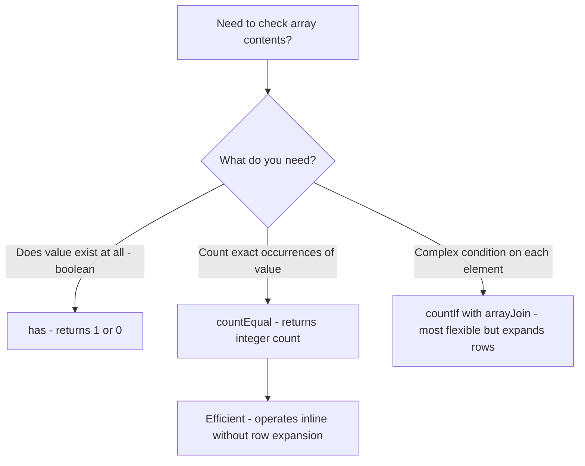

# How to Use countEqual() in ClickHouse

Author: [OneUptime](https://www.github.com/OneUptime)

Tags: ClickHouse, SQL, Array Function, Analytics, countEqual

Description: Learn how to use countEqual() in ClickHouse to count the number of elements in an array that equal a specific value, enabling efficient array-based metric analysis.

---

`countEqual(arr, value)` is an array function (not an aggregate function) that counts how many elements in an array are equal to a given value. It is the equivalent of calling `countIf(x = value)` over a `ARRAY JOIN`, but operates inline on a single array without expanding rows. This makes it useful for array columns, JSON-extracted arrays, or pre-aggregated tag/label arrays.

## Syntax

```sql
-- Count elements in an array equal to a value
SELECT countEqual(array_column, value) FROM table_name;

-- Works on literal arrays too
SELECT countEqual([1, 2, 3, 2, 2], 2);  -- returns 3
```

## Basic Example

```sql
-- Count how many HTTP status codes in a session's array were errors
SELECT
    session_id,
    status_codes,
    countEqual(status_codes, 500) AS internal_errors,
    countEqual(status_codes, 404) AS not_founds,
    countEqual(status_codes, 200) AS successes,
    length(status_codes)          AS total_requests
FROM user_sessions
WHERE session_date = today()
LIMIT 20;
```

## Counting Label Occurrences in Tag Arrays

```sql
-- How many of each alert severity appear in each host's alert history?
SELECT
    host_name,
    countEqual(alert_severities, 'critical') AS critical_count,
    countEqual(alert_severities, 'warning')  AS warning_count,
    countEqual(alert_severities, 'info')     AS info_count,
    length(alert_severities)                 AS total_alerts
FROM host_alert_history
WHERE alert_date = today()
ORDER BY critical_count DESC;
```

## Filtering Rows Based on Array Element Count

```sql
-- Find sessions where more than 2 requests in the session array resulted in 500 errors
SELECT
    session_id,
    user_id,
    status_codes,
    countEqual(status_codes, 500) AS error_count
FROM user_sessions
WHERE session_date >= today() - 7
  AND countEqual(status_codes, 500) > 2
ORDER BY error_count DESC;
```

## Using countEqual in Aggregations

```sql
-- Per service: what fraction of requests (stored in arrays per batch) were errors?
SELECT
    service_name,
    sum(countEqual(status_batch, 500))  AS total_500s,
    sum(length(status_batch))           AS total_requests,
    round(
        sum(countEqual(status_batch, 500)) / sum(length(status_batch)) * 100,
        2
    ) AS error_rate_pct
FROM request_batches
WHERE batch_date >= today() - 7
GROUP BY service_name
ORDER BY error_rate_pct DESC;
```

## countEqual vs has() vs countIf + arrayJoin



## Counting Tags in Log Event Arrays

```sql
-- Count how many log entries per host contain 'ERROR' level tags
SELECT
    host_name,
    sum(countEqual(log_levels, 'ERROR'))   AS error_log_count,
    sum(countEqual(log_levels, 'WARN'))    AS warn_log_count,
    sum(length(log_levels))               AS total_logs
FROM log_batches
WHERE batch_date = today()
GROUP BY host_name
HAVING error_log_count > 0
ORDER BY error_log_count DESC;
```

## Combining with Array Functions

```sql
-- Find sessions where error rate within the session exceeds 10%
SELECT
    session_id,
    length(status_codes)                   AS session_length,
    countEqual(status_codes, 500)          AS errors_500,
    countEqual(status_codes, 404)          AS errors_404,
    countEqual(status_codes, 500) + countEqual(status_codes, 404) AS total_errors,
    round(
        (countEqual(status_codes, 500) + countEqual(status_codes, 404))
        / length(status_codes) * 100,
        1
    ) AS error_rate_pct
FROM user_sessions
WHERE session_date = today()
  AND length(status_codes) > 5
HAVING error_rate_pct > 10
ORDER BY error_rate_pct DESC;
```

## countEqual with Nested Arrays via arrayFlatten

```sql
-- If you have nested arrays, flatten first then count
SELECT
    device_id,
    countEqual(
        arrayFlatten(reading_batches),
        0
    ) AS zero_reading_count
FROM iot_devices
WHERE read_date = today();
```

## Summary

`countEqual(arr, value)` counts the number of elements in an array that exactly match the given value. It operates inline on array-typed columns without expanding rows (unlike `ARRAY JOIN + countIf`), making it efficient for array columns in wide tables. Use it to count occurrences of specific values in pre-aggregated status code arrays, tag lists, log level arrays, or any scenario where your data arrives in batches stored as arrays. Combine it with `sum()` and `length()` to compute array-based rates and ratios across aggregated datasets.
