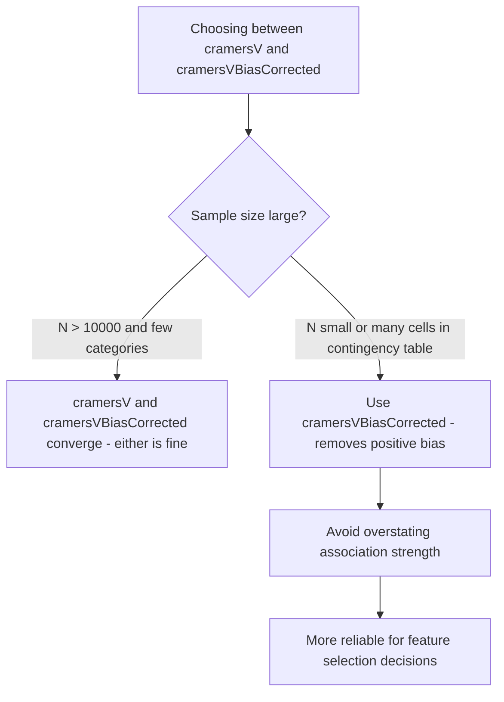

# How to Use cramersVBiasCorrected() in ClickHouse

Author: [OneUptime](https://www.github.com/OneUptime)

Tags: ClickHouse, SQL, Aggregate Function, Statistics, cramersVBiasCorrected

Description: Learn how cramersVBiasCorrected() improves on cramersV() in ClickHouse by removing upward bias from small samples, giving more reliable categorical association scores.

---

`cramersVBiasCorrected(col1, col2)` computes the bias-corrected version of Cramer's V, a measure of association between two categorical variables based on the chi-squared statistic. While the standard `cramersV()` has a known upward bias when sample sizes are small or when the contingency table has many cells, `cramersVBiasCorrected()` applies Bergsma-Wicher bias correction, making it more reliable for small-to-medium datasets.

## Cramer's V Recap

Cramer's V ranges from 0 (no association) to 1 (perfect association). The bias-corrected version uses adjusted phi-squared to remove the positive bias, often returning a result closer to 0 for small samples where the raw Cramer's V would overstate the association.

| Cramer's V | Interpretation |
|-----------|----------------|
| 0.0 to 0.1 | Negligible association |
| 0.1 to 0.2 | Weak association |
| 0.2 to 0.4 | Moderate association |
| 0.4 to 0.6 | Relatively strong association |
| 0.6 to 1.0 | Strong to perfect association |

## Syntax

```sql
-- Bias-corrected Cramer's V
SELECT cramersVBiasCorrected(col1, col2) FROM table_name;

-- Standard Cramer's V for comparison
SELECT cramersV(col1, col2) FROM table_name;
```

## Basic Example

```sql
-- How strongly associated are browser type and conversion outcome?
SELECT
    cramersVBiasCorrected(browser, converted) AS v_bias_corrected,
    cramersV(browser, converted)             AS v_uncorrected
FROM user_sessions
WHERE session_date >= today() - 30;
```

## Bias Correction Shows Most Clearly on Small Samples

```sql
-- Compare bias-corrected vs uncorrected V across different sample sizes
SELECT
    n_rows,
    cramersVBiasCorrected(a, b) AS v_corrected,
    cramersV(a, b)              AS v_uncorrected,
    cramersV(a, b) - cramersVBiasCorrected(a, b) AS bias_amount
FROM (
    SELECT
        count() AS n_rows,
        region AS a,
        plan_tier AS b
    FROM user_profiles
    WHERE cohort_month = '2026-03-01'
    GROUP BY region, plan_tier
    LIMIT 1
);
```

## Comparing Multiple Categorical Predictors

```sql
-- Which categorical dimensions are most associated with churn?
SELECT
    'plan_tier'      AS dimension,
    cramersVBiasCorrected(plan_tier, churned) AS v_corrected
FROM user_profiles WHERE profile_month >= '2026-01-01'
UNION ALL
SELECT
    'country',
    cramersVBiasCorrected(country, churned)
FROM user_profiles WHERE profile_month >= '2026-01-01'
UNION ALL
SELECT
    'signup_channel',
    cramersVBiasCorrected(signup_channel, churned)
FROM user_profiles WHERE profile_month >= '2026-01-01'
ORDER BY v_corrected DESC;
```

## When Bias Correction Matters Most



## Root-Cause Analysis: Associating Error Patterns with Categories

```sql
-- Is error type associated with the deployment version or region?
SELECT
    cramersVBiasCorrected(error_type, deployment_version) AS v_error_version,
    cramersVBiasCorrected(error_type, region)             AS v_error_region,
    cramersVBiasCorrected(error_type, service_name)       AS v_error_service,
    count() AS total_errors
FROM error_events
WHERE event_date = today();
```

## Tracking Association Strength Over Time

```sql
-- Is the association between user tier and feature usage changing over time?
SELECT
    toStartOfMonth(event_date) AS month,
    cramersVBiasCorrected(user_tier, feature_used) AS v_corrected,
    cramersV(user_tier, feature_used)              AS v_uncorrected
FROM feature_usage_events
WHERE event_date >= '2025-01-01'
GROUP BY month
ORDER BY month;
```

## Full Feature Selection Pipeline

```sql
-- Score all available categorical features for churn prediction
SELECT
    feature_name,
    v_corrected
FROM (
    SELECT 'browser'         AS feature_name, cramersVBiasCorrected(browser, churned)          AS v_corrected FROM sessions WHERE s_date >= today() - 90
    UNION ALL
    SELECT 'os',                               cramersVBiasCorrected(os, churned)               FROM sessions WHERE s_date >= today() - 90
    UNION ALL
    SELECT 'signup_channel',                   cramersVBiasCorrected(signup_channel, churned)   FROM sessions WHERE s_date >= today() - 90
    UNION ALL
    SELECT 'country',                          cramersVBiasCorrected(country, churned)          FROM sessions WHERE s_date >= today() - 90
    UNION ALL
    SELECT 'plan_tier',                        cramersVBiasCorrected(plan_tier, churned)        FROM sessions WHERE s_date >= today() - 90
)
ORDER BY v_corrected DESC;
```

## Summary

`cramersVBiasCorrected(col1, col2)` computes the Bergsma-Wicher bias-corrected Cramer's V association measure between two categorical variables. It improves on `cramersV()` by removing the systematic positive bias that affects standard Cramer's V when sample sizes are small or contingency tables have many cells. The result is a more reliable measure of association strength, which matters when using V scores for feature selection or comparing associations across different category cardinalities. Use it wherever `cramersV()` would be appropriate, particularly when working with smaller datasets or high-cardinality categorical variables.
