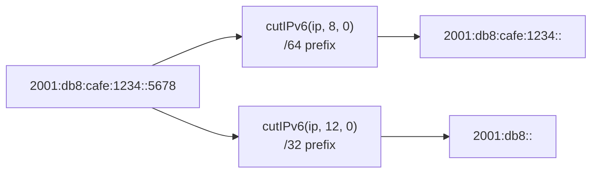

# How to Use cutIPv6() in ClickHouse

Author: [nawazdhandala](https://www.github.com/nawazdhandala)

Tags: ClickHouse, SQL, IP Address, IPv6, Function, Network Analytics, cutIPv6

Description: Learn how to use cutIPv6() in ClickHouse to truncate IPv6 addresses to a specified prefix length for subnet grouping and anonymization.

---

IPv6 addresses are 128 bits long and can be long to read and group by. `cutIPv6()` lets you truncate an IPv6 address to a specific number of bits from the left (network prefix) or right (host portion), making it useful for subnet grouping, traffic aggregation by prefix, and IP anonymization.

## How cutIPv6() Works

`cutIPv6(ipv6_binary, bytes_to_cut_for_ipv6_part, bytes_to_cut_for_ipv4_part)` takes a 16-byte IPv6 binary value and zeroes out the rightmost `bytes_to_cut_for_ipv6_part` bytes of the IPv6 portion. The second argument controls how many bytes of the address to zero from the right.

For pure IPv6 addresses, only the first argument matters for most use cases. A value of `0` means no truncation; `16` zeros the entire address.

## Syntax

```sql
cutIPv6(fixed_string_16, ipv6_bytes_to_zero, ipv4_bytes_to_zero)
```

The input must be a `FixedString(16)` (the output of `IPv6StringToNum()`). The result is also a `FixedString(16)` that you typically wrap with `IPv6NumToString()` for display.

## Prefix Truncation



## Examples

### Basic Truncation to /64 Prefix

Zero out the last 8 bytes (64 bits) to get the network prefix:

```sql
SELECT IPv6NumToString(
    cutIPv6(IPv6StringToNum('2001:db8:cafe:1234:abcd:ef01:2345:6789'), 8, 0)
) AS prefix_64;
```

```text
prefix_64
2001:db8:cafe:1234::
```

### Truncation to /48 Prefix

Zero out the last 10 bytes (80 bits):

```sql
SELECT IPv6NumToString(
    cutIPv6(IPv6StringToNum('2001:db8:cafe:1234:abcd:ef01:2345:6789'), 10, 0)
) AS prefix_48;
```

```text
prefix_48
2001:db8:cafe::
```

### Aggregating Traffic by /48 Prefix

```sql
SELECT
    IPv6NumToString(cutIPv6(IPv6StringToNum(ip), 10, 0)) AS subnet_48,
    count() AS requests
FROM (
    SELECT '2001:db8:cafe::1'     AS ip UNION ALL
    SELECT '2001:db8:cafe::2'     AS ip UNION ALL
    SELECT '2001:db8:beef::1'     AS ip UNION ALL
    SELECT '2001:db8:dead::1'     AS ip UNION ALL
    SELECT '2001:db8:cafe:1::5'   AS ip
)
GROUP BY subnet_48
ORDER BY requests DESC;
```

```text
subnet_48     requests
2001:db8:cafe::  3
2001:db8:beef::  1
2001:db8:dead::  1
```

### Complete Working Example

Aggregate IPv6 traffic by /32 allocation blocks:

```sql
CREATE TABLE ipv6_traffic
(
    conn_id   UInt64,
    client_ip FixedString(16),
    bytes     UInt32
) ENGINE = MergeTree()
ORDER BY conn_id;

INSERT INTO ipv6_traffic VALUES
    (1, IPv6StringToNum('2001:db8:1::1'),   1024),
    (2, IPv6StringToNum('2001:db8:2::1'),   2048),
    (3, IPv6StringToNum('2001:db8:1::5'),   512),
    (4, IPv6StringToNum('2001:4860::1'),    4096),
    (5, IPv6StringToNum('2001:4860::2'),    8192),
    (6, IPv6StringToNum('2001:db8:3::1'),   256);

SELECT
    IPv6NumToString(cutIPv6(client_ip, 12, 0)) AS slash32_prefix,
    count()                                    AS connections,
    sum(bytes)                                 AS total_bytes
FROM ipv6_traffic
GROUP BY slash32_prefix
ORDER BY total_bytes DESC;
```

```text
slash32_prefix  connections  total_bytes
2001:4860::     2            12288
2001:db8::      4            3840
```

## Summary

`cutIPv6()` zeroes out the rightmost bytes of an IPv6 address binary to produce a network prefix, enabling subnet-level grouping and IP anonymization in ClickHouse. The second argument specifies how many bytes from the right of the IPv6 portion to zero; common values are `8` for /64, `10` for /48, and `12` for /32 prefixes. Always wrap the output with `IPv6NumToString()` for human-readable display.
