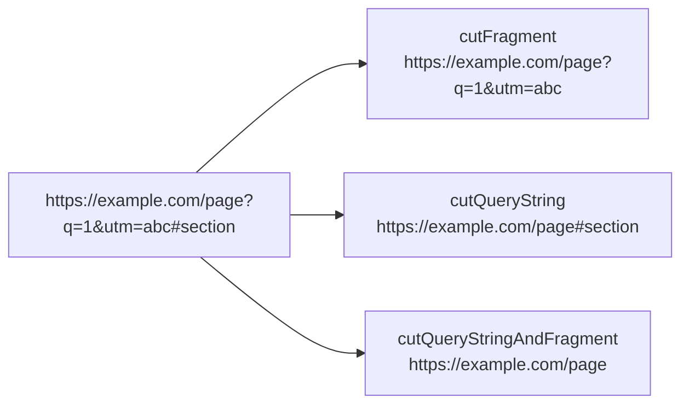

# How to Use cutQueryString() and cutFragment() in ClickHouse

Author: [nawazdhandala](https://www.github.com/nawazdhandala)

Tags: ClickHouse, SQL, URL, Function, Web Analytics, cutQueryString, cutFragment

Description: Learn how to strip query strings and URL fragments from URLs in ClickHouse using cutQueryString() and cutFragment() for URL normalization.

---

URL normalization is a common data cleaning task in web analytics. When comparing or grouping URLs, you often need to remove tracking parameters or fragment identifiers so that `https://example.com/page?utm_source=email` and `https://example.com/page` count as the same URL. ClickHouse provides `cutQueryString()` and `cutFragment()` for exactly this purpose.

## How These Functions Work

- `cutQueryString(url)` - removes the query string (everything from `?` onward) from the URL, leaving the scheme, domain, and path intact. The `?` is also removed.
- `cutFragment(url)` - removes the fragment (everything from `#` onward), leaving scheme, domain, path, and query string.
- `cutQueryStringAndFragment(url)` - removes both the query string and fragment in one call.

## Syntax

```sql
cutQueryString(url)
cutFragment(url)
cutQueryStringAndFragment(url)
```

## What Each Function Removes



## Examples

### Removing the Query String

```sql
SELECT cutQueryString('https://example.com/search?q=clickhouse&page=2') AS clean_url;
```

```text
clean_url
https://example.com/search
```

### Removing the Fragment

```sql
SELECT cutFragment('https://example.com/docs/intro#installation') AS no_fragment;
```

```text
no_fragment
https://example.com/docs/intro
```

### Removing Both

```sql
SELECT cutQueryStringAndFragment(
    'https://example.com/pricing?plan=pro&trial=true#features'
) AS base_url;
```

```text
base_url
https://example.com/pricing
```

### URLs Without the Component

When there is no query string or fragment, the URL is returned unchanged:

```sql
SELECT
    cutQueryString('https://example.com/about') AS no_qs,
    cutFragment('https://example.com/about')    AS no_frag;
```

```text
no_qs                       no_frag
https://example.com/about   https://example.com/about
```

### Complete Working Example

Normalize tracking URLs to count canonical page views:

```sql
CREATE TABLE raw_pageviews
(
    view_id  UInt64,
    full_url String
) ENGINE = MergeTree()
ORDER BY view_id;

INSERT INTO raw_pageviews VALUES
    (1, 'https://shop.com/product/42?utm_source=email&utm_campaign=spring'),
    (2, 'https://shop.com/product/42?utm_source=google'),
    (3, 'https://shop.com/product/42'),
    (4, 'https://shop.com/product/42#reviews'),
    (5, 'https://shop.com/cart?session=abc123'),
    (6, 'https://shop.com/cart');

SELECT
    cutQueryStringAndFragment(full_url) AS canonical_url,
    count()                             AS views
FROM raw_pageviews
GROUP BY canonical_url
ORDER BY views DESC;
```

```text
canonical_url              views
https://shop.com/product/42  4
https://shop.com/cart        2
```

### Combining with path() for Clean Path Analysis

Strip query strings before extracting paths to avoid path fragmentation:

```sql
SELECT
    path(cutQueryString(full_url)) AS clean_path,
    count()                        AS views
FROM raw_pageviews
GROUP BY clean_path
ORDER BY views DESC;
```

```text
clean_path   views
/product/42  4
/cart        2
```

## Summary

`cutQueryString()` removes everything from `?` onward, `cutFragment()` removes everything from `#` onward, and `cutQueryStringAndFragment()` removes both. These functions are essential for URL normalization in web analytics - use them to canonicalize URLs before grouping, deduplication, or funnel analysis so that tracking parameters and anchor links do not artificially split page view counts.
