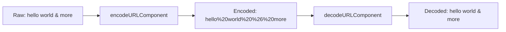

# How to Use decodeURLComponent() and encodeURLComponent() in ClickHouse

Author: [nawazdhandala](https://www.github.com/nawazdhandala)

Tags: ClickHouse, SQL, URL, Function, Encoding, decodeURLComponent, encodeURLComponent

Description: Learn how to decode percent-encoded URL components and encode strings for safe URL inclusion using decodeURLComponent() and encodeURLComponent() in ClickHouse.

---

URLs use percent-encoding (also called URL encoding) to represent special characters. For example, a space becomes `%20` and a `&` in a query parameter value becomes `%26`. ClickHouse provides `decodeURLComponent()` to reverse this encoding and `encodeURLComponent()` to apply it.

## How These Functions Work

- `decodeURLComponent(str)` - decodes percent-encoded characters in the input string. For example, `hello%20world` becomes `hello world`.
- `encodeURLComponent(str)` - encodes a string so it is safe to include as a URL component. Spaces become `%20`, `&` becomes `%26`, etc.

Both functions operate on the full input string without knowledge of URL structure - they treat the entire string as a component value.

## Syntax

```sql
decodeURLComponent(string)
encodeURLComponent(string)
```

## Encoding Table Examples



## Examples

### Decoding a Percent-Encoded String

```sql
SELECT decodeURLComponent('hello%20world%21') AS decoded;
```

```text
decoded
hello world!
```

### Encoding a String for URL Use

```sql
SELECT encodeURLComponent('search term & filter=yes') AS encoded;
```

```text
encoded
search%20term%20%26%20filter%3Dyes
```

### Decoding Query Parameter Values

When extracting URL parameters, the values may still be percent-encoded:

```sql
SELECT
    extractURLParameter('https://example.com/search?q=hello%20world', 'q') AS raw_param,
    decodeURLComponent(extractURLParameter(
        'https://example.com/search?q=hello%20world', 'q'
    )) AS decoded_param;
```

```text
raw_param     decoded_param
hello%20world  hello world
```

### Handling UTF-8 Encoded Characters

Percent-encoded UTF-8 sequences are also decoded:

```sql
SELECT decodeURLComponent('%D0%9F%D1%80%D0%B8%D0%B2%D0%B5%D1%82') AS russian_hello;
```

```text
russian_hello
Привет
```

### Invalid Encoding

When the input contains an invalid percent sequence, the function leaves it as-is:

```sql
SELECT decodeURLComponent('value%ZZbad') AS partial_decode;
```

```text
partial_decode
value%ZZbad
```

### Complete Working Example

Normalize search query logs to human-readable terms:

```sql
CREATE TABLE search_queries
(
    query_id  UInt64,
    raw_url   String
) ENGINE = MergeTree()
ORDER BY query_id;

INSERT INTO search_queries VALUES
    (1, 'https://shop.com/search?q=blue%20running%20shoes&sort=price'),
    (2, 'https://shop.com/search?q=laptop%20%26%20accessories&sort=rating'),
    (3, 'https://shop.com/search?q=coffee%20maker'),
    (4, 'https://shop.com/search?q=wireless%20headphones');

SELECT
    query_id,
    decodeURLComponent(extractURLParameter(raw_url, 'q')) AS search_term,
    extractURLParameter(raw_url, 'sort')                   AS sort_by
FROM search_queries
ORDER BY query_id;
```

```text
query_id  search_term              sort_by
1         blue running shoes       price
2         laptop & accessories     rating
3         coffee maker             (empty)
4         wireless headphones      (empty)
```

## Summary

`decodeURLComponent()` and `encodeURLComponent()` handle percent-encoding and decoding of URL component strings in ClickHouse. Use `decodeURLComponent()` when analyzing URL query parameters that contain encoded user input, and `encodeURLComponent()` when constructing URLs from raw string data. These functions operate on the whole string, not on full URL structures, so apply them to extracted components rather than complete URLs.
