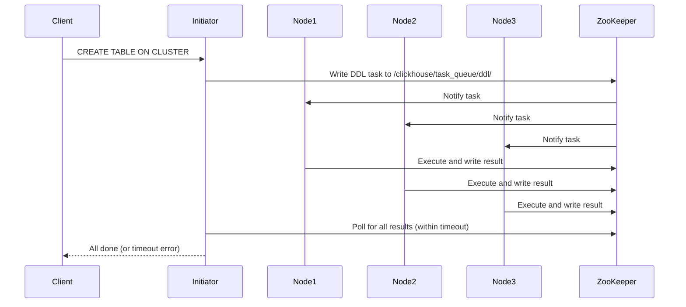

# How to Use distributed_ddl_task_timeout in ClickHouse

Author: [nawazdhandala](https://www.github.com/nawazdhandala)

Tags: ClickHouse, Distributed, DDL, Cluster, Configuration, Operations

Description: Learn how to configure distributed_ddl_task_timeout in ClickHouse to control how long ON CLUSTER DDL operations wait for all nodes to complete before returning.

---

## Introduction

When you run a DDL statement with `ON CLUSTER` in ClickHouse (such as `CREATE TABLE ON CLUSTER`, `ALTER TABLE ON CLUSTER`, or `DROP TABLE ON CLUSTER`), ClickHouse distributes the DDL task to all nodes in the cluster and waits for them to confirm completion. The `distributed_ddl_task_timeout` setting controls how many seconds to wait before the initiating node gives up and returns an error.

## How Distributed DDL Works



## Default Timeout

```sql
SELECT name, value, description
FROM system.settings
WHERE name = 'distributed_ddl_task_timeout';
```

Default: `180` seconds.

## Configuring distributed_ddl_task_timeout

### Per Query

```sql
CREATE TABLE events ON CLUSTER my_cluster
(
    event_id   UInt64,
    event_time DateTime,
    event_type String
)
ENGINE = ReplicatedMergeTree(
    '/clickhouse/tables/{shard}/events',
    '{replica}'
)
ORDER BY event_time
SETTINGS distributed_ddl_task_timeout = 600;  -- 10 minutes
```

### Globally in config.xml

```xml
<!-- /etc/clickhouse-server/config.d/distributed_ddl.xml -->
<clickhouse>
  <distributed_ddl>
    <task_timeout>600</task_timeout>
  </distributed_ddl>
</clickhouse>
```

### Per User Profile

```xml
<profiles>
  <admin>
    <distributed_ddl_task_timeout>600</distributed_ddl_task_timeout>
  </admin>
</profiles>
```

## Common Distributed DDL Operations

```sql
-- Create table on all nodes
CREATE TABLE events ON CLUSTER my_cluster
(
    event_id   UInt64,
    event_time DateTime,
    event_type LowCardinality(String)
)
ENGINE = ReplicatedMergeTree('/clickhouse/tables/{shard}/events', '{replica}')
PARTITION BY toYYYYMM(event_time)
ORDER BY (event_time, event_type);

-- Add a column on all nodes
ALTER TABLE events ON CLUSTER my_cluster
    ADD COLUMN region LowCardinality(String) DEFAULT '';

-- Modify TTL on all nodes
ALTER TABLE events ON CLUSTER my_cluster
    MODIFY TTL event_time + INTERVAL 90 DAY;

-- Drop table on all nodes
DROP TABLE IF EXISTS events ON CLUSTER my_cluster;
```

## Monitoring DDL Task Queue

```sql
-- Check pending and completed DDL tasks
SELECT
    entry,
    host,
    status,
    exception_code,
    query,
    exception
FROM system.distributed_ddl_queue
ORDER BY entry DESC
LIMIT 20;
```

## Handling Timeout Errors

If a DDL operation times out:

1. Check which nodes have not responded:

```sql
SELECT host, status, exception
FROM system.distributed_ddl_queue
WHERE entry = 'query-0000000042'
ORDER BY host;
```

2. Check node connectivity:

```sql
SELECT host_name, is_local, errors_count
FROM system.clusters
WHERE cluster = 'my_cluster';
```

3. Re-run the DDL with a longer timeout or fix the unresponsive node.

## Setting distributed_ddl_task_timeout = -1 (Wait Forever)

To wait indefinitely (useful for large ALTER operations):

```sql
ALTER TABLE events ON CLUSTER my_cluster
    ADD COLUMN new_field String
SETTINGS distributed_ddl_task_timeout = -1;
```

## Configuring max_distributed_ddl_wait_for_first_replica

Wait only for the first replica to complete (non-blocking):

```sql
ALTER TABLE events ON CLUSTER my_cluster
    ADD COLUMN new_field String
SETTINGS
    distributed_ddl_task_timeout = 60,
    distributed_ddl_output_mode = 'none_only_active';
```

## Cleaning Up the DDL Task Queue

Old DDL tasks accumulate in ZooKeeper. Configure cleanup in `config.xml`:

```xml
<clickhouse>
  <distributed_ddl>
    <cleanup_delay_period>60</cleanup_delay_period>
    <max_tasks_in_queue>1000</max_tasks_in_queue>
    <task_max_lifetime>604800</task_max_lifetime>  <!-- 7 days -->
  </distributed_ddl>
</clickhouse>
```

## Summary

`distributed_ddl_task_timeout` controls how long ClickHouse waits for all cluster nodes to execute an `ON CLUSTER` DDL statement. The default is 180 seconds, which is sufficient for most operations. For large clusters or heavy ALTER operations (such as adding columns to multi-terabyte tables), increase it to 600-3600 seconds. Monitor the DDL queue in `system.distributed_ddl_queue` to diagnose which nodes are slow or failing.
