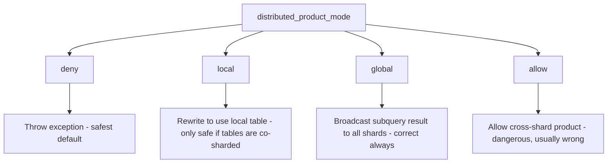

# How to Set distributed_product_mode in ClickHouse

Author: [nawazdhandala](https://www.github.com/nawazdhandala)

Tags: ClickHouse, Distributed, Configuration, Join, Query

Description: Learn how distributed_product_mode controls subquery behavior in distributed JOINs in ClickHouse and which mode to choose for correctness and performance.

---

When you run a query against a `Distributed` table that contains a subquery or `IN` clause also referencing a `Distributed` table, ClickHouse must decide how to execute the inner query across shards. The `distributed_product_mode` setting controls this behavior. Choosing the wrong mode can produce incorrect results or cause extreme performance issues.

## The Problem

Consider two distributed tables sharded across three nodes:

```sql
CREATE TABLE orders_local ON CLUSTER 'my_cluster'
(
    order_id  UInt64,
    user_id   UInt64,
    amount    Float64
)
ENGINE = ReplicatedMergeTree('/clickhouse/tables/{shard}/orders', '{replica}')
ORDER BY order_id;

CREATE TABLE orders AS orders_local
ENGINE = Distributed('my_cluster', default, orders_local, user_id);

CREATE TABLE users_local ON CLUSTER 'my_cluster'
(
    user_id  UInt64,
    country  String
)
ENGINE = ReplicatedMergeTree('/clickhouse/tables/{shard}/users', '{replica}')
ORDER BY user_id;

CREATE TABLE users AS users_local
ENGINE = Distributed('my_cluster', default, users_local, user_id);
```

A query like this crosses distributed tables:

```sql
SELECT order_id, amount
FROM orders
WHERE user_id IN (
    SELECT user_id FROM users WHERE country = 'US'
);
```

Without guidance, each shard of `orders` would query all shards of `users`, producing a cross-product of requests.

## The Four Modes



## Mode: deny (default)

```sql
SET distributed_product_mode = 'deny';

-- This will raise an exception:
SELECT order_id FROM orders
WHERE user_id IN (SELECT user_id FROM users WHERE country = 'US');
-- Code: 288. DB::Exception: Double-distributed IN/JOIN subqueries is denied
```

The `deny` mode is the safest default. It forces developers to think explicitly about the distribution strategy.

## Mode: local

```sql
SET distributed_product_mode = 'local';

SELECT order_id FROM orders
WHERE user_id IN (SELECT user_id FROM users WHERE country = 'US');
```

ClickHouse rewrites the inner query to use the underlying local table (`users_local`) on each shard. This is only correct when both tables are sharded by the same key and data is co-located. If `user_id` rows for the same user are on different shards, you will get incomplete results.

## Mode: global

```sql
SET distributed_product_mode = 'global';

SELECT order_id FROM orders
WHERE user_id IN (SELECT user_id FROM users WHERE country = 'US');
```

ClickHouse executes the inner subquery once on the initiator node, collects the full result, and broadcasts it to all shards. This is always correct but may be expensive if the subquery returns a large result set.

Equivalent to writing:

```sql
SELECT order_id FROM orders
WHERE user_id GLOBAL IN (SELECT user_id FROM users WHERE country = 'US');
```

## Mode: allow

```sql
SET distributed_product_mode = 'allow';
```

Allows the cross-product execution where each shard independently runs the inner distributed query. This results in N * M shard-level queries and almost always produces duplicate or incorrect results. Avoid this mode.

## Choosing the Right Mode

| Use Case | Recommended Mode |
|----------|-----------------|
| Tables co-sharded on the same key | `local` |
| Tables on different sharding keys | `global` |
| Large subquery result (> 1M rows) | Use `JOIN` with `GLOBAL JOIN` instead |
| Prevent accidental cross-distributed queries | `deny` (default) |

## Using GLOBAL IN / GLOBAL JOIN Explicitly

Rather than relying on `distributed_product_mode`, prefer explicit `GLOBAL IN` or `GLOBAL JOIN`:

```sql
-- Explicit GLOBAL IN - always correct, self-documenting
SELECT order_id, amount
FROM orders
WHERE user_id GLOBAL IN (
    SELECT user_id FROM users WHERE country = 'US'
);

-- Explicit GLOBAL JOIN
SELECT o.order_id, o.amount, u.country
FROM orders o
GLOBAL JOIN users u ON o.user_id = u.user_id
WHERE u.country = 'US';
```

## Summary

`distributed_product_mode` controls how ClickHouse handles subqueries or `IN` clauses that reference another `Distributed` table. The default `deny` prevents accidental cross-shard fan-out. Use `global` for correctness when tables are not co-sharded, and `local` only when you are certain data is co-located by the same sharding key. For production queries, prefer explicit `GLOBAL IN` and `GLOBAL JOIN` syntax over relying on this setting.
