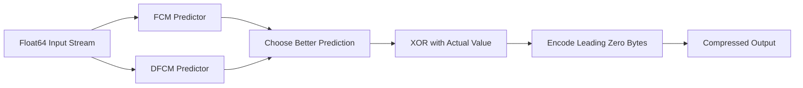

# How to Use FPC Codec for Float Compression in ClickHouse

Author: [nawazdhandala](https://www.github.com/nawazdhandala)

Tags: ClickHouse, Compression, Codec, Float, Performance

Description: Learn how to use the FPC codec in ClickHouse to compress double-precision floating-point columns using the FPC predictor algorithm for scientific and sensor data.

---

The FPC codec in ClickHouse implements the FPC (Floating Point Compression) algorithm designed by Martin Burtscher and Paruj Ratanaworabhan. It predicts each floating-point value from prior values using two hardware-friendly predictors and encodes only the difference from the prediction. FPC performs well on smooth, correlated double-precision series and offers an alternative to Gorilla for Float64 columns.

Unlike Gorilla which is XOR-based, FPC uses FCM (Finite Context Method) and DFCM (Differential FCM) predictors. It is particularly strong on scientific and financial float sequences where values follow a consistent numerical pattern.

## How FPC Works



FPC maintains two hash tables of predictions. For each value, it XORs the best prediction with the actual value, counts leading zero bytes in the result, and encodes only the non-zero suffix. This delivers competitive compression on correlated data with low decompression latency.

## Syntax

```sql
CODEC(FPC)
CODEC(FPC(level))
CODEC(FPC, LZ4)
CODEC(FPC, ZSTD(3))
```

FPC operates only on `Float64` (double-precision) columns. It does not support `Float32`. The optional level parameter controls hash table sizes; higher levels use more memory for better compression:

- Level 1 to 28 (default is 12)

## Basic Usage

```sql
CREATE TABLE financial_ticks
(
    symbol_id  UInt32   CODEC(LZ4),
    bid        Float64  CODEC(FPC),
    ask        Float64  CODEC(FPC),
    last_price Float64  CODEC(FPC),
    volume     Float64  CODEC(FPC),
    ts         DateTime64(9) CODEC(DoubleDelta, LZ4)
)
ENGINE = MergeTree()
PARTITION BY toYYYYMM(ts)
ORDER BY (symbol_id, ts);
```

## FPC Level Tuning

```sql
-- Conservative: small hash tables, lower memory, acceptable ratio
CREATE TABLE ticks_fpc_12
(
    id  UInt32,
    val Float64 CODEC(FPC(12))
)
ENGINE = MergeTree()
ORDER BY id;

-- Aggressive: larger hash tables, better ratio for long correlated sequences
CREATE TABLE ticks_fpc_20
(
    id  UInt32,
    val Float64 CODEC(FPC(20))
)
ENGINE = MergeTree()
ORDER BY id;
```

## Benchmarking FPC vs Gorilla vs Plain ZSTD

Insert identical correlated float data into three tables and compare:

```sql
CREATE TABLE bench_gorilla (id UInt32, val Float64 CODEC(Gorilla, LZ4))
    ENGINE = MergeTree() ORDER BY id;

CREATE TABLE bench_fpc     (id UInt32, val Float64 CODEC(FPC, LZ4))
    ENGINE = MergeTree() ORDER BY id;

CREATE TABLE bench_zstd    (id UInt32, val Float64 CODEC(ZSTD(3)))
    ENGINE = MergeTree() ORDER BY id;

-- Smooth correlated series simulating sensor readings
INSERT INTO bench_gorilla SELECT number, 20.0 + sin(number / 500.0) * 5 FROM numbers(5000000);
INSERT INTO bench_fpc     SELECT number, 20.0 + sin(number / 500.0) * 5 FROM numbers(5000000);
INSERT INTO bench_zstd    SELECT number, 20.0 + sin(number / 500.0) * 5 FROM numbers(5000000);

SELECT
    table,
    formatReadableSize(sum(data_compressed_bytes))   AS compressed,
    formatReadableSize(sum(data_uncompressed_bytes)) AS uncompressed,
    round(sum(data_uncompressed_bytes) / sum(data_compressed_bytes), 2) AS ratio
FROM system.parts
WHERE active = 1
  AND table IN ('bench_gorilla', 'bench_fpc', 'bench_zstd')
  AND database = currentDatabase()
GROUP BY table
ORDER BY ratio DESC;
```

FPC and Gorilla typically achieve comparable ratios on smooth data. FPC can outperform Gorilla on highly structured numerical sequences (e.g., financial price series with small increments), while Gorilla edges ahead on purely oscillating signals.

## Scientific Data Example

```sql
CREATE TABLE simulation_output
(
    run_id      UInt32   CODEC(LZ4),
    step        UInt64   CODEC(Delta(8), LZ4),
    position_x  Float64  CODEC(FPC(14)),
    position_y  Float64  CODEC(FPC(14)),
    position_z  Float64  CODEC(FPC(14)),
    velocity_x  Float64  CODEC(FPC(14)),
    velocity_y  Float64  CODEC(FPC(14)),
    velocity_z  Float64  CODEC(FPC(14)),
    energy      Float64  CODEC(FPC(14)),
    ts          DateTime CODEC(DoubleDelta, LZ4)
)
ENGINE = MergeTree()
ORDER BY (run_id, step);
```

For molecular dynamics or physics simulations, position and velocity series are highly correlated across steps, making FPC an excellent fit.

## FPC Limitation: Float64 Only

FPC does not compress `Float32`. For Float32 columns, use Gorilla instead:

```sql
CREATE TABLE mixed_floats
(
    id       UInt32,
    double_v Float64 CODEC(FPC),   -- FPC supported
    float_v  Float32 CODEC(Gorilla, LZ4) -- use Gorilla for Float32
)
ENGINE = MergeTree()
ORDER BY id;
```

## Adding FPC to an Existing Column

```sql
ALTER TABLE financial_ticks
    MODIFY COLUMN bid Float64 CODEC(FPC, LZ4);

OPTIMIZE TABLE financial_ticks FINAL;
```

## Checking Codec Assignments

```sql
SELECT name, type, compression_codec
FROM system.columns
WHERE table = 'financial_ticks'
  AND database = currentDatabase();
```

## When to Choose FPC vs Gorilla

| Scenario | Recommended Codec |
|---|---|
| Float64 financial price series | FPC |
| Float64 physics simulation outputs | FPC |
| Float32 sensor readings | Gorilla |
| Float64 smooth sensor metrics | Either (benchmark) |
| Random or uncorrelated floats | ZSTD alone |

## Summary

FPC is a Float64-specific transform codec that uses FCM and DFCM predictors to compress correlated double-precision sequences. It is an alternative to Gorilla for Float64 columns, with particular strength on structured numerical series like financial prices and scientific simulation outputs. Use level 12 as the default, benchmark against Gorilla with your real data, and chain with LZ4 or ZSTD for additional compression if needed.
