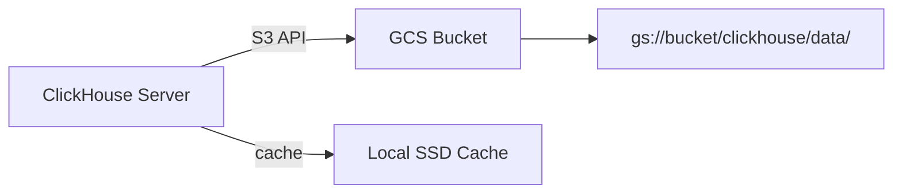

# How to Configure GCS as ClickHouse Storage Backend

Author: [nawazdhandala](https://www.github.com/nawazdhandala)

Tags: ClickHouse, GCS, Storage, Object Storage, Google Cloud, Disk

Description: Configure Google Cloud Storage (GCS) as a ClickHouse storage backend using S3 interoperability, enabling cost-effective data storage with full SQL query capability.

---

## Introduction

ClickHouse connects to Google Cloud Storage (GCS) through GCS's S3 interoperability API. This means you use the same `s3` disk type in ClickHouse configuration but point it at a GCS bucket endpoint. All data parts are stored on GCS, reducing local disk requirements and taking advantage of GCS durability and regional storage tiers.

## Architecture



## Step 1: Enable GCS S3 Interoperability

In the Google Cloud Console:

1. Navigate to Cloud Storage > Settings > Interoperability.
2. Create a service account HMAC key pair.
3. Note the `Access Key` and `Secret`.

Alternatively via `gcloud`:

```bash
# Create a service account
gcloud iam service-accounts create clickhouse-gcs \
    --display-name="ClickHouse GCS Service Account"

# Grant storage admin on the bucket
gsutil iam ch \
    serviceAccount:clickhouse-gcs@PROJECT_ID.iam.gserviceaccount.com:objectAdmin \
    gs://my-clickhouse-bucket

# Create HMAC key
gcloud storage hmac create clickhouse-gcs@PROJECT_ID.iam.gserviceaccount.com
```

## Step 2: Create the GCS Bucket

```bash
gsutil mb -l us-central1 gs://my-clickhouse-bucket
gsutil versioning set off gs://my-clickhouse-bucket
```

## Step 3: Configure ClickHouse

Create `/etc/clickhouse-server/config.d/gcs_storage.xml`:

```xml
<clickhouse>
  <storage_configuration>
    <disks>
      <gcs>
        <type>s3</type>
        <endpoint>https://storage.googleapis.com/my-clickhouse-bucket/data/</endpoint>
        <access_key_id>GOOGHMAAC5EXAMPLEACCESSKEY</access_key_id>
        <secret_access_key>EXAMPLESECRETKEY1234567890ABCDEFGHIJKLMN</secret_access_key>
        <region>us-central1</region>
        <use_path_style_url>false</use_path_style_url>
        <send_metadata>true</send_metadata>
      </gcs>

      <gcs_cache>
        <type>cache</type>
        <disk>gcs</disk>
        <path>/var/lib/clickhouse/gcs_cache/</path>
        <max_size>50Gi</max_size>
        <cache_on_write_operations>true</cache_on_write_operations>
      </gcs_cache>
    </disks>

    <policies>
      <gcs_policy>
        <volumes>
          <main>
            <disk>gcs_cache</disk>
          </main>
        </volumes>
      </gcs_policy>
    </policies>
  </storage_configuration>
</clickhouse>
```

## Step 4: Reload Configuration

```sql
SYSTEM RELOAD CONFIG;
```

## Step 5: Create a Table on GCS

```sql
CREATE TABLE pageviews
(
    session_id  UUID,
    user_id     UInt64,
    page_url    String,
    viewed_at   DateTime,
    duration_ms UInt32
)
ENGINE = MergeTree
PARTITION BY toYYYYMM(viewed_at)
ORDER BY (viewed_at, user_id)
SETTINGS storage_policy = 'gcs_policy';
```

## Verify Parts Are on GCS

```sql
SELECT
    disk_name,
    count()               AS parts,
    formatReadableSize(sum(bytes_on_disk)) AS total_size
FROM system.parts
WHERE table = 'pageviews' AND active = 1
GROUP BY disk_name;
```

## Hot-Local + Cold-GCS Policy

Store recent data locally and move older data to GCS:

```xml
<policies>
  <hot_local_cold_gcs>
    <volumes>
      <hot>
        <disk>default</disk>
        <max_data_part_size_bytes>10737418240</max_data_part_size_bytes>
      </hot>
      <cold>
        <disk>gcs</disk>
      </cold>
    </volumes>
    <move_factor>0.2</move_factor>
  </hot_local_cold_gcs>
</policies>
```

```sql
ALTER TABLE pageviews
    MODIFY TTL viewed_at + INTERVAL 60 DAY
    TO VOLUME 'cold';
```

## Moving Partitions Manually to GCS

```sql
ALTER TABLE pageviews MOVE PARTITION '202401' TO DISK 'gcs';
```

## Cost Optimization

- Use `Nearline` or `Coldline` storage classes for rarely accessed data by setting a lifecycle policy on the GCS bucket.
- The `gcs_cache` disk avoids repeated reads of hot data from GCS, reducing read costs.

## Summary

GCS works as a ClickHouse storage backend via the S3 interoperability API. Configure an `s3` type disk pointing at the GCS endpoint with HMAC credentials, optionally add a local cache layer, define a storage policy, and assign it to MergeTree tables. TTL rules or manual partition moves let you offload cold data to GCS automatically.
