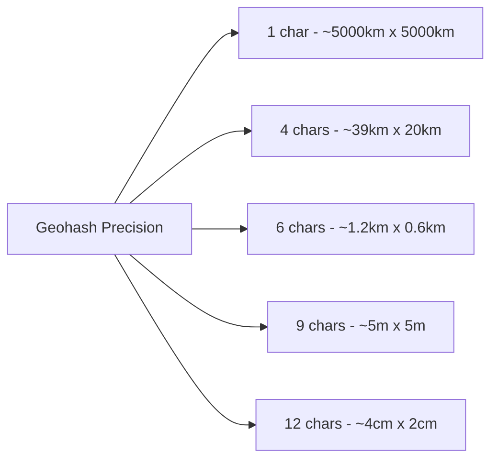

# How to Use geohashEncode() and geohashDecode() in ClickHouse

Author: [nawazdhandala](https://www.github.com/nawazdhandala)

Tags: ClickHouse, SQL, Geospatial, Geohash, Function, Location Analytics

Description: Learn how to encode latitude/longitude coordinates to geohash strings and decode geohash strings back to coordinates in ClickHouse using geohashEncode() and geohashDecode().

---

Geohash is a geocoding system that encodes a geographic location (latitude/longitude) into a short alphanumeric string. Nearby locations share common prefixes, making geohashes excellent for proximity grouping and spatial indexing. ClickHouse provides `geohashEncode()` and `geohashDecode()` for working with geohashes.

## How Geohash Works

The geohash algorithm divides the Earth's surface into a hierarchical grid. Each character added to the hash string refines the location to a smaller bounding box. A geohash of length 1 covers about 5000km x 5000km; length 9 covers about 5m x 5m.

- `geohashEncode(longitude, latitude, precision)` - returns a geohash string of the given precision (1-12 characters).
- `geohashDecode(geohash_str)` - returns a tuple `(longitude, latitude)` representing the center of the geohash cell.

## Precision Table



## Syntax

```sql
geohashEncode(longitude, latitude, precision)
geohashDecode(geohash_string)
```

Note: longitude comes before latitude.

## Examples

### Encoding a Location

Encode the coordinates of New York City:

```sql
SELECT
    geohashEncode(-74.0060, 40.7128, 6) AS nyc_6,
    geohashEncode(-74.0060, 40.7128, 9) AS nyc_9;
```

```text
nyc_6   nyc_9
dr5reg  dr5regw3p
```

### Decoding a Geohash

Decode back to the center coordinate of the geohash cell:

```sql
SELECT geohashDecode('dr5reg') AS nyc_center;
```

```text
nyc_center
(-74.00390625,40.71044921875)
```

### Extracting Tuple Components

Access individual coordinates from the decoded tuple:

```sql
SELECT
    tupleElement(geohashDecode('dr5reg'), 1) AS longitude,
    tupleElement(geohashDecode('dr5reg'), 2) AS latitude;
```

```text
longitude         latitude
-74.00390625      40.71044921875
```

### Grouping Locations by Geohash Prefix

Using lower precision groups nearby points into cells:

```sql
SELECT
    geohashEncode(longitude, latitude, 4) AS region,
    count() AS locations
FROM (
    SELECT -74.0060 AS longitude, 40.7128 AS latitude UNION ALL  -- NYC
    SELECT -73.9857 AS longitude, 40.7484 AS latitude UNION ALL  -- Midtown
    SELECT -73.9442 AS longitude, 40.6782 AS latitude UNION ALL  -- Brooklyn
    SELECT -87.6298 AS longitude, 41.8781 AS latitude UNION ALL  -- Chicago
    SELECT -87.6500 AS longitude, 41.8500 AS latitude            -- Chicago west
)
GROUP BY region
ORDER BY locations DESC;
```

```text
region  locations
dr5r    2
dp3w    2
dr5x    1
```

### Complete Working Example

Store POI data and perform geohash-based clustering:

```sql
CREATE TABLE points_of_interest
(
    poi_id    UInt32,
    name      String,
    longitude Float64,
    latitude  Float64,
    category  String
) ENGINE = MergeTree()
ORDER BY poi_id;

INSERT INTO points_of_interest VALUES
    (1, 'Central Park',    -73.9654, 40.7829, 'park'),
    (2, 'Times Square',    -74.0060, 40.7580, 'landmark'),
    (3, 'Empire State',    -73.9857, 40.7484, 'landmark'),
    (4, 'Brooklyn Bridge', -73.9969, 40.7061, 'landmark'),
    (5, 'Prospect Park',   -73.9671, 40.6602, 'park');

SELECT
    geohashEncode(longitude, latitude, 5) AS geohash_cell,
    groupArray(name)                       AS pois,
    count()                               AS poi_count
FROM points_of_interest
GROUP BY geohash_cell
ORDER BY poi_count DESC;
```

```text
geohash_cell  pois                               poi_count
dr5re         ['Times Square','Empire State']    2
dr5rg         ['Central Park']                   1
dr5ru         ['Brooklyn Bridge']                1
dr5rm         ['Prospect Park']                  1
```

## Summary

`geohashEncode()` converts longitude/latitude coordinates to a geohash string of a specified precision, and `geohashDecode()` returns the center coordinate of a geohash cell as a tuple. Geohashes are ideal for proximity grouping, spatial partitioning, and location-based clustering in ClickHouse. Lower precision values produce larger cells for coarser grouping, while higher values yield precise location identification. Always pass longitude before latitude in `geohashEncode()`.
