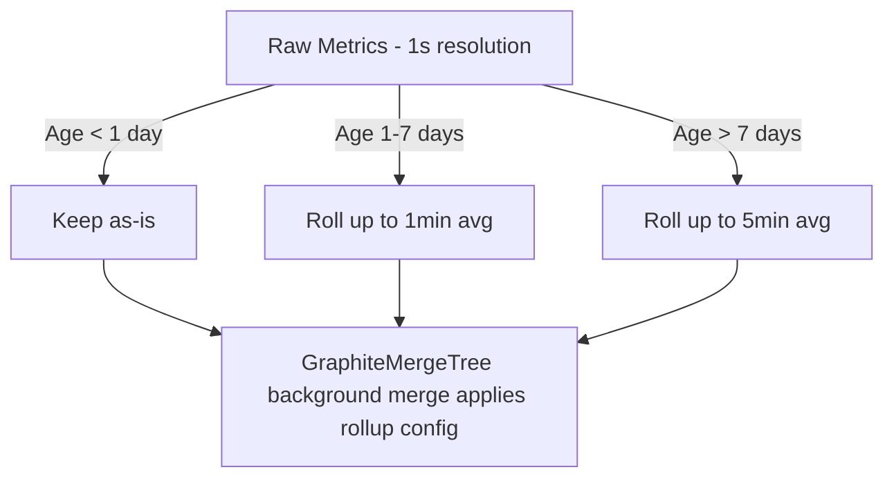

# How to Use GraphiteMergeTree in ClickHouse for Metrics Rollup

Author: [nawazdhandala](https://www.github.com/nawazdhandala)

Tags: ClickHouse, SQL, GraphiteMergeTree, Engine, Metric, Time Series, ROLLUP

Description: Learn how to use GraphiteMergeTree in ClickHouse to store and automatically roll up Graphite-compatible time-series metrics with configurable retention and aggregation rules.

---

`GraphiteMergeTree` is a ClickHouse table engine designed for storing Graphite-style time-series metrics data. It extends `MergeTree` with automatic rollup and downsampling during background merges, applying user-defined retention and aggregation rules. This allows you to store high-resolution data for recent time windows while automatically coarsening older data - the same behavior as Graphite's `storage-schemas.conf` and `storage-aggregation.conf`.

## How GraphiteMergeTree Works



During background merges, ClickHouse reads the rollup configuration (defined in `config.xml` or via a named section) and applies it to data matching each retention rule. Old high-resolution rows are aggregated into fewer rows at coarser granularity.

## Configuration

GraphiteMergeTree requires a rollup configuration section in ClickHouse's server configuration file.

```xml
<!-- In /etc/clickhouse-server/config.xml or a .d/ include -->
<graphite_rollup_example>
    <default>
        <function>avg</function>
        <retention>
            <age>0</age>
            <precision>10</precision>
        </retention>
        <retention>
            <age>86400</age>
            <precision>60</precision>
        </retention>
        <retention>
            <age>604800</age>
            <precision>300</precision>
        </retention>
    </default>
    <pattern>
        <regexp>^server\.cpu\.</regexp>
        <function>avg</function>
        <retention>
            <age>0</age>
            <precision>10</precision>
        </retention>
        <retention>
            <age>86400</age>
            <precision>60</precision>
        </retention>
    </pattern>
    <pattern>
        <regexp>^server\.requests\.count</regexp>
        <function>sum</function>
        <retention>
            <age>0</age>
            <precision>60</precision>
        </retention>
        <retention>
            <age>604800</age>
            <precision>3600</precision>
        </retention>
    </pattern>
</graphite_rollup_example>
```

Rules:
- `default` - applies when no pattern matches
- `pattern` - applies to metric names matching the `regexp`
- `function` - aggregation function used during rollup (`avg`, `sum`, `min`, `max`, `any`)
- `retention.age` - age in seconds at which this resolution applies
- `retention.precision` - resolution in seconds (e.g., 60 = 1-minute granularity)

## Table Schema

GraphiteMergeTree requires four specific columns with predefined roles, though the column names can be configured:

```sql
CREATE TABLE graphite_metrics
(
    Path        String,
    Time        UInt32,
    Value       Float64,
    Timestamp   UInt32
)
ENGINE = GraphiteMergeTree('graphite_rollup_example')
PARTITION BY toYYYYMM(toDateTime(Time))
ORDER BY (Path, Time);
```

The column roles:
- `Path` - the metric name (e.g., `server.cpu.user`)
- `Time` - Unix timestamp of the data point (UInt32 or DateTime)
- `Value` - the metric value (Float64)
- `Timestamp` - the version timestamp for deduplication during rollup

## Complete Working Example

```sql
-- Create the table
CREATE TABLE graphite_metrics
(
    Path        String,
    Time        UInt32,
    Value       Float64,
    Timestamp   UInt32
)
ENGINE = GraphiteMergeTree('graphite_rollup_example')
PARTITION BY toYYYYMM(toDateTime(Time))
ORDER BY (Path, Time);

-- Insert 10-second resolution metrics for the last few hours
INSERT INTO graphite_metrics
SELECT
    concat('server.cpu.', ['user','system','iowait'][((number % 3) + 1)]) AS Path,
    toUnixTimestamp(now() - (3600 - number * 10))                          AS Time,
    rand() % 100                                                            AS Value,
    toUnixTimestamp(now())                                                  AS Timestamp
FROM numbers(360 * 3);

-- Query the latest values per metric path
SELECT
    Path,
    toDateTime(max(Time)) AS last_time,
    avg(Value)            AS avg_value,
    count()               AS data_points
FROM graphite_metrics
GROUP BY Path
ORDER BY Path;
```

## Querying Rolled-Up Data

After background merges apply rollup rules, older data will have fewer rows at coarser granularity:

```sql
-- Compare data density for recent vs old data
SELECT
    Path,
    toStartOfHour(toDateTime(Time)) AS hour,
    avg(Value)                      AS avg_val,
    count()                         AS raw_points
FROM graphite_metrics
WHERE Path = 'server.cpu.user'
GROUP BY Path, hour
ORDER BY hour DESC
LIMIT 24;
```

## Forcing a Rollup (for Testing)

You can trigger an immediate merge to test rollup behavior:

```sql
OPTIMIZE TABLE graphite_metrics FINAL;
```

After this, data older than the retention thresholds will be merged into coarser resolution rows.

## Inserting Data from Graphite Protocol

In production, metrics are typically sent to ClickHouse via the Graphite-compatible input format or via a Kafka pipeline. The plain-text Graphite protocol format is:

```text
metric.path value timestamp
server.cpu.user 42.5 1711900800
server.cpu.system 12.3 1711900800
```

Use the `carbonClickHouseReceiver` or a custom Kafka consumer to route these into your `graphite_metrics` table.

## Multi-Tag Support with Tagged Metrics

Modern monitoring systems use tagged metrics (InfluxDB line protocol style). ClickHouse can store these in GraphiteMergeTree with the tag syntax embedded in the Path column:

```sql
-- Tagged path format: metric_name;tag1=value1;tag2=value2
INSERT INTO graphite_metrics VALUES
    ('server.cpu;host=web01;env=prod', toUnixTimestamp(now()), 45.2, toUnixTimestamp(now())),
    ('server.cpu;host=web02;env=prod', toUnixTimestamp(now()), 38.7, toUnixTimestamp(now()));

-- Query by tag using LIKE
SELECT Path, Value, toDateTime(Time) AS ts
FROM graphite_metrics
WHERE Path LIKE 'server.cpu;host=web01%'
ORDER BY Time DESC
LIMIT 10;
```

## Use Case Comparison

```text
Use Case                     | Engine to Use
-----------------------------+-------------------------
Graphite metrics with rollup | GraphiteMergeTree
Generic time series          | MergeTree
Pre-aggregated metrics       | AggregatingMergeTree
IoT sensor data              | MergeTree
OpenTelemetry metrics        | MergeTree + Mat. Views
```

## Summary

`GraphiteMergeTree` combines ClickHouse's columnar storage performance with Graphite-compatible automatic data rollup. By defining retention and aggregation rules in the server configuration, high-resolution recent data is preserved while older data is automatically coarsened during background merges. This eliminates the need for external rollup processes and makes ClickHouse a drop-in Graphite storage backend for long-term metrics storage with automatic tiered retention.
