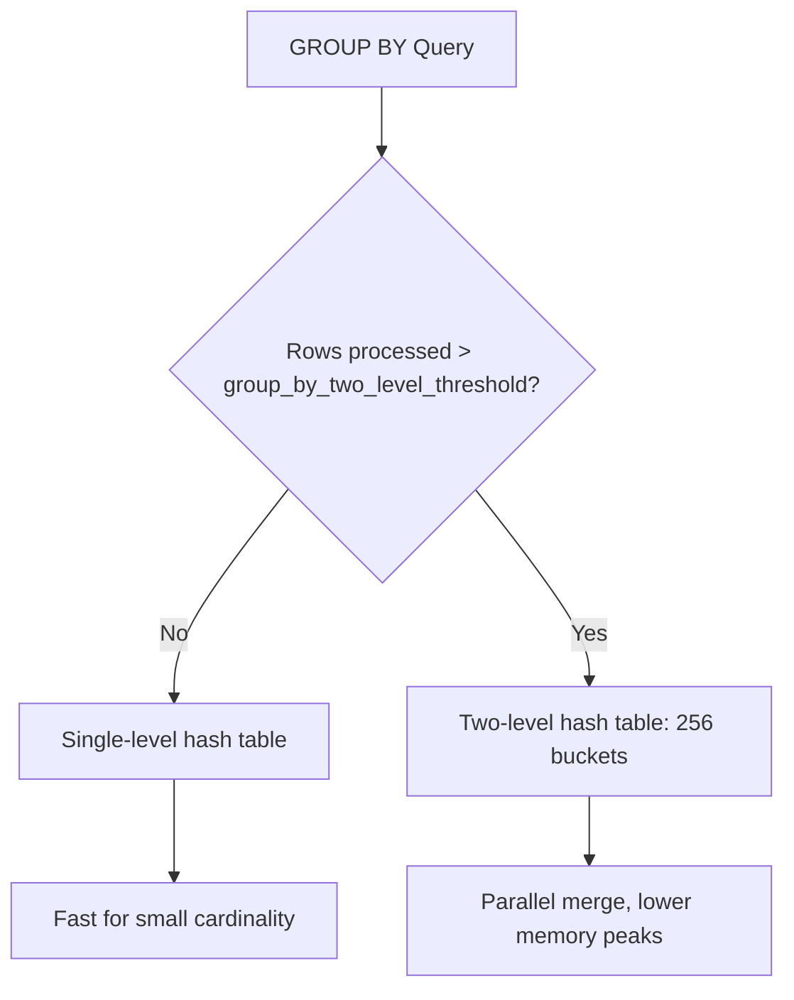

# How to Set group_by_two_level_threshold in ClickHouse

Author: [nawazdhandala](https://www.github.com/nawazdhandala)

Tags: ClickHouse, Configuration, Performance, Aggregation, Query

Description: Learn how group_by_two_level_threshold controls when ClickHouse switches to two-level GROUP BY aggregation and how tuning it affects memory and performance.

---

ClickHouse uses two distinct algorithms for `GROUP BY` aggregation: a single-level hash table and a two-level hash table. The single-level approach is faster for small result sets but can cause memory pressure and lock contention when the number of unique group keys is large. The `group_by_two_level_threshold` setting controls the row count at which ClickHouse automatically switches from single-level to two-level aggregation.

## What Is Two-Level Aggregation

In single-level mode, ClickHouse builds one global hash table for all group keys. In two-level mode, it splits the hash table into 256 buckets based on the first byte of the key hash. This allows:

- Parallel merging across buckets
- Lower memory peaks for large aggregations
- Better cache locality per bucket



## Default Values

```sql
SELECT name, value, description
FROM system.settings
WHERE name IN (
    'group_by_two_level_threshold',
    'group_by_two_level_threshold_bytes'
);
```

| Setting | Default |
|---------|---------|
| `group_by_two_level_threshold` | 100000 |
| `group_by_two_level_threshold_bytes` | 50000000 (50 MB) |

ClickHouse switches to two-level aggregation when either threshold is exceeded.

## Setting the Threshold

```sql
-- Lower threshold: switch to two-level sooner (better for high-cardinality columns)
SET group_by_two_level_threshold = 50000;
SET group_by_two_level_threshold_bytes = 25000000;

-- Higher threshold: stay single-level longer (better for low-cardinality aggregations)
SET group_by_two_level_threshold = 500000;
```

## Practical Example

```sql
-- Create a table with high cardinality
CREATE TABLE events
(
    event_id   UInt64,
    session_id String,
    event_type LowCardinality(String),
    ts         DateTime
)
ENGINE = MergeTree()
ORDER BY ts;

INSERT INTO events
SELECT
    number,
    toString(rand() % 1000000),
    ['click', 'view', 'scroll', 'purchase'][rand() % 4 + 1],
    now() - rand() % 86400
FROM numbers(5000000);

-- With default threshold, this will switch to two-level around 100k unique session_ids
SELECT session_id, count() AS event_count
FROM events
GROUP BY session_id
ORDER BY event_count DESC
LIMIT 10;
```

## Checking Which Algorithm Was Used

Query `system.query_log` after execution to see aggregation memory usage:

```sql
SELECT
    query_id,
    memory_usage,
    query_duration_ms,
    ProfileEvents['AggregationHashTablesInitializedAsTwoLevel'] AS two_level_count
FROM system.query_log
WHERE type = 'QueryFinish'
  AND query LIKE '%GROUP BY session_id%'
ORDER BY event_time DESC
LIMIT 5;
```

## Impact on Distributed Queries

For distributed `GROUP BY`, two-level mode enables the initiator node to merge partial results from shards bucket-by-bucket, reducing peak memory on the initiator:

```sql
-- On a distributed cluster, lowering threshold helps when aggregating across shards
SET group_by_two_level_threshold = 10000;

SELECT
    event_type,
    uniq(session_id) AS unique_sessions
FROM distributed_events
GROUP BY event_type;
```

## Tuning Guidance

| Scenario | Recommended Threshold |
|----------|-----------------------|
| Low cardinality GROUP BY (< 10k keys) | 500000+ (stay single-level) |
| Medium cardinality (10k - 500k keys) | 50000 - 100000 (default is fine) |
| High cardinality (> 500k keys) | 10000 - 50000 (switch earlier) |
| Distributed aggregation with memory pressure | 10000 - 25000 |

## Setting in Configuration File

```xml
<profiles>
  <default>
    <group_by_two_level_threshold>100000</group_by_two_level_threshold>
    <group_by_two_level_threshold_bytes>50000000</group_by_two_level_threshold_bytes>
  </default>
</profiles>
```

## Summary

`group_by_two_level_threshold` controls when ClickHouse switches from a single global hash table to a bucketed two-level hash table for `GROUP BY`. Lowering the threshold triggers two-level aggregation earlier, which reduces memory peaks for high-cardinality groupings and improves distributed merge performance. Raising it keeps simple low-cardinality aggregations on the faster single-level path. Tune based on your typical group key cardinality and available memory per query.
