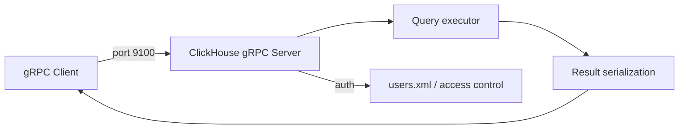

# How to Configure ClickHouse gRPC Interface

Author: OneUptime Team

Tags: ClickHouse, Configuration, gRPC, Networking, Protocol

Description: Learn how to enable and configure the ClickHouse gRPC interface including port, TLS, and connection settings for gRPC-based clients.

---

ClickHouse includes a built-in gRPC interface that exposes the same query execution capabilities as the native TCP and HTTP interfaces but over the gRPC protocol. This is useful for applications that already use gRPC for inter-service communication and want a consistent protocol for ClickHouse access.

## Enabling the gRPC Interface

The gRPC interface is disabled by default. Enable it by adding the port to your configuration:

```xml
<!-- /etc/clickhouse-server/config.d/grpc.xml -->
<clickhouse>
    <grpc_port>9100</grpc_port>
</clickhouse>
```

After restarting ClickHouse, verify the port is listening:

```bash
ss -tlnp | grep 9100
```

## Full gRPC Configuration

```xml
<clickhouse>
    <grpc_port>9100</grpc_port>

    <grpc>
        <!-- Enable TLS -->
        <enable_ssl>false</enable_ssl>

        <!-- Certificate files for TLS -->
        <ssl_cert_file>/etc/clickhouse-server/certs/server.crt</ssl_cert_file>
        <ssl_key_file>/etc/clickhouse-server/certs/server.key</ssl_key_file>
        <ssl_ca_cert_file>/etc/clickhouse-server/certs/ca.crt</ssl_ca_cert_file>

        <!-- Require client certificate -->
        <ssl_require_client_auth>false</ssl_require_client_auth>

        <!-- Compression: none, deflate, gzip, stream_zlib -->
        <compression>deflate</compression>

        <!-- Log grpc queries to system.query_log -->
        <verbose_logs>false</verbose_logs>

        <!-- Maximum message size in bytes -->
        <max_receive_message_size>-1</max_receive_message_size>
        <max_send_message_size>-1</max_send_message_size>
    </grpc>
</clickhouse>
```

## gRPC with TLS

```xml
<clickhouse>
    <grpc_port>9100</grpc_port>

    <grpc>
        <enable_ssl>true</enable_ssl>
        <ssl_cert_file>/etc/clickhouse-server/certs/server.crt</ssl_cert_file>
        <ssl_key_file>/etc/clickhouse-server/certs/server.key</ssl_key_file>
        <ssl_ca_cert_file>/etc/clickhouse-server/certs/ca.crt</ssl_ca_cert_file>
        <ssl_require_client_auth>true</ssl_require_client_auth>
    </grpc>
</clickhouse>
```

## Architecture



## gRPC Proto Interface

ClickHouse exposes its gRPC service defined in `clickhouse_grpc.proto`. The key service method is:

```text
service ClickHouse {
    rpc ExecuteQuery(QueryInfo) returns (stream Result);
    rpc ExecuteQueryWithStreamInput(stream QueryInfo) returns (stream Result);
    rpc ExecuteQueryWithStreamOutput(QueryInfo) returns (stream Result);
    rpc ExecuteBatchQuery(stream QueryInfo) returns (stream Result);
}
```

## Connecting with grpcurl

Test the gRPC interface without writing client code:

```bash
grpcurl -plaintext \
  -proto clickhouse_grpc.proto \
  -d '{
    "query": "SELECT 1",
    "user_name": "default",
    "password": ""
  }' \
  localhost:9100 \
  clickhouse.grpc.ClickHouse/ExecuteQuery
```

## Python gRPC Client Example

```python
import grpc
import clickhouse_grpc_pb2
import clickhouse_grpc_pb2_grpc

channel = grpc.insecure_channel("localhost:9100")
stub = clickhouse_grpc_pb2_grpc.ClickHouseStub(channel)

request = clickhouse_grpc_pb2.QueryInfo(
    query="SELECT count() FROM system.tables",
    user_name="default",
    password="",
    output_format="JSONEachRow",
)

for result in stub.ExecuteQuery(request):
    print(result.output.decode("utf-8"))
```

## Compression Options

| Value | Algorithm | Best for |
|---|---|---|
| `none` | No compression | Low-latency LAN |
| `deflate` | zlib deflate | General use |
| `gzip` | gzip | Compatibility |
| `stream_zlib` | Streaming zlib | Large streaming results |

## Limitations

- The gRPC interface is less widely used than HTTP or native TCP. Most ClickHouse client libraries target HTTP or TCP.
- Server-side cancellation requires client cooperation via gRPC context cancellation.
- Protobuf message size limits apply; increase `max_receive_message_size` for large INSERT payloads.

## Monitoring gRPC Connections

```sql
SELECT *
FROM system.processes
WHERE interface = 'GRPC';
```

## Summary

Enable the ClickHouse gRPC interface by setting `grpc_port` in configuration. Use TLS with `enable_ssl` and client certificate authentication for production deployments. Configure compression based on your network characteristics. Test connectivity with `grpcurl` before integrating custom clients. For most use cases, the HTTP interface is better supported by existing tooling, but gRPC is a good choice when your stack already uses gRPC extensively.
