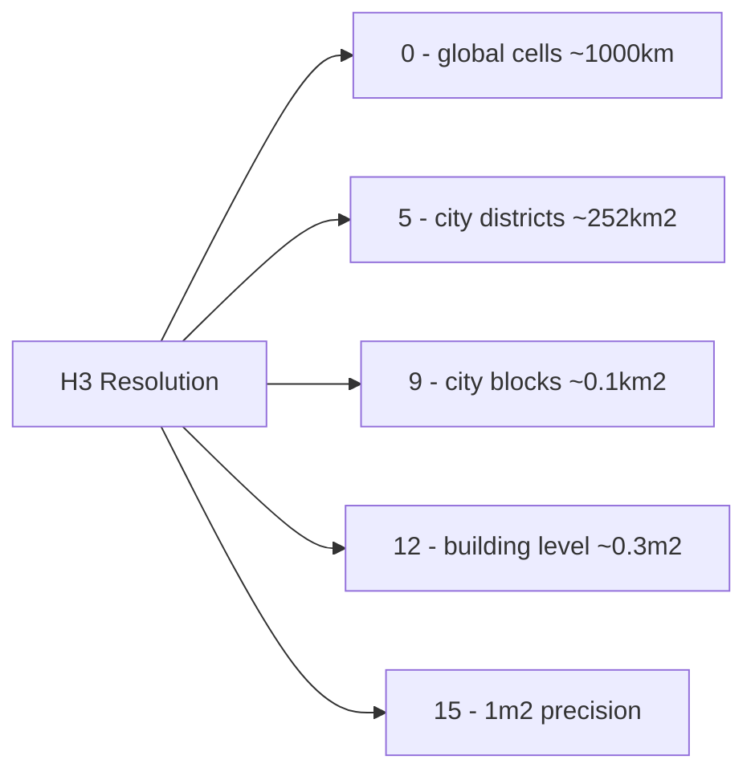

# How to Use h3ToGeo() and h3GetResolution() in ClickHouse

Author: [nawazdhandala](https://www.github.com/nawazdhandala)

Tags: ClickHouse, SQL, Geospatial, H3, Function, Location Analytics

Description: Learn how to convert H3 cell indexes to geographic coordinates and retrieve the resolution of H3 indexes in ClickHouse using h3ToGeo() and h3GetResolution().

---

The H3 hierarchical geospatial indexing system divides the globe into hexagonal cells at 16 resolution levels. ClickHouse includes a comprehensive H3 function library. `h3ToGeo()` retrieves the center coordinates of an H3 cell, and `h3GetResolution()` returns the resolution level of a given H3 index.

## How H3 Functions Work

- `h3ToGeo(h3_index)` - takes an H3 cell index (`UInt64`) and returns a tuple `(latitude, longitude)` of the cell center.
- `h3GetResolution(h3_index)` - returns the resolution level (0-15) of the H3 index as a `UInt8`.

H3 cell indexes are 64-bit unsigned integers that encode both the cell location and its resolution level.

## H3 Resolution Scale



## Syntax

```sql
h3ToGeo(h3_index)
h3GetResolution(h3_index)
```

## Examples

### Getting the Center of an H3 Cell

```sql
SELECT
    h3ToGeo(644325524701716479) AS cell_center,
    tupleElement(h3ToGeo(644325524701716479), 1) AS lat,
    tupleElement(h3ToGeo(644325524701716479), 2) AS lon;
```

```text
cell_center                   lat              lon
(40.689167,  -74.044444)      40.689167        -74.044444
```

### Getting the Resolution of an H3 Index

```sql
SELECT
    h3_index,
    h3GetResolution(h3_index) AS resolution
FROM (
    SELECT 644325524701716479 AS h3_index UNION ALL
    SELECT 617733204307009535 AS h3_index
);
```

```text
h3_index             resolution
644325524701716479   9
617733204307009535   5
```

### Converting H3 Index to Geo Using geoToH3 Inverse

To work with H3 indexes in ClickHouse you typically generate them with `geoToH3()` and then convert back with `h3ToGeo()`:

```sql
SELECT
    geoToH3(lon, lat, 9)   AS h3_index,
    h3GetResolution(geoToH3(lon, lat, 9)) AS res,
    tupleElement(h3ToGeo(geoToH3(lon, lat, 9)), 1) AS cell_lat,
    tupleElement(h3ToGeo(geoToH3(lon, lat, 9)), 2) AS cell_lon
FROM (
    SELECT -74.0060 AS lon, 40.7128 AS lat  -- New York
    UNION ALL
    SELECT -87.6298 AS lon, 41.8781 AS lat  -- Chicago
);
```

```text
h3_index             res  cell_lat    cell_lon
8a2a100d2937fff      9    40.71...    -74.00...
8a2a5901b22ffff      9    41.87...    -87.62...
```

### Complete Working Example

Aggregate delivery events by H3 cells and retrieve cell centers for mapping:

```sql
CREATE TABLE delivery_events
(
    delivery_id UInt64,
    h3_cell     UInt64,
    status      String,
    driver_id   UInt32
) ENGINE = MergeTree()
ORDER BY delivery_id;

INSERT INTO delivery_events VALUES
    (1, geoToH3(-74.0060, 40.7128, 9), 'delivered', 101),
    (2, geoToH3(-74.0060, 40.7128, 9), 'delivered', 102),
    (3, geoToH3(-73.9857, 40.7484, 9), 'failed',    101),
    (4, geoToH3(-73.9857, 40.7484, 9), 'delivered', 103),
    (5, geoToH3(-73.9442, 40.6782, 9), 'delivered', 104);

SELECT
    h3_cell,
    h3GetResolution(h3_cell)                         AS resolution,
    tupleElement(h3ToGeo(h3_cell), 1)                AS center_lat,
    tupleElement(h3ToGeo(h3_cell), 2)                AS center_lon,
    count()                                          AS total_deliveries,
    countIf(status = 'delivered')                    AS successful
FROM delivery_events
GROUP BY h3_cell
ORDER BY total_deliveries DESC;
```

```text
h3_cell               resolution  center_lat   center_lon   total  successful
8a2a100d2937fff       9           40.712...    -74.005...   2      2
8a2a100820b7fff       9           40.748...    -73.986...   2      1
8a2a1008522ffff       9           40.678...    -73.944...   1      1
```

## Summary

`h3ToGeo()` returns the center latitude/longitude of an H3 cell as a tuple, and `h3GetResolution()` returns the resolution level (0-15) of an H3 index. These functions are fundamental for H3-based geospatial analytics in ClickHouse - use `h3ToGeo()` to generate map-ready coordinates from stored H3 indexes, and `h3GetResolution()` to validate or classify indexes by their precision level.
