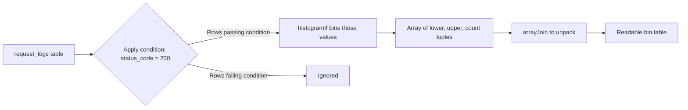

# How to Use histogramIf() in ClickHouse

Author: [nawazdhandala](https://www.github.com/nawazdhandala)

Tags: ClickHouse, SQL, Aggregate Function, Histogram, Analytics

Description: Learn how to use histogramIf() in ClickHouse to compute conditional adaptive histograms, filtering rows before building frequency distributions for segmented analysis.

---

`histogramIf(num_bins)(value, condition)` is the conditional variant of ClickHouse's adaptive histogram aggregate function. It builds a frequency distribution over `value` but only for rows where `condition` is true. This lets you compare distributions across segments without multiple subqueries or CTEs.

## Syntax

```sql
-- Basic histogramIf usage
SELECT histogramIf(num_bins)(value_column, condition) FROM table_name;

-- The result is an array of (lower, upper, count) tuples
SELECT histogramIf(10)(response_time_ms, status_code = 200) AS ok_histogram
FROM request_logs;
```

The `num_bins` parameter is a hint to the adaptive algorithm; the actual number of bins may differ based on data distribution.

## Understanding the Output

The function returns an `Array(Tuple(Float64, Float64, Float64))` where each tuple is `(lower_bound, upper_bound, count)`.

```sql
-- Unpack histogram bins for readability
SELECT
    arrayJoin(
        histogramIf(8)(response_time_ms, status_code = 200)
    ) AS bin
FROM request_logs
WHERE log_date = today();

-- Access tuple fields
SELECT
    bin.1 AS lower_ms,
    bin.2 AS upper_ms,
    bin.3 AS approx_count
FROM (
    SELECT arrayJoin(
        histogramIf(8)(response_time_ms, status_code = 200)
    ) AS bin
    FROM request_logs
    WHERE log_date = today()
);
```

## Comparing Two Distributions Side by Side

```sql
-- Success vs error response time distributions
SELECT
    histogramIf(10)(response_time_ms, status_code < 400)  AS success_hist,
    histogramIf(10)(response_time_ms, status_code >= 400) AS error_hist
FROM request_logs
WHERE log_date = today();
```

## Segmented Latency Histograms Per Service

```sql
SELECT
    service_name,
    histogramIf(10)(response_time_ms, endpoint = '/api/login')    AS login_hist,
    histogramIf(10)(response_time_ms, endpoint = '/api/checkout')  AS checkout_hist,
    histogramIf(10)(response_time_ms, endpoint = '/api/search')    AS search_hist
FROM request_logs
WHERE log_date = today()
GROUP BY service_name;
```

## Conditional Histograms for A/B Testing

```sql
-- Compare response time distribution between experiment variants
SELECT
    histogramIf(12)(response_time_ms, variant = 'control')    AS control_dist,
    histogramIf(12)(response_time_ms, variant = 'treatment')  AS treatment_dist,
    countIf(variant = 'control')    AS control_n,
    countIf(variant = 'treatment')  AS treatment_n
FROM ab_test_events
WHERE experiment_id = 'exp_2026_q1'
  AND event_date >= today() - 7;
```

## Histogram Over Time Windows

```sql
-- Hourly histograms showing how latency distribution shifts
SELECT
    toStartOfHour(timestamp)                                    AS hour,
    histogramIf(10)(response_time_ms, status_code = 200)        AS ok_hist,
    histogramIf(10)(response_time_ms, status_code >= 500)       AS error_hist
FROM request_logs
WHERE timestamp >= now() - INTERVAL 24 HOUR
GROUP BY hour
ORDER BY hour DESC;
```

## Extracting Percentile Estimates from Histogram Output

Because histogram bins are approximate, you can use them to estimate where percentiles fall.

```sql
-- Flatten bins and compute cumulative frequency to estimate p95
WITH bins AS (
    SELECT
        bin.1 AS lower_ms,
        bin.2 AS upper_ms,
        bin.3 AS bin_count,
        sum(bin.3) OVER (ORDER BY bin.1 ROWS UNBOUNDED PRECEDING) AS cumulative
    FROM (
        SELECT arrayJoin(histogramIf(20)(response_time_ms, status_code = 200)) AS bin
        FROM request_logs
        WHERE log_date = today()
    )
),
total AS (
    SELECT sum(bin.3) AS total_count
    FROM (
        SELECT arrayJoin(histogramIf(20)(response_time_ms, status_code = 200)) AS bin
        FROM request_logs
        WHERE log_date = today()
    )
)
SELECT
    lower_ms,
    upper_ms,
    bin_count,
    cumulative,
    round(cumulative / total_count * 100, 1) AS cumulative_pct
FROM bins, total
ORDER BY lower_ms;
```

## Combining with -If Conditions for Multi-Dimensional Filtering

```sql
-- Histogram of CPU usage only during business hours and only on production hosts
SELECT
    histogramIf(
        10
    )(
        cpu_percent,
        toHour(metric_time) BETWEEN 9 AND 17
        AND environment = 'production'
    ) AS prod_biz_hours_cpu_dist
FROM host_metrics
WHERE metric_date >= today() - 7;
```

## Visualizing with Mermaid



## Summary

`histogramIf(num_bins)(value, condition)` computes an adaptive histogram over a numeric column restricted to rows where the condition is true. It returns an array of `(lower, upper, count)` tuples that can be unpacked with `arrayJoin`. The primary advantage over a plain `histogram()` after a WHERE clause is that you can compute multiple conditional histograms in a single scan, making it efficient for side-by-side distribution comparisons across segments, experiment variants, or status codes.
