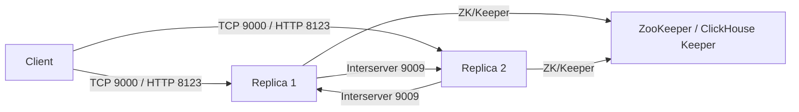

# How to Configure ClickHouse Interserver HTTP Port

Author: OneUptime Team

Tags: ClickHouse, Configuration, Replication, Networking, Cluster

Description: Learn how to configure the ClickHouse interserver HTTP port used for part replication and data exchange between replica nodes.

---

ClickHouse replicas communicate with each other over a dedicated HTTP endpoint called the interserver HTTP port. This port is used to transfer data parts during replication, fetch missing parts, and synchronize replica states. It is separate from the client-facing HTTP port (8123) and must be reachable between all nodes in a replication group.

## Default Port

The default interserver HTTP port is `9009`. The TLS variant defaults to `9010`.

```xml
<!-- /etc/clickhouse-server/config.d/interserver.xml -->
<clickhouse>
    <interserver_http_port>9009</interserver_http_port>

    <!-- For TLS replication (requires certificate config) -->
    <!-- <interserver_https_port>9010</interserver_https_port> -->
</clickhouse>
```

## interserver_http_host

You must also set `interserver_http_host` so each replica advertises the correct address to its peers. Without this, replicas may advertise `localhost` which other nodes cannot reach.

```xml
<clickhouse>
    <interserver_http_port>9009</interserver_http_port>
    <interserver_http_host>clickhouse-replica-1.internal.example.com</interserver_http_host>
</clickhouse>
```

On each replica, set this to the hostname or IP that other replicas can reach. In Kubernetes:

```xml
<clickhouse>
    <interserver_http_port>9009</interserver_http_port>
    <interserver_http_host from_env="HOSTNAME"/>
</clickhouse>
```

## Architecture



## Verifying the Interserver Port

After configuration, verify the port is listening:

```bash
ss -tlnp | grep 9009
```

Test connectivity from another node:

```bash
curl -s "http://clickhouse-replica-2.internal:9009/"
# Expected: "Ok." or a redirect - any non-connection-refused response means the port is open
```

## Interserver Authentication

In ClickHouse 22.4+ you can require password authentication for interserver communication:

```xml
<clickhouse>
    <interserver_http_port>9009</interserver_http_port>
    <interserver_http_credentials>
        <user>interserver</user>
        <password>secret_replication_password</password>
    </interserver_http_credentials>
</clickhouse>
```

All replicas in the same shard must share the same credentials.

## TLS for Interserver Communication

For encrypted replication traffic, use `interserver_https_port` with a certificate:

```xml
<clickhouse>
    <interserver_https_port>9010</interserver_https_port>
    <interserver_http_host>clickhouse-1.internal.example.com</interserver_http_host>

    <openSSL>
        <server>
            <certificateFile>/etc/clickhouse-server/certs/server.crt</certificateFile>
            <privateKeyFile>/etc/clickhouse-server/certs/server.key</privateKeyFile>
            <caConfig>/etc/clickhouse-server/certs/ca.crt</caConfig>
            <verificationMode>strict</verificationMode>
        </server>
    </openSSL>
</clickhouse>
```

## Replication Lag Monitoring

If interserver connectivity is degraded, replication lag increases. Monitor with:

```sql
SELECT
    database,
    table,
    replica_name,
    absolute_delay,
    inserts_in_queue,
    merges_in_queue
FROM system.replicas
ORDER BY absolute_delay DESC;
```

Alert if `absolute_delay` exceeds a few minutes or `inserts_in_queue` grows unbounded.

## Firewall Rules for Interserver Port

All ClickHouse nodes in a replication group need bidirectional access on port 9009:

```bash
# On each node, allow all replica IPs
ufw allow from 10.0.1.10 to any port 9009 proto tcp
ufw allow from 10.0.1.11 to any port 9009 proto tcp
ufw allow from 10.0.1.12 to any port 9009 proto tcp
```

Do not expose port 9009 to the public internet. It has no authentication by default (unless you configure `interserver_http_credentials`).

## Summary

Configure `interserver_http_port` (default 9009) and always set `interserver_http_host` to the address other replicas can reach. Enable `interserver_http_credentials` in production to authenticate replication traffic. Use `interserver_https_port` when replication traffic crosses untrusted networks. Monitor `system.replicas` for absolute delay and queue depth.
