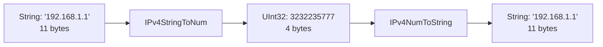

# How to Use IPv4NumToString() and IPv4StringToNum() in ClickHouse

Author: [nawazdhandala](https://www.github.com/nawazdhandala)

Tags: ClickHouse, SQL, IP Address, IPv4, Function, Network Analytics

Description: Learn how to convert IPv4 addresses between numeric UInt32 representation and dotted-decimal strings in ClickHouse using IPv4NumToString() and IPv4StringToNum().

---

ClickHouse stores IPv4 addresses efficiently as `UInt32` values (4 bytes per address) rather than as strings. The `IPv4NumToString()` and `IPv4StringToNum()` functions convert between these two representations, enabling both efficient storage and human-readable output.

## How These Functions Work

- `IPv4NumToString(num)` - converts a `UInt32` number to a dotted-decimal IPv4 string like `192.168.1.1`.
- `IPv4StringToNum(str)` - converts a dotted-decimal IPv4 string to a `UInt32` number. Returns `0` for invalid input.
- `IPv4StringToNumOrNull(str)` - like `IPv4StringToNum()` but returns `NULL` for invalid input instead of `0`.
- `IPv4StringToNumOrDefault(str, default)` - returns a specified default value for invalid input.

The numeric representation uses network byte order (big-endian): `192.168.1.1` = `(192 << 24) | (168 << 16) | (1 << 8) | 1` = `3232235777`.

## Syntax

```sql
IPv4NumToString(uint32_value)
IPv4StringToNum(ipv4_string)
IPv4StringToNumOrNull(ipv4_string)
```

## Storage Comparison



## Examples

### Converting String to Number

```sql
SELECT
    IPv4StringToNum('192.168.1.1')   AS ip_num,
    IPv4StringToNum('10.0.0.1')      AS private_ip_num,
    IPv4StringToNum('255.255.255.255') AS broadcast_num;
```

```text
ip_num       private_ip_num  broadcast_num
3232235777   167772161       4294967295
```

### Converting Number Back to String

```sql
SELECT IPv4NumToString(3232235777) AS ip_str;
```

```text
ip_str
192.168.1.1
```

### Handling Invalid Input

```sql
SELECT
    IPv4StringToNum('not-an-ip')       AS invalid_zero,
    IPv4StringToNumOrNull('not-an-ip') AS invalid_null;
```

```text
invalid_zero  invalid_null
0             NULL
```

### IP Range Arithmetic

Numeric IPs enable arithmetic comparisons for subnet checks:

```sql
SELECT
    IPv4NumToString(IPv4StringToNum('10.0.0.1') + 1)   AS next_ip,
    IPv4NumToString(IPv4StringToNum('10.0.0.254') + 1) AS broadcast_ish;
```

```text
next_ip   broadcast_ish
10.0.0.2  10.0.0.255
```

### Complete Working Example

Store access logs with IP as UInt32 for efficient storage and filter/display as string:

```sql
CREATE TABLE access_log
(
    request_id UInt64,
    client_ip  UInt32,
    status     UInt16,
    bytes      UInt32
) ENGINE = MergeTree()
ORDER BY request_id;

INSERT INTO access_log VALUES
    (1, IPv4StringToNum('203.0.113.10'),  200, 4096),
    (2, IPv4StringToNum('198.51.100.5'),  404, 512),
    (3, IPv4StringToNum('203.0.113.10'),  200, 8192),
    (4, IPv4StringToNum('192.0.2.15'),    500, 256),
    (5, IPv4StringToNum('203.0.113.22'),  200, 2048);

SELECT
    IPv4NumToString(client_ip) AS ip_address,
    count()                    AS requests,
    sum(bytes)                 AS total_bytes
FROM access_log
WHERE status = 200
GROUP BY client_ip
ORDER BY requests DESC;
```

```text
ip_address      requests  total_bytes
203.0.113.10    2         12288
203.0.113.22    1         2048
```

## Summary

`IPv4NumToString()` and `IPv4StringToNum()` enable efficient storage of IPv4 addresses as `UInt32` in ClickHouse, saving 7 bytes per address compared to string storage. Use `IPv4StringToNum()` at insert time to convert incoming string IPs to numbers, and `IPv4NumToString()` at query time to present them as human-readable dotted-decimal strings. Use `IPv4StringToNumOrNull()` when parsing untrusted input to safely handle invalid IP strings.
