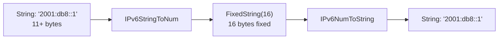

# How to Use IPv6NumToString() and IPv6StringToNum() in ClickHouse

Author: [nawazdhandala](https://www.github.com/nawazdhandala)

Tags: ClickHouse, SQL, IP Address, IPv6, Function, Network Analytics

Description: Learn how to convert IPv6 addresses between binary FixedString(16) storage and human-readable string format in ClickHouse using IPv6NumToString() and IPv6StringToNum().

---

IPv6 addresses are 128-bit values. ClickHouse stores them as `FixedString(16)` (16 bytes in binary form) for efficiency. The `IPv6NumToString()` and `IPv6StringToNum()` functions convert between this compact binary representation and the standard colon-separated hexadecimal string format.

## How These Functions Work

- `IPv6StringToNum(str)` - converts an IPv6 string (e.g., `2001:db8::1`) to a 16-byte `FixedString(16)`. Also handles IPv4-mapped IPv6 addresses.
- `IPv6NumToString(binary)` - converts the 16-byte binary representation back to a human-readable IPv6 string in lowercase compressed form.
- `IPv6StringToNumOrNull(str)` - returns `NULL` for invalid input instead of throwing.

## Syntax

```sql
IPv6StringToNum(ipv6_string)
IPv6NumToString(fixedstring16_value)
IPv6StringToNumOrNull(ipv6_string)
```

## Binary Storage



## Examples

### Converting IPv6 String to Binary

```sql
SELECT
    hex(IPv6StringToNum('2001:db8::1'))   AS hex_repr,
    length(IPv6StringToNum('2001:db8::1')) AS byte_length;
```

```text
hex_repr                          byte_length
20010DB8000000000000000000000001  16
```

### Converting Binary Back to String

```sql
SELECT IPv6NumToString(IPv6StringToNum('2001:db8:cafe::1')) AS ipv6_str;
```

```text
ipv6_str
2001:db8:cafe::1
```

### IPv4-Mapped IPv6 Addresses

The function handles IPv4-mapped IPv6 addresses:

```sql
SELECT IPv6NumToString(IPv6StringToNum('::ffff:192.168.1.1')) AS mapped_ipv4;
```

```text
mapped_ipv4
::ffff:192.168.1.1
```

### Handling Invalid Input

```sql
SELECT
    IPv6StringToNumOrNull('not-valid-ipv6') AS invalid_null,
    IPv6StringToNumOrNull('2001:db8::1')    AS valid_binary IS NOT NULL AS is_valid;
```

```text
invalid_null  is_valid
NULL          1
```

### Complete Working Example

Store and query IPv6 access logs with binary IP storage:

```sql
CREATE TABLE ipv6_access_log
(
    request_id UInt64,
    client_ip  FixedString(16),
    method     String,
    status     UInt16
) ENGINE = MergeTree()
ORDER BY request_id;

INSERT INTO ipv6_access_log VALUES
    (1, IPv6StringToNum('2001:db8::1'),       'GET',  200),
    (2, IPv6StringToNum('2001:db8::2'),       'POST', 201),
    (3, IPv6StringToNum('2001:db8::1'),       'GET',  200),
    (4, IPv6StringToNum('fe80::1'),           'GET',  404),
    (5, IPv6StringToNum('::ffff:10.0.0.5'),   'PUT',  200);

SELECT
    IPv6NumToString(client_ip) AS ip_address,
    method,
    count()                    AS requests,
    countIf(status = 200)      AS success
FROM ipv6_access_log
GROUP BY client_ip, method
ORDER BY requests DESC;
```

```text
ip_address           method  requests  success
2001:db8::1          GET     2         2
2001:db8::2          POST    1         0
::ffff:10.0.0.5      PUT     1         1
fe80::1              GET     1         0
```

## Summary

`IPv6StringToNum()` and `IPv6NumToString()` convert IPv6 addresses between human-readable string format and the compact 16-byte `FixedString(16)` binary representation used for efficient storage in ClickHouse. Store IPs in binary form to save space and enable fast binary comparisons, and use `IPv6NumToString()` only in SELECT output. For handling untrusted input, prefer `IPv6StringToNumOrNull()` to avoid query failures on malformed addresses.
