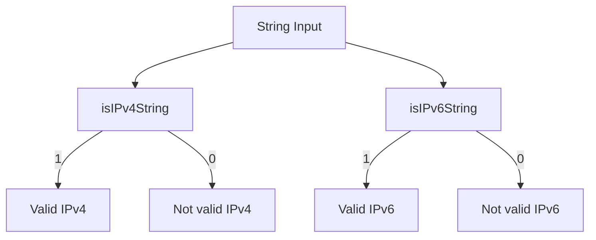

# How to Use isIPv4String() and isIPv6String() in ClickHouse

Author: [nawazdhandala](https://www.github.com/nawazdhandala)

Tags: ClickHouse, SQL, IP Address, IPv4, IPv6, Validation, Function

Description: Learn how to validate whether a string contains a valid IPv4 or IPv6 address in ClickHouse using isIPv4String() and isIPv6String().

---

When processing network logs, user-submitted data, or mixed IP address columns, you often need to determine whether a given string is a valid IPv4 or IPv6 address before attempting conversion or filtering. ClickHouse provides `isIPv4String()` and `isIPv6String()` for this validation.

## How These Functions Work

- `isIPv4String(str)` - returns `1` if the string is a valid dotted-decimal IPv4 address (e.g., `192.168.1.1`), `0` otherwise.
- `isIPv6String(str)` - returns `1` if the string is a valid IPv6 address in any recognized format, `0` otherwise.

Both functions perform format validation only - they do not check whether the address is routable or assigned.

## Syntax

```sql
isIPv4String(string)
isIPv6String(string)
```

## Validation Flow



## Examples

### Basic Validation

```sql
SELECT
    isIPv4String('192.168.1.1')      AS valid_v4,
    isIPv4String('256.0.0.1')        AS invalid_v4_octet,
    isIPv4String('192.168.1')        AS incomplete_v4,
    isIPv6String('2001:db8::1')      AS valid_v6,
    isIPv6String('::1')              AS loopback_v6,
    isIPv6String('not-an-ip')        AS invalid_v6;
```

```text
valid_v4  invalid_v4_octet  incomplete_v4  valid_v6  loopback_v6  invalid_v6
1         0                 0              1         1            0
```

### Filtering Valid IPs Before Conversion

Always validate before converting to avoid errors:

```sql
SELECT
    ip_str,
    if(isIPv4String(ip_str), IPv4StringToNum(ip_str), NULL) AS ip_num
FROM (
    SELECT '192.168.1.1'  AS ip_str UNION ALL
    SELECT '10.0.0.5'     AS ip_str UNION ALL
    SELECT 'invalid'      AS ip_str UNION ALL
    SELECT '172.16.0.100' AS ip_str
);
```

```text
ip_str         ip_num
192.168.1.1    3232235777
10.0.0.5       167772165
invalid        NULL
172.16.0.100   2886729828
```

### Classifying Mixed IP Column

Determine whether each IP is v4, v6, or neither:

```sql
SELECT
    ip_str,
    multiIf(
        isIPv4String(ip_str), 'IPv4',
        isIPv6String(ip_str), 'IPv6',
        'Invalid'
    ) AS ip_version
FROM (
    SELECT '203.0.113.5'    AS ip_str UNION ALL
    SELECT '2001:db8::cafe' AS ip_str UNION ALL
    SELECT '::ffff:192.0.2.1' AS ip_str UNION ALL
    SELECT 'garbage'        AS ip_str
);
```

```text
ip_str             ip_version
203.0.113.5        IPv4
2001:db8::cafe     IPv6
::ffff:192.0.2.1   IPv6
garbage            Invalid
```

### Complete Working Example

Process a mixed log table with both IPv4 and IPv6 client addresses:

```sql
CREATE TABLE mixed_ip_log
(
    log_id    UInt64,
    client_ip String,
    status    UInt16
) ENGINE = MergeTree()
ORDER BY log_id;

INSERT INTO mixed_ip_log VALUES
    (1, '192.168.1.10',     200),
    (2, '2001:db8::1',      200),
    (3, 'bad-ip',           400),
    (4, '10.0.0.5',         404),
    (5, 'fe80::1',          200),
    (6, '203.0.113.99',     500);

SELECT
    multiIf(
        isIPv4String(client_ip), 'IPv4',
        isIPv6String(client_ip), 'IPv6',
        'Invalid'
    )                  AS ip_type,
    count()            AS total_requests,
    countIf(status = 200) AS successful
FROM mixed_ip_log
GROUP BY ip_type
ORDER BY total_requests DESC;
```

```text
ip_type  total_requests  successful
IPv4     3               1
IPv6     2               2
Invalid  1               0
```

## Summary

`isIPv4String()` and `isIPv6String()` are validation functions that return 1 or 0 to indicate whether a string contains a valid IPv4 or IPv6 address. Use them to validate and classify IP strings before passing them to conversion functions like `IPv4StringToNum()` or `IPv6StringToNum()`, and use them with `multiIf()` to route mixed IP columns to the correct processing path.
