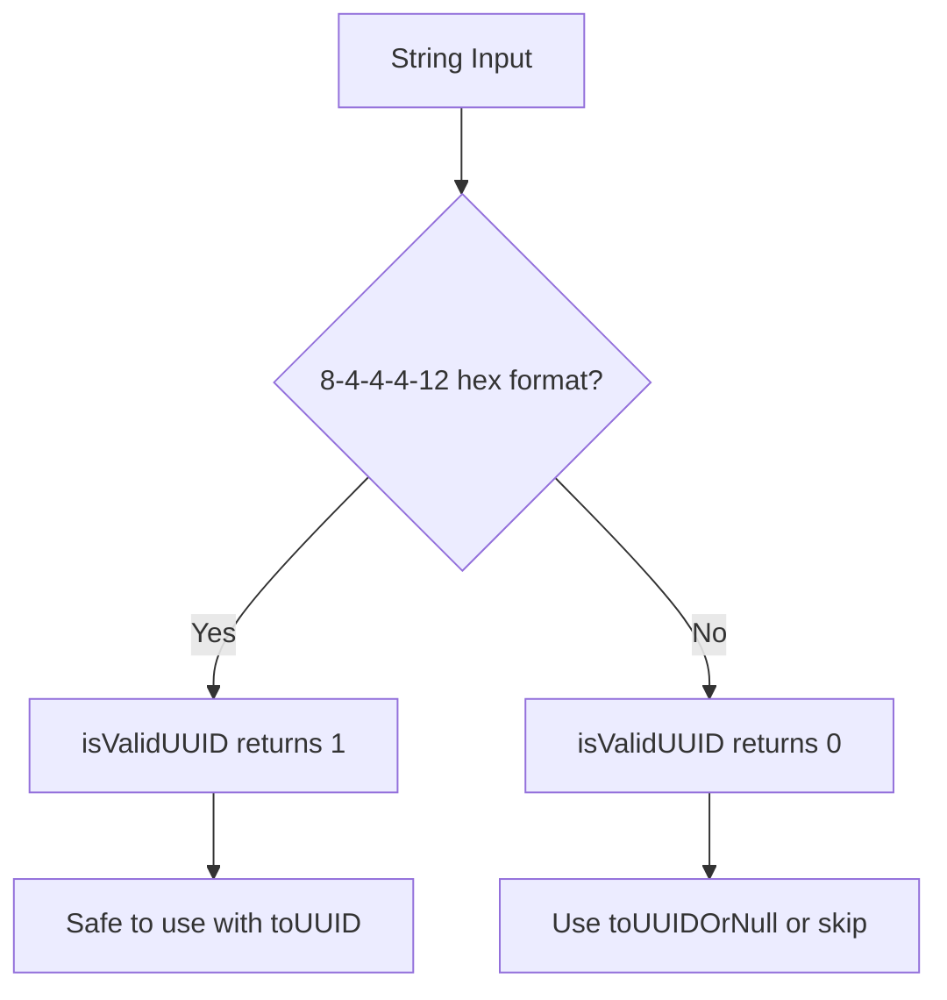

# How to Use isValidUUID() in ClickHouse

Author: [nawazdhandala](https://www.github.com/nawazdhandala)

Tags: ClickHouse, SQL, UUID, Validation, Function, isValidUUID

Description: Learn how to validate UUID strings in ClickHouse using isValidUUID() to check format compliance before type conversion or storage.

---

When ingesting data from external systems, UUID fields may arrive as strings that are malformed, empty, or replaced with placeholder values. The `isValidUUID()` function lets you validate these strings before conversion, preventing errors and bad data from entering your tables.

## How isValidUUID() Works

`isValidUUID(str)` returns `1` if the string is a valid UUID in the standard format `xxxxxxxx-xxxx-xxxx-xxxx-xxxxxxxxxxxx` where `x` is a hexadecimal digit. It returns `0` for any other input including empty strings, UUIDs without hyphens, or strings with invalid characters.

## Syntax

```sql
isValidUUID(string)
```

## Validation Logic



## Examples

### Basic Validation

```sql
SELECT
    isValidUUID('550e8400-e29b-41d4-a716-446655440000') AS standard_uuid,
    isValidUUID('550e8400e29b41d4a716446655440000')       AS no_hyphens,
    isValidUUID('not-a-uuid')                             AS invalid_str,
    isValidUUID('')                                       AS empty_str,
    isValidUUID('00000000-0000-0000-0000-000000000000')   AS nil_uuid;
```

```text
standard_uuid  no_hyphens  invalid_str  empty_str  nil_uuid
1              0           0            0          1
```

### Safe Conditional Conversion

Use `isValidUUID()` to gate `toUUID()` calls:

```sql
SELECT
    raw_id,
    if(isValidUUID(raw_id), toUUID(raw_id), NULL) AS uuid_val
FROM (
    SELECT '550e8400-e29b-41d4-a716-446655440001' AS raw_id UNION ALL
    SELECT 'invalid-uuid-value'                   AS raw_id UNION ALL
    SELECT '6ba7b810-9dad-11d1-80b4-00c04fd430c8' AS raw_id UNION ALL
    SELECT ''                                      AS raw_id
);
```

```text
raw_id                                uuid_val
550e8400-e29b-41d4-a716-446655440001  550e8400-e29b-41d4-a716-446655440001
invalid-uuid-value                    NULL
6ba7b810-9dad-11d1-80b4-00c04fd430c8  6ba7b810-9dad-11d1-80b4-00c04fd430c8
(empty)                               NULL
```

### Filtering Valid UUIDs

Filter out rows with invalid UUID fields before processing:

```sql
SELECT count() AS valid_count
FROM (
    SELECT '550e8400-e29b-41d4-a716-446655440001' AS id UNION ALL
    SELECT 'N/A'                                   AS id UNION ALL
    SELECT '6ba7b810-9dad-11d1-80b4-00c04fd430c8' AS id UNION ALL
    SELECT 'placeholder'                           AS id UNION ALL
    SELECT '00000000-0000-0000-0000-000000000000' AS id
)
WHERE isValidUUID(id) = 1;
```

```text
valid_count
3
```

### Complete Working Example

Validate and clean an external data feed with mixed-quality UUID fields:

```sql
CREATE TABLE external_events
(
    row_id      UInt64,
    event_uuid  String,
    event_type  String
) ENGINE = MergeTree()
ORDER BY row_id;

INSERT INTO external_events VALUES
    (1, '550e8400-e29b-41d4-a716-446655440001', 'click'),
    (2, 'N/A',                                   'view'),
    (3, '6ba7b810-9dad-11d1-80b4-00c04fd430c8',  'purchase'),
    (4, '',                                       'login'),
    (5, '7c9e6679-7425-40de-944b-e07fc1f90ae7',  'logout');

SELECT
    row_id,
    event_type,
    isValidUUID(event_uuid)                          AS is_valid,
    if(isValidUUID(event_uuid), event_uuid, 'INVALID') AS uuid_display
FROM external_events
ORDER BY row_id;
```

```text
row_id  event_type  is_valid  uuid_display
1       click       1         550e8400-e29b-41d4-a716-446655440001
2       view        0         INVALID
3       purchase    1         6ba7b810-9dad-11d1-80b4-00c04fd430c8
4       login       0         INVALID
5       logout      1         7c9e6679-7425-40de-944b-e07fc1f90ae7
```

## Summary

`isValidUUID()` is a simple validation function that returns 1 for properly formatted UUID strings and 0 for everything else. Use it as a guard before calling `toUUID()` to prevent query failures, or in `WHERE` clauses to filter rows with invalid UUID fields. Combined with `if()` or `multiIf()`, it enables safe conditional UUID processing in data cleaning pipelines.
