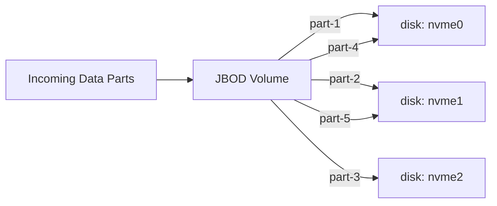

# How to Use JBOD Storage Policy in ClickHouse

Author: [nawazdhandala](https://www.github.com/nawazdhandala)

Tags: ClickHouse, Storage, JBOD, Disk, Policy, Performance

Description: Learn how to configure a JBOD (Just a Bunch of Disks) storage policy in ClickHouse to stripe data across multiple local disks for higher throughput and capacity.

---

## Introduction

JBOD (Just a Bunch of Disks) in ClickHouse means placing multiple physical disks in a single volume. ClickHouse writes new data parts to disks in round-robin order, distributing the write load and aggregating total capacity. JBOD is ideal when you have several local NVMe or SSD drives and want to use them all without RAID overhead.

## How JBOD Works in ClickHouse



ClickHouse picks the disk with the most free space for each new part write. This is not strict round-robin -- it is free-space-weighted to avoid filling any single disk.

## Preparing Mount Points

Format and mount each drive:

```bash
# Format each drive
mkfs.ext4 /dev/nvme0n1
mkfs.ext4 /dev/nvme1n1
mkfs.ext4 /dev/nvme2n1

# Create mount points
mkdir -p /mnt/nvme0/clickhouse
mkdir -p /mnt/nvme1/clickhouse
mkdir -p /mnt/nvme2/clickhouse

# Add to /etc/fstab
echo "/dev/nvme0n1 /mnt/nvme0 ext4 defaults 0 0" >> /etc/fstab
echo "/dev/nvme1n1 /mnt/nvme1 ext4 defaults 0 0" >> /etc/fstab
echo "/dev/nvme2n1 /mnt/nvme2 ext4 defaults 0 0" >> /etc/fstab

mount -a

# Set permissions
chown -R clickhouse:clickhouse /mnt/nvme0/clickhouse
chown -R clickhouse:clickhouse /mnt/nvme1/clickhouse
chown -R clickhouse:clickhouse /mnt/nvme2/clickhouse
```

## Configuring the JBOD Policy

Create `/etc/clickhouse-server/config.d/jbod.xml`:

```xml
<clickhouse>
  <storage_configuration>
    <disks>
      <nvme0>
        <type>local</type>
        <path>/mnt/nvme0/clickhouse/</path>
      </nvme0>
      <nvme1>
        <type>local</type>
        <path>/mnt/nvme1/clickhouse/</path>
      </nvme1>
      <nvme2>
        <type>local</type>
        <path>/mnt/nvme2/clickhouse/</path>
      </nvme2>
    </disks>

    <policies>
      <jbod>
        <volumes>
          <main>
            <disk>nvme0</disk>
            <disk>nvme1</disk>
            <disk>nvme2</disk>
          </main>
        </volumes>
      </jbod>
    </policies>
  </storage_configuration>
</clickhouse>
```

## Applying the Policy to a Table

```sql
CREATE TABLE access_logs
(
    log_id     UInt64,
    host       String,
    path       String,
    status     UInt16,
    bytes_sent UInt32,
    ts         DateTime
)
ENGINE = MergeTree
PARTITION BY toYYYYMM(ts)
ORDER BY (ts, host)
SETTINGS storage_policy = 'jbod';
```

## Verifying Part Distribution

```sql
SELECT
    disk_name,
    count()        AS parts,
    sum(bytes_on_disk) AS total_bytes
FROM system.parts
WHERE table = 'access_logs'
  AND active = 1
GROUP BY disk_name
ORDER BY disk_name;
```

```
disk_name   parts   total_bytes
nvme0       12      42000000000
nvme1       11      38000000000
nvme2       13      45000000000
```

## JBOD with a Cold S3 Tier

Combine JBOD for hot data with S3 for cold data:

```xml
<policies>
  <jbod_hot_s3_cold>
    <volumes>
      <hot>
        <disk>nvme0</disk>
        <disk>nvme1</disk>
        <disk>nvme2</disk>
        <max_data_part_size_bytes>5368709120</max_data_part_size_bytes>
      </hot>
      <cold>
        <disk>s3_archive</disk>
      </cold>
    </volumes>
    <move_factor>0.1</move_factor>
  </jbod_hot_s3_cold>
</policies>
```

TTL move rule:

```sql
ALTER TABLE access_logs
    MODIFY TTL ts + INTERVAL 90 DAY
    TO VOLUME 'cold';
```

## Disk Space Monitoring

```sql
SELECT
    name,
    type,
    formatReadableSize(free_space)  AS free,
    formatReadableSize(total_space) AS total,
    round((1 - free_space / total_space) * 100, 1) AS used_pct
FROM system.disks
WHERE name IN ('nvme0', 'nvme1', 'nvme2');
```

## What JBOD Does Not Provide

- No redundancy: a single disk failure loses the parts on that disk. Use ClickHouse replication across nodes for durability.
- No striping of a single part: each part lands entirely on one disk.

## Summary

JBOD in ClickHouse lets you place multiple local disks in a single volume so new data parts are distributed across drives based on free space. Configure it with multiple `<disk>` entries inside a `<volume>` block in `storage_configuration`. Use JBOD when you need high local write throughput and have several drives, then pair it with a cold S3 volume and TTL moves for long-term retention.
