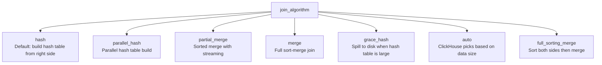

# How to Configure join_algorithm Setting in ClickHouse

Author: [nawazdhandala](https://www.github.com/nawazdhandala)

Tags: ClickHouse, Join, Performance, Configuration, Query, Optimization

Description: Learn how to configure the join_algorithm setting in ClickHouse to choose between hash join, merge join, partial merge, and grace hash join for optimal query performance.

---

## Introduction

ClickHouse supports multiple join algorithms, each with different memory and CPU trade-offs. The `join_algorithm` setting selects which algorithm to use. Choosing the right algorithm can mean the difference between a query that runs in seconds versus one that exhausts memory or spills to disk.

## Available Join Algorithms



## Join Algorithm Comparison

| Algorithm | Memory | Speed | Use Case |
|---|---|---|---|
| `hash` | High (right side fits RAM) | Fast | Right side small, left side large |
| `parallel_hash` | High | Very fast | Large right side, many CPU cores |
| `partial_merge` | Low | Medium | Right side too large for RAM |
| `merge` | Low | Medium | Both sides sorted by join key |
| `grace_hash` | Medium (spills to disk) | Fast | Right side slightly larger than RAM |
| `auto` | Adaptive | Adaptive | Default safe choice |

## Checking Current Setting

```sql
SELECT name, value
FROM system.settings
WHERE name = 'join_algorithm';
```

## Setting join_algorithm Per Query

```sql
-- Hash join (default behavior)
SELECT
    o.order_id,
    c.name AS customer_name
FROM orders AS o
JOIN customers AS c ON o.customer_id = c.id
SETTINGS join_algorithm = 'hash';
```

```sql
-- Parallel hash (better for large right-side tables with many cores)
SELECT
    l.log_id,
    u.email
FROM access_logs AS l
JOIN users AS u ON l.user_id = u.id
SETTINGS join_algorithm = 'parallel_hash';
```

```sql
-- Grace hash (right side too large for RAM, spills to disk)
SELECT
    e.event_id,
    p.page_name
FROM events AS e
JOIN pages AS p ON e.page_id = p.id
SETTINGS
    join_algorithm = 'grace_hash',
    grace_hash_join_initial_buckets = 16;
```

```sql
-- Partial merge (streaming join, minimal memory)
SELECT
    a.session_id,
    b.conversion_type
FROM sessions AS a
JOIN conversions AS b ON a.session_id = b.session_id
SETTINGS join_algorithm = 'partial_merge';
```

## Setting Globally via Profile

```xml
<profiles>
  <default>
    <join_algorithm>auto</join_algorithm>
  </default>
  <memory_constrained>
    <join_algorithm>partial_merge</join_algorithm>
    <max_memory_usage>4294967296</max_memory_usage>
  </memory_constrained>
</profiles>
```

## auto Mode

With `join_algorithm = 'auto'`, ClickHouse starts with a hash join and switches to `grace_hash` if the hash table exceeds `max_bytes_in_join`:

```sql
SELECT o.order_id, c.name
FROM orders AS o
JOIN customers AS c ON o.customer_id = c.id
SETTINGS
    join_algorithm  = 'auto',
    max_bytes_in_join = 1073741824;
```

## Optimizing Hash Join Memory

Control the maximum size of the hash table built from the right-side table:

```sql
SELECT e.event_id, p.page_name
FROM events AS e
JOIN pages AS p ON e.page_id = p.id
SETTINGS
    join_algorithm       = 'hash',
    max_bytes_in_join    = 536870912,
    join_overflow_mode   = 'throw';
```

## Analyzing Join Performance

Use EXPLAIN to see which join algorithm will be used:

```sql
EXPLAIN PIPELINE
SELECT o.order_id, c.name
FROM orders AS o
JOIN customers AS c ON o.customer_id = c.id
SETTINGS join_algorithm = 'hash';
```

Check actual join memory usage:

```sql
SELECT
    query,
    peak_memory_usage,
    query_duration_ms
FROM system.query_log
WHERE type = 'QueryFinish'
  AND query LIKE '%JOIN customers%'
ORDER BY event_time DESC
LIMIT 5;
```

## Summary

The `join_algorithm` setting lets you choose between hash join, parallel hash, grace hash, partial merge, merge, and auto modes in ClickHouse. Hash join is fastest when the right-side table fits in memory. Use `grace_hash` when the right side is too large for RAM (it spills to disk). Use `partial_merge` for the lowest memory footprint. The `auto` mode is a safe default that switches algorithms based on actual data size during execution.
