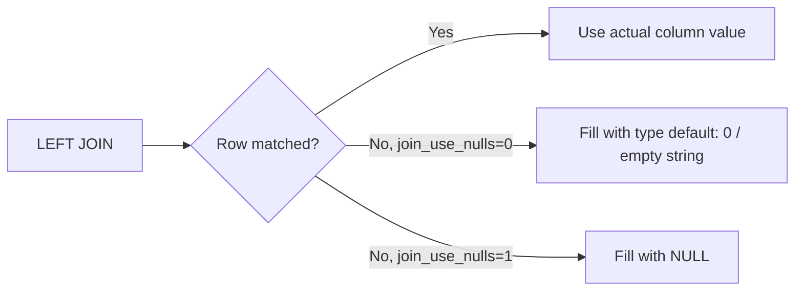

# How to Set join_use_nulls for NULL Handling in JOINs in ClickHouse

Author: [nawazdhandala](https://www.github.com/nawazdhandala)

Tags: ClickHouse, Join, Null, Configuration, Query

Description: Learn how join_use_nulls changes NULL behavior in ClickHouse JOINs, how it affects LEFT and RIGHT joins, and when to enable it for SQL compatibility.

---

ClickHouse has a non-standard default behavior for `LEFT JOIN` and `RIGHT JOIN`: when there is no matching row on the nullable side, it fills missing columns with the default value for their type (0 for numbers, empty string for `String`, etc.) rather than `NULL`. This surprises developers coming from PostgreSQL or MySQL. The `join_use_nulls` setting restores standard SQL behavior by substituting `NULL` for unmatched columns.

## Default Behavior Without join_use_nulls

By default, `join_use_nulls = 0`. Missing right-side columns are filled with type defaults:

```sql
CREATE TABLE users (id UInt32, name String) ENGINE = MergeTree() ORDER BY id;
CREATE TABLE orders (user_id UInt32, amount Float64) ENGINE = MergeTree() ORDER BY user_id;

INSERT INTO users VALUES (1, 'Alice'), (2, 'Bob'), (3, 'Carol');
INSERT INTO orders VALUES (1, 99.99), (1, 49.50);

-- join_use_nulls = 0 (default)
SELECT u.id, u.name, o.amount
FROM users u
LEFT JOIN orders o ON u.id = o.user_id;
```

Result:

| id | name  | amount |
|----|-------|--------|
| 1  | Alice | 99.99  |
| 1  | Alice | 49.50  |
| 2  | Bob   | 0      |
| 3  | Carol | 0      |

`Bob` and `Carol` have `amount = 0` instead of `NULL`.

## Enabling join_use_nulls

```sql
SET join_use_nulls = 1;

SELECT u.id, u.name, o.amount
FROM users u
LEFT JOIN orders o ON u.id = o.user_id;
```

Result:

| id | name  | amount |
|----|-------|--------|
| 1  | Alice | 99.99  |
| 1  | Alice | 49.50  |
| 2  | Bob   | NULL   |
| 3  | Carol | NULL   |

Now unmatched rows produce `NULL`, matching standard SQL semantics.

## Column Type Implications

When `join_use_nulls = 1`, ClickHouse internally wraps the right-side columns in `Nullable(T)`. If those columns were declared as non-nullable, the engine promotes them for the duration of the query. This has a minor performance cost because `Nullable` columns carry an extra null byte per value.

```sql
-- Confirm result column types with join_use_nulls enabled
SET join_use_nulls = 1;

SELECT toTypeName(o.amount)
FROM users u
LEFT JOIN orders o ON u.id = o.user_id
LIMIT 1;
-- Returns: Nullable(Float64)
```

## Behavior Comparison



## Setting Per Query

```sql
SELECT
    u.name,
    coalesce(o.amount, 0) AS paid
FROM users u
LEFT JOIN orders o ON u.id = o.user_id
SETTINGS join_use_nulls = 1;
```

Using `coalesce` with `join_use_nulls = 1` gives you explicit null-to-default conversion, which is often clearer than relying on the implicit default fill.

## Setting in Users Profile

To enable for all queries from a specific user profile, add it to `users.xml`:

```xml
<profiles>
  <sql_compatible>
    <join_use_nulls>1</join_use_nulls>
  </sql_compatible>
</profiles>
```

Or via SQL for ClickHouse 22.4+:

```sql
ALTER USER analytics_user SETTINGS join_use_nulls = 1;
```

## Filtering Unmatched Rows

With `join_use_nulls = 1`, you can use standard `IS NULL` to find unmatched rows:

```sql
SET join_use_nulls = 1;

-- Find users with no orders
SELECT u.id, u.name
FROM users u
LEFT JOIN orders o ON u.id = o.user_id
WHERE o.user_id IS NULL;
```

With `join_use_nulls = 0` (default), you must check the default value instead:

```sql
-- With default behavior, check the default for UInt32 = 0
SELECT u.id, u.name
FROM users u
LEFT JOIN orders o ON u.id = o.user_id
WHERE o.user_id = 0;
```

## FULL OUTER JOIN with join_use_nulls

`FULL JOIN` always produces `NULL` for unmatched sides, but only when `join_use_nulls = 1` does this behave predictably for `IS NULL` checks:

```sql
SET join_use_nulls = 1;

SELECT u.id, u.name, o.amount
FROM users u
FULL JOIN orders o ON u.id = o.user_id
ORDER BY u.id;
```

## Summary

`join_use_nulls = 1` makes ClickHouse `LEFT`, `RIGHT`, and `FULL` joins behave like standard SQL, producing `NULL` for unmatched columns instead of type defaults. Enable it when migrating SQL from other databases, when using `IS NULL` filters on join results, or when integrating with tools that expect standard null semantics. Be aware of the minor overhead from promoting columns to `Nullable` types during query execution.
