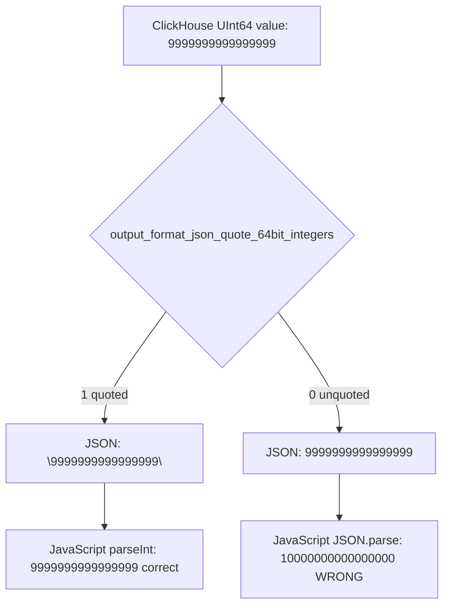

# How to Set output_format_json_quote_64bit_integers in ClickHouse

Author: [nawazdhandala](https://www.github.com/nawazdhandala)

Tags: ClickHouse, Json, Configuration, Format, Output

Description: Learn how output_format_json_quote_64bit_integers controls whether 64-bit integers are quoted as strings in ClickHouse JSON output, and when to change it.

---

JavaScript and many JSON parsers cannot safely represent integers larger than 2^53 - 1 (9007199254740991) because they use IEEE 754 double-precision floats. ClickHouse's `UInt64` and `Int64` columns routinely hold values larger than this, which silently lose precision when parsed in JavaScript without special handling. The setting `output_format_json_quote_64bit_integers` controls whether these values are emitted as JSON strings (quoted) or as raw JSON numbers (unquoted).

## Default Behavior

By default, `output_format_json_quote_64bit_integers = 1`, meaning 64-bit integers are quoted as strings in JSON output:

```sql
SELECT
    toUInt64(9999999999999999) AS big_number,
    toInt64(-9999999999999999) AS big_negative
FORMAT JSON;
```

Default output (quoted):

```json
{
  "data": [
    {
      "big_number": "9999999999999999",
      "big_negative": "-9999999999999999"
    }
  ]
}
```

## Disabling Quoting

Setting `output_format_json_quote_64bit_integers = 0` emits integers as raw JSON numbers:

```sql
SET output_format_json_quote_64bit_integers = 0;

SELECT
    toUInt64(9999999999999999) AS big_number,
    toInt64(-9999999999999999) AS big_negative
FORMAT JSON;
```

Output (unquoted):

```json
{
  "data": [
    {
      "big_number": 9999999999999999,
      "big_negative": -9999999999999999
    }
  ]
}
```

This is required when consuming the output with typed JSON parsers (Python's `json` module, Go's `encoding/json`, Java's Jackson) that correctly parse large integers from number tokens.

## Precision Loss in JavaScript



JavaScript's `JSON.parse` silently rounds the unquoted value. Always keep the default `1` when the consumer is JavaScript or a browser-based tool.

## Per-Query Override

```sql
SELECT
    user_id,
    sum(revenue_cents) AS total_cents
FROM orders
GROUP BY user_id
FORMAT JSON
SETTINGS output_format_json_quote_64bit_integers = 0;
```

## Affected Types

The setting applies to these ClickHouse types:

| Type | Affected |
|------|----------|
| `UInt64` | Yes |
| `Int64` | Yes |
| `UInt128`, `UInt256` | Yes (always quoted regardless) |
| `Int128`, `Int256` | Yes (always quoted regardless) |
| `UInt8` to `UInt32` | No - safe in JavaScript |
| `Int8` to `Int32` | No - safe in JavaScript |

## JSONEachRow Format

The setting also applies to `JSONEachRow`, `JSONCompact`, and `JSONStringsEachRow` formats:

```sql
SELECT number AS id, toUInt64(number * 10000000000) AS big_id
FROM numbers(3)
FORMAT JSONEachRow
SETTINGS output_format_json_quote_64bit_integers = 1;
```

Output:

```json
{"id":0,"big_id":"0"}
{"id":1,"big_id":"10000000000"}
{"id":2,"big_id":"20000000000"}
```

## Practical Guidance

- Keep the default `1` (quoted) when your API response is consumed by JavaScript frontends or tools that use JS-based JSON parsing.
- Set to `0` when writing to message queues, file exports, or Python/Go/Java consumers that handle large integers natively.
- If you need both number-type and precision for JS consumers, cast to `String` explicitly in your query: `toString(big_col) AS big_col`.

## Verifying the Setting

```sql
SELECT name, value
FROM system.settings
WHERE name = 'output_format_json_quote_64bit_integers';
```

## Summary

`output_format_json_quote_64bit_integers` (default `1`) causes ClickHouse to emit `UInt64` and `Int64` values as JSON strings to preserve precision in JavaScript environments. Disable it only when your JSON consumer can parse large integers as numbers natively. Always consider the downstream parser before changing this setting in production.
