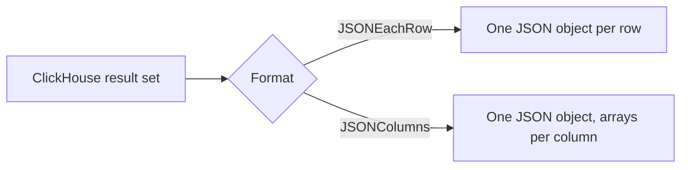

# How to Use JSONColumns Format in ClickHouse

Author: OneUptime Team

Tags: ClickHouse, Format, JSON, JSONColumns, DataExport

Description: Learn how to use the JSONColumns format in ClickHouse to read and write data as a single JSON object where each key is a column containing an array of values.

---

`JSONColumns` is a columnar JSON format in ClickHouse where the output is a single JSON object and each key corresponds to a column name holding an array of all values for that column. This is different from `JSONEachRow`, which emits one JSON object per row. `JSONColumns` is compact for wide queries and integrates naturally with JavaScript and Python tools that prefer columnar arrays.

## Format Structure

```json
{
  "event_type": ["click", "view", "purchase"],
  "user_id":    [101, 202, 303],
  "ts":         ["2024-06-01 12:00:00", "2024-06-01 12:00:01", "2024-06-01 12:00:05"]
}
```

Compare this to `JSONEachRow`:

```json
{"event_type":"click","user_id":101,"ts":"2024-06-01 12:00:00"}
{"event_type":"view","user_id":202,"ts":"2024-06-01 12:00:01"}
{"event_type":"purchase","user_id":303,"ts":"2024-06-01 12:00:05"}
```



## Selecting Data in JSONColumns Format

```sql
SELECT event_type, user_id, ts
FROM user_events
WHERE ts >= today() - 1
LIMIT 100
FORMAT JSONColumns;
```

This returns a single JSON object. The entire response fits in one parse operation.

## Inserting Data with JSONColumns

You can also INSERT using `JSONColumns`:

```sql
INSERT INTO user_events FORMAT JSONColumns;
```

With the data payload:

```json
{
  "event_type": ["click", "view"],
  "user_id":    [101, 202],
  "ts":         ["2024-06-01 12:00:00", "2024-06-01 12:00:01"]
}
```

All arrays must have the same length; ClickHouse raises an error if they differ.

## JSONColumns vs JSONCompactColumns

`JSONCompactColumns` replaces column-name keys with positional arrays for a more compact representation:

```json
[
  ["click", "view", "purchase"],
  [101, 202, 303],
  ["2024-06-01 12:00:00", "2024-06-01 12:00:01", "2024-06-01 12:00:05"]
]
```

Use `JSONCompactColumns` when column names are known by the consumer and bandwidth is critical.

## JSONColumnsWithMetadata

`JSONColumnsWithMetadata` extends `JSONColumns` with a `meta` block containing column names and types:

```sql
SELECT event_type, user_id
FROM user_events
LIMIT 2
FORMAT JSONColumnsWithMetadata;
```

Output:

```json
{
  "meta": [
    {"name": "event_type", "type": "String"},
    {"name": "user_id", "type": "UInt32"}
  ],
  "data": {
    "event_type": ["click", "view"],
    "user_id": [101, 202]
  },
  "rows": 2
}
```

This is useful for self-describing API responses.

## Using JSONColumns via HTTP Interface

```bash
curl -s "http://localhost:8123/?query=SELECT+event_type,user_id+FROM+user_events+LIMIT+5+FORMAT+JSONColumns"
```

Or with compression:

```bash
curl -s \
  -H "Accept-Encoding: gzip" \
  "http://localhost:8123/?query=SELECT+*+FROM+user_events+LIMIT+1000+FORMAT+JSONColumns" \
  | gunzip
```

## Python Integration

`JSONColumns` maps cleanly onto Python dictionaries and pandas DataFrames:

```python
import requests, json, pandas as pd

response = requests.get(
    "http://localhost:8123/",
    params={
        "query": "SELECT event_type, user_id, ts FROM user_events LIMIT 1000 FORMAT JSONColumns",
        "user": "default",
        "password": "",
    },
)

data = json.loads(response.text)
df = pd.DataFrame(data)
print(df.head())
```

## Comparison of JSON Formats

| Format | One object per... | Column names included | Type metadata | Good for |
|---|---|---|---|---|
| `JSON` | Full result | Yes | Yes | REST API |
| `JSONEachRow` | Row | Yes (per row) | No | Streaming |
| `JSONColumns` | Full result | Yes (as keys) | No | Columnar export |
| `JSONColumnsWithMetadata` | Full result | Yes | Yes | Self-describing API |
| `JSONCompactColumns` | Full result | No | No | Compact columnar |

## Summary

Use `JSONColumns` when you want a single JSON document where column arrays are ready to plug into JavaScript charting libraries, Python data pipelines, or any consumer that prefers columnar arrays over row-at-a-time iteration. Use `JSONColumnsWithMetadata` when the consumer needs type information. For streaming or Kafka ingest, `JSONEachRow` remains the better choice.
