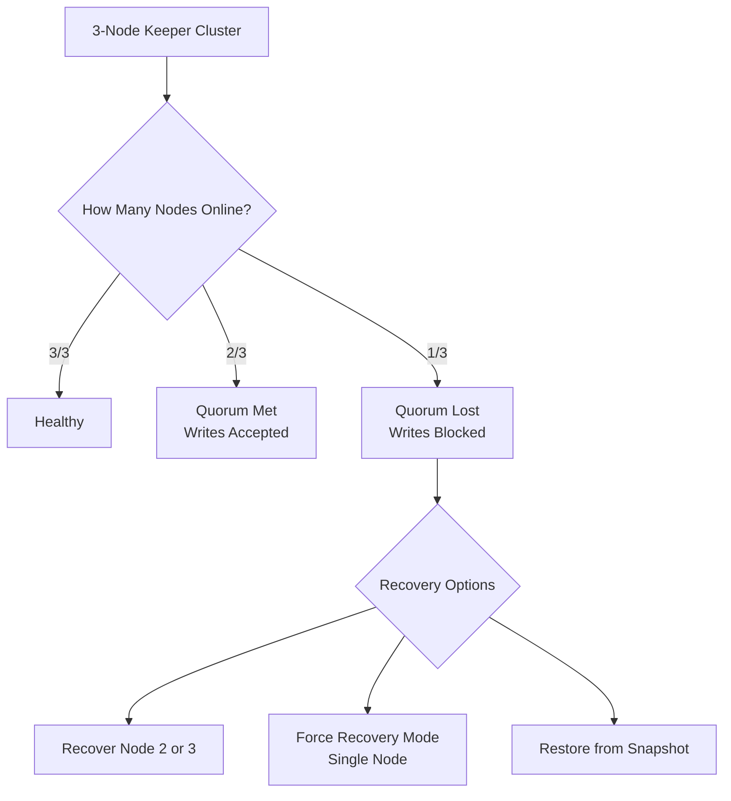

# How to Recover ClickHouse Keeper from Quorum Loss

Author: [nawazdhandala](https://www.github.com/nawazdhandala)

Tags: ClickHouse, Keeper, Quorum, Recovery, Raft, Disaster Recovery

Description: Learn how to recover ClickHouse Keeper from quorum loss including single-node recovery mode, restoring from snapshots, and safely rejoining nodes to the Raft cluster.

---

ClickHouse Keeper uses the Raft consensus algorithm, which requires a majority quorum to accept writes. A 3-node cluster requires 2 nodes; a 5-node cluster requires 3. When quorum is lost (e.g., 2 of 3 nodes are offline), Keeper stops accepting writes and ClickHouse replication halts. This guide covers how to recover from quorum loss.

## Understanding Quorum Loss



## Step 1: Diagnose Quorum Loss

Check Keeper health from a running node:

```bash
echo "ruok" | nc keeper-node-1 2181
# Expected: imok
# If no response or connection refused: keeper is down
```

Check which nodes are online:

```bash
echo "stat" | nc keeper-node-1 2181
```

Output includes `Mode: leader`, `Mode: follower`, or `Mode: observer`. If all remaining nodes show no output, quorum is lost.

From ClickHouse:

```sql
SELECT *
FROM system.zookeeper_connection;
-- connected_status = 'Connected' if Keeper is reachable
```

## Step 2: Attempt Normal Node Recovery

The preferred recovery is bringing crashed nodes back online. On the crashed node:

```bash
# Check the service status
sudo systemctl status clickhouse-keeper

# Examine logs for the reason for failure
sudo journalctl -u clickhouse-keeper -n 100

# Restart the node
sudo systemctl start clickhouse-keeper
```

If the node starts successfully and has a consistent snapshot, it will replay its log and rejoin the Raft cluster automatically. No manual intervention is needed if the data is intact.

## Step 3: Force Single-Node Recovery Mode

If 2 of 3 nodes are permanently lost (disk failure, destroyed VMs), and you have only 1 surviving node, use Keeper's force recovery mode:

Stop the surviving Keeper:

```bash
sudo systemctl stop clickhouse-keeper
```

Edit the Keeper configuration to declare it the only remaining node and enable force recovery:

```xml
<!-- /etc/clickhouse-keeper/config.d/recovery.xml -->
<clickhouse>
    <keeper_server>
        <server_id>1</server_id>
        <force_recover>true</force_recover>
        <raft_configuration>
            <!-- Only list the surviving node -->
            <server>
                <id>1</id>
                <hostname>keeper-node-1</hostname>
                <port>9234</port>
            </server>
        </raft_configuration>
    </keeper_server>
</clickhouse>
```

Start the surviving Keeper:

```bash
sudo systemctl start clickhouse-keeper
```

The node will force itself to leader with a one-node quorum, making the cluster writable again. Verify:

```bash
echo "ruok" | nc keeper-node-1 2181
# Expected: imok

echo "stat" | nc keeper-node-1 2181
# Should show: Mode: leader
```

## Step 4: Remove force_recover After Recovery

Once the node is stable, remove `force_recover` from configuration and restart:

```xml
<!-- Remove this line from recovery.xml -->
<!-- <force_recover>true</force_recover> -->
```

```bash
sudo systemctl restart clickhouse-keeper
```

## Step 5: Restore Lost Nodes from Snapshots

If you have backups of Keeper snapshots, restore them on the replacement nodes:

```bash
# Copy snapshot files to the new node
# Default path: /var/lib/clickhouse-keeper/snapshots/

sudo mkdir -p /var/lib/clickhouse-keeper/snapshots
sudo cp /backup/keeper/snapshots/snapshot_* /var/lib/clickhouse-keeper/snapshots/
sudo chown -R clickhouse:clickhouse /var/lib/clickhouse-keeper/
```

Identify the latest snapshot:

```bash
ls -lt /var/lib/clickhouse-keeper/snapshots/
```

## Step 6: Add Replacement Nodes Back to the Cluster

Once the surviving node is stable as a single-node cluster, add replacement nodes one at a time:

On the surviving leader node, update the configuration to include the new nodes:

```xml
<clickhouse>
    <keeper_server>
        <raft_configuration>
            <server>
                <id>1</id>
                <hostname>keeper-node-1</hostname>
                <port>9234</port>
            </server>
            <server>
                <id>4</id> <!-- New node, new ID -->
                <hostname>keeper-node-4</hostname>
                <port>9234</port>
            </server>
            <server>
                <id>5</id>
                <hostname>keeper-node-5</hostname>
                <port>9234</port>
            </server>
        </raft_configuration>
    </keeper_server>
</clickhouse>
```

Start the new nodes with matching configuration. They will pull the current snapshot from the leader and join the cluster.

## Verifying Cluster Recovery

After adding all nodes:

```bash
echo "stat" | nc keeper-node-1 2181
# Expect: Connections, Mode: leader, Followers: 2
```

From ClickHouse:

```sql
-- Check ClickHouse can write to replication queue again
SELECT * FROM system.replication_queue
WHERE is_currently_executing = 1
LIMIT 5;

-- Check replicas are syncing
SELECT database, table, active_replicas, total_replicas, queue_size
FROM system.replicas
WHERE queue_size > 0
ORDER BY queue_size DESC
LIMIT 10;
```

## Preventing Future Quorum Loss

```xml
<!-- Use 5 nodes for more fault tolerance -->
<raft_configuration>
    <server><id>1</id><hostname>keeper-1</hostname><port>9234</port></server>
    <server><id>2</id><hostname>keeper-2</hostname><port>9234</port></server>
    <server><id>3</id><hostname>keeper-3</hostname><port>9234</port></server>
    <server><id>4</id><hostname>keeper-4</hostname><port>9234</port></server>
    <server><id>5</id><hostname>keeper-5</hostname><port>9234</port></server>
</raft_configuration>
```

A 5-node cluster tolerates 2 simultaneous failures vs 1 for a 3-node cluster.

## Summary

Recovering ClickHouse Keeper from quorum loss involves first attempting to restart crashed nodes normally. If nodes are permanently lost, use `force_recover: true` on the surviving node to bootstrap a single-node cluster, then add replacement nodes one at a time after restoring their snapshot directories. Always remove `force_recover` from configuration after the cluster stabilizes. Run 5-node Keeper clusters in production to tolerate 2 simultaneous node failures.
