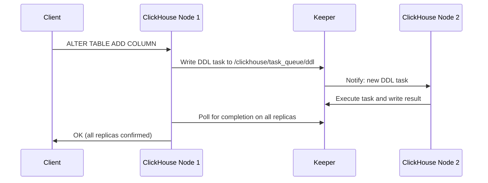

# How to Use ClickHouse Keeper for Schema Migration Coordination

Author: [nawazdhandala](https://www.github.com/nawazdhandala)

Tags: ClickHouse, Keeper, Schema, Migration, Coordination, DDL

Description: Learn how to use ClickHouse Keeper to coordinate schema migrations across cluster nodes, manage DDL locks, and safely apply ALTER TABLE changes in replicated environments.

---

Schema migrations in a replicated ClickHouse cluster require coordination: when you run `ALTER TABLE` on a distributed table, ClickHouse uses Keeper (or ZooKeeper) to propagate the DDL change to all replicas and track its completion status. Understanding how this coordination works lets you run migrations safely and diagnose stuck DDL operations.

## How ClickHouse Uses Keeper for DDL



ClickHouse stores DDL tasks in a Keeper path (default `/clickhouse/task_queue/ddl`). Each node watches this path, picks up tasks, executes them, and writes a completion marker. The originating node waits until all active replicas report success or failure.

## Checking DDL Queue Status

Monitor in-flight and recent DDL operations:

```sql
SELECT *
FROM system.distributed_ddl_queue
ORDER BY entry_time DESC
LIMIT 20;
```

Fields of interest:
- `status`: `Active`, `Finished`, or `Failed`
- `exception_code`: non-zero indicates an error
- `num_hosts_total` vs `num_hosts_finished`: shows which nodes are still pending
- `entry_time`: when the task was queued
- `initiator_host`: which node initiated the migration

## Running a Safe Schema Migration

### Step 1: Check Cluster Health Before Migration

```sql
-- All replicas should be active and in sync
SELECT
    database,
    table,
    is_leader,
    total_replicas,
    active_replicas
FROM system.replicas
WHERE is_readonly = 1 OR total_replicas != active_replicas;
```

Proceed only when all replicas are active and no replica is in read-only mode.

### Step 2: Run the Migration with ON CLUSTER

```sql
ALTER TABLE events ON CLUSTER analytics_cluster
    ADD COLUMN IF NOT EXISTS region LowCardinality(String) DEFAULT '' CODEC(LZ4)
    AFTER country;
```

The `ON CLUSTER` clause sends the DDL task to Keeper, which distributes it to all nodes.

### Step 3: Monitor Completion

```sql
SELECT
    cluster,
    query,
    status,
    num_hosts_total,
    num_hosts_finished,
    num_hosts_active,
    exception_code
FROM system.distributed_ddl_queue
WHERE query LIKE '%ADD COLUMN%region%'
ORDER BY entry_time DESC
LIMIT 5;
```

### Step 4: Verify on All Nodes

```sql
SELECT name, type
FROM system.columns
WHERE table = 'events'
  AND database = currentDatabase();
```

## Handling a Stuck DDL

If `num_hosts_finished < num_hosts_total` and the task is not progressing, check the lagging replica:

```sql
-- On the lagging replica node
SELECT * FROM system.replication_queue
WHERE type = 'ALTER_METADATA'
ORDER BY create_time
LIMIT 10;
```

Common causes of stuck DDL:
- Replica is offline during the migration
- Replica is lagging too far behind in replication
- Keeper is unreachable from that node

Force the replica to re-execute the DDL:

```sql
-- If the replica missed the DDL due to downtime
SYSTEM SYNC REPLICA events;
```

## Cancelling a Stuck DDL Task

```sql
-- Find the task identifier
SELECT entry, query, status
FROM system.distributed_ddl_queue
WHERE status = 'Active'
ORDER BY entry_time;

-- Remove the task from Keeper directly (use keeper-client)
```

```bash
clickhouse-keeper-client --host keeper-node-1 --port 2181
```

Inside the client:

```
keeper> ls /clickhouse/task_queue/ddl
keeper> rmr /clickhouse/task_queue/ddl/query-0000001234
```

Only remove stuck tasks after confirming the DDL has been manually applied on all nodes.

## Setting DDL Task Timeout

By default, ClickHouse waits indefinitely for all replicas to confirm DDL. Set a timeout:

```sql
SET distributed_ddl_task_timeout = 300; -- 300 seconds
```

After the timeout, the operation returns an error to the client, but the DDL task remains in Keeper and will be executed when offline nodes come back online.

## Viewing DDL History in Keeper

```bash
clickhouse-keeper-client --host keeper-node-1 --port 2181
```

```
keeper> ls /clickhouse/task_queue/ddl
keeper> get /clickhouse/task_queue/ddl/query-0000000001
```

Each node writes its result under the task path:

```
keeper> ls /clickhouse/task_queue/ddl/query-0000000001
# Shows: active_nodes  finished_nodes
```

## Migration with Conditional Checks

Prefer idempotent DDL to avoid failures on re-runs:

```sql
-- Safe to run multiple times
ALTER TABLE events ON CLUSTER analytics_cluster
    ADD COLUMN IF NOT EXISTS region LowCardinality(String) DEFAULT '' CODEC(LZ4);

-- Safe column type modification
ALTER TABLE events ON CLUSTER analytics_cluster
    MODIFY COLUMN IF EXISTS value Float64 CODEC(Gorilla, LZ4);
```

## Summary

ClickHouse Keeper coordinates schema migrations by queuing DDL tasks in `/clickhouse/task_queue/ddl` and tracking per-replica completion markers. Monitor in-flight migrations with `system.distributed_ddl_queue`, ensure all replicas are active before starting, use `ON CLUSTER` for distributed DDL, and set `distributed_ddl_task_timeout` to prevent indefinite blocking. For stuck tasks, use `clickhouse-keeper-client` to inspect and clean up the Keeper task queue.
