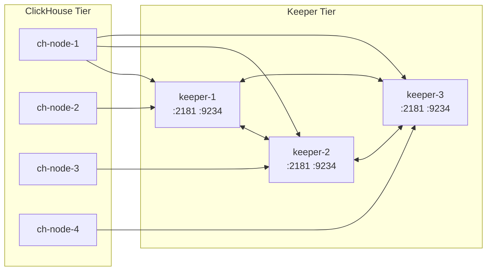

# How to Set Up ClickHouse Keeper on Separate Nodes

Author: [nawazdhandala](https://www.github.com/nawazdhandala)

Tags: ClickHouse, Keeper, Infrastructure, Deployment, Reliability, Cluster

Description: Learn how to deploy ClickHouse Keeper on dedicated nodes separate from ClickHouse server nodes for improved reliability, resource isolation, and independent scaling.

---

Running ClickHouse Keeper on the same nodes as ClickHouse server mixes coordination overhead with query and storage workloads. Under heavy ingest, a ClickHouse node under CPU or I/O pressure can slow Keeper responses, increasing replication lag. Deploying Keeper on dedicated nodes eliminates this interference and lets you upgrade or restart Keeper independently of the data nodes.

## Architecture: Keeper on Dedicated Nodes



Keeper nodes form a 3-node Raft cluster. ClickHouse server nodes connect to all three Keeper addresses for automatic failover.

## Hardware Requirements for Dedicated Keeper Nodes

Keeper is lightweight compared to ClickHouse server. Minimum viable dedicated Keeper node:
- 4 CPU cores
- 8 GB RAM (16 GB for large clusters with many tables)
- 50-200 GB SSD (fast fsync is critical for Raft log durability)
- Low-latency network to ClickHouse nodes (under 5 ms preferred)

Keeper's disk I/O profile is write-heavy with many small synchronous writes (Raft log entries). NVMe SSD is strongly preferred over HDD.

## Installing ClickHouse Keeper (Without ClickHouse Server)

On each dedicated Keeper node, install only the Keeper package:

```bash
# Ubuntu/Debian
sudo apt-get install clickhouse-keeper

# RHEL/CentOS
sudo yum install clickhouse-keeper
```

The `clickhouse-keeper` package installs the standalone Keeper binary without the full ClickHouse server.

## Keeper Configuration: Node 1

```xml
<!-- /etc/clickhouse-keeper/config.xml on keeper-1 -->
<clickhouse>
    <logger>
        <level>information</level>
        <log>/var/log/clickhouse-keeper/clickhouse-keeper.log</log>
        <errorlog>/var/log/clickhouse-keeper/clickhouse-keeper.err.log</errorlog>
        <size>500M</size>
        <count>10</count>
    </logger>

    <listen_host>0.0.0.0</listen_host>

    <keeper_server>
        <tcp_port>2181</tcp_port>
        <server_id>1</server_id>
        <log_storage_path>/var/lib/clickhouse-keeper/log</log_storage_path>
        <snapshot_storage_path>/var/lib/clickhouse-keeper/snapshots</snapshot_storage_path>

        <coordination_settings>
            <operation_timeout_ms>10000</operation_timeout_ms>
            <session_timeout_ms>30000</session_timeout_ms>
            <raft_logs_level>information</raft_logs_level>
            <compress_logs>true</compress_logs>
            <compress_snapshots_with_zstd_format>true</compress_snapshots_with_zstd_format>
        </coordination_settings>

        <raft_configuration>
            <server>
                <id>1</id>
                <hostname>keeper-1</hostname>
                <port>9234</port>
            </server>
            <server>
                <id>2</id>
                <hostname>keeper-2</hostname>
                <port>9234</port>
            </server>
            <server>
                <id>3</id>
                <hostname>keeper-3</hostname>
                <port>9234</port>
            </server>
        </raft_configuration>
    </keeper_server>
</clickhouse>
```

Repeat this file on keeper-2 and keeper-3, changing only `<server_id>` to 2 and 3 respectively.

## Keeper Configuration: Node 2

```xml
<!-- /etc/clickhouse-keeper/config.xml on keeper-2 -->
<clickhouse>
    <!-- Same as keeper-1 with this change: -->
    <keeper_server>
        <server_id>2</server_id>
        <!-- All other settings identical -->
    </keeper_server>
</clickhouse>
```

## Creating Required Directories

Run on each Keeper node:

```bash
sudo mkdir -p /var/lib/clickhouse-keeper/log
sudo mkdir -p /var/lib/clickhouse-keeper/snapshots
sudo chown -R clickhouse:clickhouse /var/lib/clickhouse-keeper
sudo chmod -R 750 /var/lib/clickhouse-keeper
```

## Starting Keeper

```bash
sudo systemctl enable clickhouse-keeper
sudo systemctl start clickhouse-keeper
sudo systemctl status clickhouse-keeper
```

Start keeper-1 first, then keeper-2, then keeper-3. The cluster elects a leader once 2 of 3 nodes are up.

## Verifying the Cluster is Healthy

```bash
# Four-letter word commands (ZooKeeper-compatible)
echo "ruok" | nc keeper-1 2181  # Expected: imok
echo "stat" | nc keeper-1 2181  # Shows mode, connections, latency
echo "mntr" | nc keeper-1 2181  # Full metrics
```

Confirm leadership:

```bash
echo "stat" | nc keeper-1 2181 | grep Mode
# Expected: Mode: leader (on one node), Mode: follower (on others)
```

## Configuring ClickHouse Server to Use Dedicated Keeper

On each ClickHouse server node, update the zookeeper connection:

```xml
<!-- /etc/clickhouse-server/config.d/zookeeper.xml -->
<clickhouse>
    <zookeeper>
        <node>
            <host>keeper-1</host>
            <port>2181</port>
        </node>
        <node>
            <host>keeper-2</host>
            <port>2181</port>
        </node>
        <node>
            <host>keeper-3</host>
            <port>2181</port>
        </node>
        <session_timeout_ms>30000</session_timeout_ms>
        <operation_timeout_ms>10000</operation_timeout_ms>
    </zookeeper>
</clickhouse>
```

Restart each ClickHouse server after updating the configuration:

```bash
sudo systemctl restart clickhouse-server
```

## Verifying ClickHouse Connects to Keeper

```sql
SELECT *
FROM system.zookeeper_connection;
-- connected_status should be 'Connected'
-- keeper_api_version should be non-zero
```

```sql
-- Test Keeper access
SELECT *
FROM system.zookeeper
WHERE path = '/'
LIMIT 5;
```

## Monitoring Keeper from ClickHouse

```sql
SELECT
    metric,
    value
FROM system.keeper_metrics;
```

Key metrics to watch:
- `znode_count`: number of znodes; large values indicate replication metadata accumulation
- `session_count`: active ClickHouse sessions to Keeper
- `commit_latency_ms`: Raft commit latency; should be under 50 ms
- `latency`: end-to-end operation latency

## Firewall Rules

Open the required ports between tiers:

```bash
# On Keeper nodes: allow from ClickHouse tier
sudo ufw allow from 10.0.1.0/24 to any port 2181  # Client port
sudo ufw allow from 10.0.2.0/24 to any port 9234  # Raft internal (Keeper-to-Keeper)

# Raft peers must be allowed between all Keeper nodes
sudo ufw allow from keeper-2 to any port 9234
sudo ufw allow from keeper-3 to any port 9234
```

## Summary

Deploying ClickHouse Keeper on separate dedicated nodes eliminates resource contention between coordination and query workloads. Use the standalone `clickhouse-keeper` package, configure each node with a unique `server_id`, store logs and snapshots on NVMe SSD, and point all ClickHouse server zookeeper configurations to the three Keeper hostnames. A 3-node Keeper cluster on dedicated hardware provides robust coordination infrastructure with 1-node fault tolerance.
