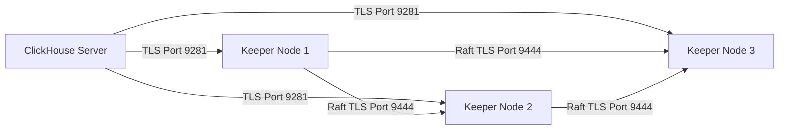

# How to Configure ClickHouse Keeper with TLS

Author: [nawazdhandala](https://www.github.com/nawazdhandala)

Tags: ClickHouse, Keeper, TLS, Security, Certificate, Encryption

Description: Learn how to configure ClickHouse Keeper with TLS encryption for secure inter-node communication, client authentication, and certificate rotation in production clusters.

---

ClickHouse Keeper uses a TCP protocol for both client connections (from ClickHouse servers) and inter-node Raft communication. In production environments, both channels should be encrypted with TLS to prevent eavesdropping and to authenticate node identities. This guide covers generating certificates, configuring Keeper with TLS, and connecting ClickHouse servers to a TLS-enabled Keeper cluster.

## TLS Architecture



Default port assignments:
- 2181 = plain Keeper client port
- 9281 = TLS Keeper client port
- 9234 = plain Raft internal port
- 9444 = TLS Raft internal port

## Generating Certificates

For production, use certificates signed by your internal CA. For testing, generate a self-signed CA:

```bash
# Create CA private key and certificate
openssl genrsa -out ca.key 4096
openssl req -new -x509 -days 3650 -key ca.key -out ca.crt \
    -subj "/CN=ClickHouse-Keeper-CA"

# Create Keeper node certificate (repeat for each node with the correct CN)
openssl genrsa -out keeper.key 2048
openssl req -new -key keeper.key -out keeper.csr \
    -subj "/CN=keeper-node-1"

# Sign with CA
openssl x509 -req -days 825 -in keeper.csr \
    -CA ca.crt -CAkey ca.key -CAcreateserial \
    -out keeper.crt
```

Copy `ca.crt`, `keeper.crt`, and `keeper.key` to each Keeper node (e.g., `/etc/clickhouse-keeper/ssl/`).

Set correct permissions:

```bash
sudo chown clickhouse:clickhouse /etc/clickhouse-keeper/ssl/*.key
sudo chmod 600 /etc/clickhouse-keeper/ssl/*.key
```

## Configuring Keeper with TLS

Create or update the Keeper configuration:

```xml
<!-- /etc/clickhouse-keeper/config.d/keeper_tls.xml -->
<clickhouse>
    <keeper_server>
        <tcp_port_secure>9281</tcp_port_secure>
        <raft_configuration>
            <server>
                <id>1</id>
                <hostname>keeper-node-1</hostname>
                <port>9444</port>
            </server>
            <server>
                <id>2</id>
                <hostname>keeper-node-2</hostname>
                <port>9444</port>
            </server>
            <server>
                <id>3</id>
                <hostname>keeper-node-3</hostname>
                <port>9444</port>
            </server>
        </raft_configuration>
    </keeper_server>

    <openssl>
        <server>
            <certificateFile>/etc/clickhouse-keeper/ssl/keeper.crt</certificateFile>
            <privateKeyFile>/etc/clickhouse-keeper/ssl/keeper.key</privateKeyFile>
            <caConfig>/etc/clickhouse-keeper/ssl/ca.crt</caConfig>
            <verificationMode>relaxed</verificationMode>
            <loadDefaultCAFile>false</loadDefaultCAFile>
            <cacheSessions>true</cacheSessions>
            <requireTLSv1_2>true</requireTLSv1_2>
        </server>
        <client>
            <certificateFile>/etc/clickhouse-keeper/ssl/keeper.crt</certificateFile>
            <privateKeyFile>/etc/clickhouse-keeper/ssl/keeper.key</privateKeyFile>
            <caConfig>/etc/clickhouse-keeper/ssl/ca.crt</caConfig>
            <verificationMode>relaxed</verificationMode>
            <loadDefaultCAFile>false</loadDefaultCAFile>
            <cacheSessions>true</cacheSessions>
        </client>
    </openssl>
</clickhouse>
```

The `<client>` section configures TLS for Raft peer connections. The `<server>` section configures TLS for incoming client connections.

## Disable Plain Text Port (Production)

Once TLS is confirmed working, disable the unencrypted port to enforce TLS-only communication:

```xml
<clickhouse>
    <keeper_server>
        <!-- Remove or comment out plain port -->
        <!-- <tcp_port>2181</tcp_port> -->
        <tcp_port_secure>9281</tcp_port_secure>
    </keeper_server>
</clickhouse>
```

## Configuring ClickHouse Server to Use TLS Keeper

On each ClickHouse server, update the zookeeper connection to use the TLS port:

```xml
<!-- /etc/clickhouse-server/config.d/zookeeper_tls.xml -->
<clickhouse>
    <zookeeper>
        <node>
            <host>keeper-node-1</host>
            <port>9281</port>
            <secure>1</secure>
        </node>
        <node>
            <host>keeper-node-2</host>
            <port>9281</port>
            <secure>1</secure>
        </node>
        <node>
            <host>keeper-node-3</host>
            <port>9281</port>
            <secure>1</secure>
        </node>
    </zookeeper>

    <openssl>
        <client>
            <caConfig>/etc/clickhouse-server/ssl/ca.crt</caConfig>
            <verificationMode>relaxed</verificationMode>
            <loadDefaultCAFile>false</loadDefaultCAFile>
        </client>
    </openssl>
</clickhouse>
```

Copy `ca.crt` to each ClickHouse server node.

## Verifying TLS Connectivity

Use `openssl s_client` to test that TLS is working before starting services:

```bash
openssl s_client -connect keeper-node-1:9281 \
    -CAfile /etc/clickhouse-keeper/ssl/ca.crt \
    -cert /etc/clickhouse-keeper/ssl/keeper.crt \
    -key /etc/clickhouse-keeper/ssl/keeper.key
```

A successful TLS handshake will show the certificate chain and `Verify return code: 0 (ok)`.

## Using clickhouse-keeper-client with TLS

```bash
clickhouse-keeper-client \
    --host keeper-node-1 \
    --port 9281 \
    --secure 1 \
    --client-certificate-file /etc/clickhouse-keeper/ssl/keeper.crt \
    --client-certificate-private-key-file /etc/clickhouse-keeper/ssl/keeper.key \
    --CA-file /etc/clickhouse-keeper/ssl/ca.crt
```

Run a health check inside the client:

```text
keeper> ruok
imok
```

## Certificate Rotation

To rotate certificates without downtime:

1. Generate new certificates with the new CA or extended validity.
2. Add the new CA cert to the `caConfig` (configure both old and new CA using a PEM bundle).
3. Replace leaf certificates on each node one at a time, restarting Keeper.
4. After all nodes are updated, remove the old CA from the bundle.

## Verifying TLS from System Tables

```sql
-- Check Keeper connection status from ClickHouse server
SELECT * FROM system.zookeeper_connection;
```

A `secured` column value of 1 confirms the connection is using TLS.

## Summary

Configuring ClickHouse Keeper with TLS requires generating CA and node certificates, adding OpenSSL configuration blocks to both Keeper and ClickHouse server configs, and pointing the zookeeper connection to the TLS port (9281) with `<secure>1</secure>`. Once TLS is confirmed working, disable the plain port. Use `openssl s_client` for connectivity testing and `clickhouse-keeper-client --secure 1` for admin operations.
