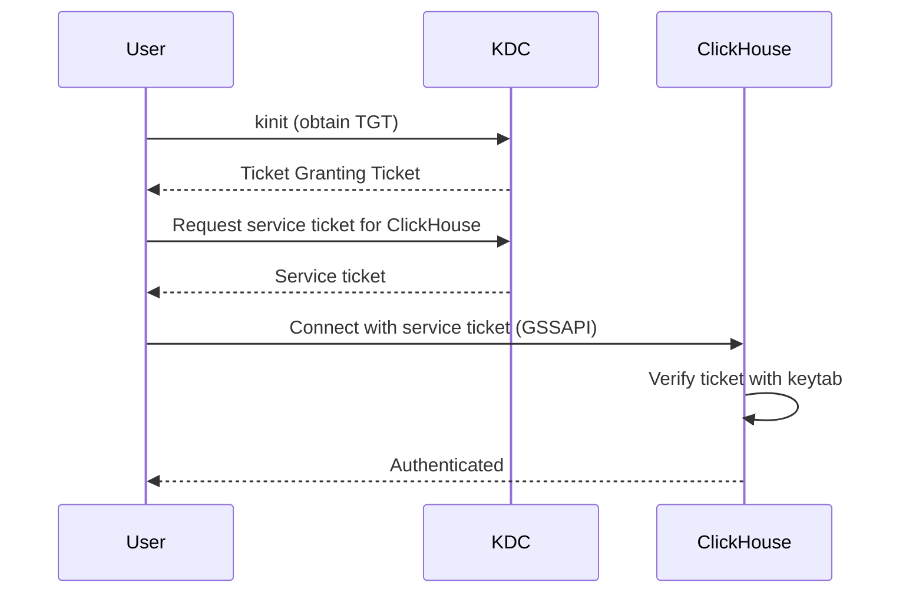

# How to Configure Kerberos Authentication in ClickHouse

Author: [nawazdhandala](https://www.github.com/nawazdhandala)

Tags: ClickHouse, Kerberos, Authentication, Security, GSS-API, Configuration

Description: Configure ClickHouse to use Kerberos (GSSAPI) authentication for secure single sign-on in enterprise Hadoop and Active Directory environments.

---

## Introduction

ClickHouse supports Kerberos authentication via GSSAPI, allowing users to authenticate using Kerberos tickets obtained from a Key Distribution Center (KDC) such as MIT Kerberos or Active Directory. This is common in Hadoop ecosystems and enterprises with centralized Kerberos infrastructure.

## Architecture



## Prerequisites

- MIT Kerberos or Active Directory KDC
- ClickHouse server joined to the Kerberos realm
- Service principal and keytab for ClickHouse

## Step 1: Create the ClickHouse Service Principal

On the KDC (MIT Kerberos):

```bash
# Create service principal
kadmin.local -q "addprinc -randkey HTTP/clickhouse.example.com@EXAMPLE.COM"

# Export keytab
kadmin.local -q "ktadd -k /etc/clickhouse-server/clickhouse.keytab HTTP/clickhouse.example.com@EXAMPLE.COM"

# Set ownership
chown clickhouse:clickhouse /etc/clickhouse-server/clickhouse.keytab
chmod 600 /etc/clickhouse-server/clickhouse.keytab
```

For Active Directory:

```powershell
# PowerShell on Domain Controller
New-ADServiceAccount -Name clickhouse -DNSHostName clickhouse.corp.example.com
Set-ADServiceAccount -Identity clickhouse -KerberosEncryptionType AES256
```

## Step 2: Configure /etc/krb5.conf

```ini
[libdefaults]
    default_realm = EXAMPLE.COM
    dns_lookup_realm = false
    dns_lookup_kdc = true
    forwardable = true

[realms]
    EXAMPLE.COM = {
        kdc = kdc.example.com
        admin_server = kdc.example.com
    }

[domain_realm]
    .example.com = EXAMPLE.COM
    example.com = EXAMPLE.COM
```

## Step 3: Configure ClickHouse

Create `/etc/clickhouse-server/config.d/kerberos.xml`:

```xml
<clickhouse>
  <kerberos>
    <principal>HTTP/clickhouse.example.com@EXAMPLE.COM</principal>
    <keytab>/etc/clickhouse-server/clickhouse.keytab</keytab>
  </kerberos>
</clickhouse>
```

## Step 4: Create a Kerberos-Authenticated User in users.xml

```xml
<users>
  <alice>
    <kerberos>
      <realm>EXAMPLE.COM</realm>
    </kerberos>
    <networks>
      <ip>::/0</ip>
    </networks>
    <profile>default</profile>
    <quota>default</quota>
  </alice>
</users>
```

ClickHouse matches the Kerberos principal `alice@EXAMPLE.COM` to the `alice` user.

## Step 5: Authenticate from the Client

The user must have a valid Kerberos ticket:

```bash
# Obtain a ticket
kinit alice@EXAMPLE.COM

# Connect to ClickHouse using GSSAPI
clickhouse-client \
    --host clickhouse.example.com \
    --port 9000 \
    --user alice \
    --query "SELECT currentUser()"
```

For the HTTP interface:

```bash
curl --negotiate -u : \
    "http://clickhouse.example.com:8123/?query=SELECT+currentUser()"
```

## Wildcard Realm Matching

Accept any principal from a realm without defining each user:

```xml
<users>
  <kerberos_users>
    <kerberos>
      <realm>EXAMPLE.COM</realm>
    </kerberos>
    <profile>readonly</profile>
    <quota>default</quota>
  </kerberos_users>
</users>
```

## External User Directory with Kerberos

Combine Kerberos authentication with LDAP group lookup for role mapping:

```xml
<clickhouse>
  <user_directories>
    <users_xml>
      <path>users.xml</path>
    </users_xml>
    <ldap>
      <server>corp_ad</server>
      <role_mapping>
        <base_dn>OU=Groups,DC=corp,DC=example,DC=com</base_dn>
        <search_filter>(&amp;(objectClass=group)(member={bind_dn}))</search_filter>
        <prefix>clickhouse_</prefix>
      </role_mapping>
    </ldap>
  </user_directories>

  <kerberos>
    <principal>HTTP/clickhouse.example.com@CORP.EXAMPLE.COM</principal>
    <keytab>/etc/clickhouse-server/clickhouse.keytab</keytab>
  </kerberos>
</clickhouse>
```

## Verifying Kerberos Configuration

```bash
# Test keytab is valid
kinit -kt /etc/clickhouse-server/clickhouse.keytab HTTP/clickhouse.example.com@EXAMPLE.COM
klist

# Check ClickHouse logs for Kerberos initialization
grep -i kerberos /var/log/clickhouse-server/clickhouse-server.log
```

## Troubleshooting

| Error | Cause | Fix |
|---|---|---|
| `Clock skew too great` | Time difference > 5 min between server and KDC | Sync NTP |
| `No credentials cache found` | User has no valid ticket | Run `kinit` |
| `Key version is not available` | Keytab outdated | Re-export keytab from KDC |
| `Ticket expired` | Ticket lifetime exceeded | Run `kinit` again |

## Summary

ClickHouse Kerberos authentication uses GSSAPI to verify service tickets issued by a KDC. Create a service principal and keytab on the KDC, configure the `<kerberos>` block in ClickHouse config with the principal and keytab path, and define users with `<kerberos><realm>` in `users.xml`. Users obtain tickets with `kinit` and connect without transmitting passwords. This integrates ClickHouse into enterprise Kerberos SSO environments.
