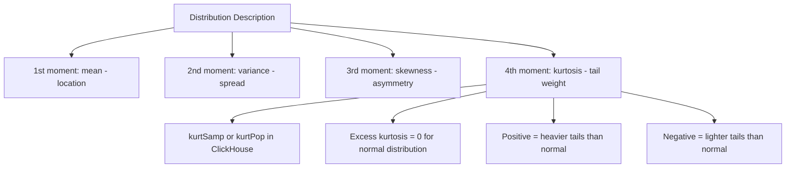

# How to Use kurtSamp() and kurtPop() in ClickHouse

Author: [nawazdhandala](https://www.github.com/nawazdhandala)

Tags: ClickHouse, SQL, Aggregate Function, Statistics, Distribution Analysis

Description: Learn how to use kurtSamp() and kurtPop() in ClickHouse to measure the tail weight and peakedness of a distribution, detecting heavy-tailed behavior in metrics.

---

Kurtosis measures the "tailedness" of a distribution - how much probability mass is in the tails compared to a normal distribution. ClickHouse computes excess kurtosis (Fisher's definition), where a normal distribution has excess kurtosis of 0. Positive excess kurtosis (leptokurtic) means heavier tails than normal; negative excess kurtosis (platykurtic) means lighter tails. `kurtSamp(x)` applies bias correction for sample data; `kurtPop(x)` assumes the complete population.

## Syntax

```sql
-- Sample excess kurtosis (bias-corrected, for sample data)
SELECT kurtSamp(value_column) FROM table_name;

-- Population excess kurtosis (for complete population)
SELECT kurtPop(value_column) FROM table_name;
```

Both return Float64 representing excess kurtosis (normal distribution = 0).

## Interpreting Kurtosis Values

| Excess Kurtosis | Distribution Type | Implication |
|-----------------|-------------------|-------------|
| 0 | Mesokurtic (normal) | Normal tail weight |
| > 0 | Leptokurtic | Heavier tails, more outliers than normal |
| < 0 | Platykurtic | Lighter tails, fewer extreme values |
| > 3 | Very heavy tails | Significant outlier activity |

## Basic Example

```sql
-- Measure tail weight of response time distribution
SELECT
    kurtSamp(response_time_ms)   AS excess_kurtosis,
    skewSamp(response_time_ms)   AS skewness,
    avg(response_time_ms)        AS mean_ms,
    stddevSamp(response_time_ms) AS std_dev_ms,
    count()                      AS n
FROM request_logs
WHERE log_date = today();
```

A high positive kurtosis confirms that while most requests may be fast, there are significantly more extreme slow outliers than a normal distribution would predict.

## Per-Service Kurtosis Analysis

```sql
-- Which services have the heaviest-tailed latency distributions?
SELECT
    service_name,
    round(kurtSamp(response_time_ms), 2)   AS excess_kurtosis,
    round(skewSamp(response_time_ms), 2)   AS skewness,
    round(avg(response_time_ms), 1)        AS mean_ms,
    round(stddevSamp(response_time_ms), 1) AS std_dev_ms,
    count()                                AS n
FROM request_logs
WHERE log_date >= today() - 7
GROUP BY service_name
HAVING n > 1000
ORDER BY excess_kurtosis DESC;
```

## Kurtosis Trend Over Time

```sql
-- Track whether tail behavior is worsening after a deployment
SELECT
    toStartOfHour(timestamp)                 AS hour,
    round(kurtSamp(response_time_ms), 2)    AS excess_kurtosis,
    round(avg(response_time_ms), 1)         AS mean_ms,
    count()                                 AS request_count
FROM request_logs
WHERE timestamp >= now() - INTERVAL 48 HOUR
GROUP BY hour
ORDER BY hour DESC;
```

## The Four Moments of a Distribution



## Comparing Before and After a Deployment

```sql
-- Did a deployment change tail behavior?
SELECT
    if(timestamp < '2026-03-31 14:00:00', 'before', 'after') AS period,
    round(kurtSamp(response_time_ms), 2)   AS excess_kurtosis,
    round(skewSamp(response_time_ms), 2)   AS skewness,
    round(avg(response_time_ms), 1)        AS mean_ms,
    round(stddevSamp(response_time_ms), 1) AS std_dev,
    count()                                AS n
FROM request_logs
WHERE timestamp BETWEEN '2026-03-31 12:00:00' AND '2026-03-31 16:00:00'
  AND service_name = 'api-gateway'
GROUP BY period
ORDER BY period;
```

## kurtSamp vs kurtPop

```sql
-- For small samples the bias correction in kurtSamp makes a difference
SELECT
    count()                AS n,
    kurtSamp(x)            AS kurt_sample,
    kurtPop(x)             AS kurt_population,
    kurtSamp(x) - kurtPop(x) AS correction_amount
FROM (
    SELECT response_time_ms AS x
    FROM request_logs
    WHERE log_date = today()
    LIMIT 30
);
```

For N > 1000, `kurtSamp` and `kurtPop` converge to near-identical values.

## Heavy-Tail Alerting

```sql
-- Alert if excess kurtosis exceeds threshold (heavy tails = outlier activity)
SELECT
    service_name,
    round(kurtSamp(response_time_ms), 2)  AS excess_kurtosis,
    round(avg(response_time_ms), 1)       AS mean_ms,
    count()                               AS n,
    if(kurtSamp(response_time_ms) > 10, 'HEAVY_TAIL_ALERT', 'normal') AS tail_status
FROM request_logs
WHERE log_date = today()
GROUP BY service_name
HAVING n > 500
ORDER BY excess_kurtosis DESC;
```

## Summary

`kurtSamp(x)` and `kurtPop(x)` compute the excess kurtosis (Fisher's definition) of a numeric distribution. A value near 0 means normal tail weight; positive values indicate heavier tails with more extreme outliers than a normal distribution (leptokurtic); negative values indicate lighter tails. `kurtSamp` uses bias correction for sample data; `kurtPop` assumes the complete population. Use kurtosis alongside skewness, mean, and standard deviation to characterize distribution shape, detect heavy-tailed behavior in latency metrics, and monitor for worsening outlier activity after deployments.
