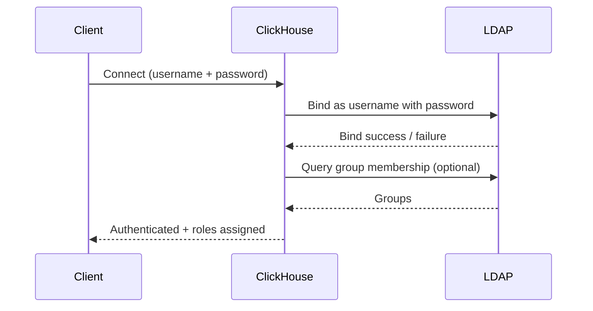

# How to Use LDAP Authentication in ClickHouse

Author: [nawazdhandala](https://www.github.com/nawazdhandala)

Tags: ClickHouse, LDAP, Authentication, Security, Active Directory, Configuration

Description: Configure ClickHouse to authenticate users against an LDAP server or Active Directory, enabling centralized identity management without managing passwords in users.xml.

---

## Introduction

ClickHouse supports LDAP authentication so users can log in with their corporate directory credentials (Active Directory, OpenLDAP, FreeIPA). Instead of storing passwords in ClickHouse, authentication is delegated to the LDAP server. Role assignment can be handled either in ClickHouse or via LDAP group membership.

## Architecture



## Step 1: Configure the LDAP Server in config.xml

Create `/etc/clickhouse-server/config.d/ldap.xml`:

```xml
<clickhouse>
  <ldap_servers>
    <my_ldap>
      <host>ldap.example.com</host>
      <port>389</port>
      <bind_dn>CN={user_name},OU=Users,DC=example,DC=com</bind_dn>
      <verification_cooldown>300</verification_cooldown>
      <enable_tls>no</enable_tls>
    </my_ldap>

    <!-- Active Directory with LDAPS -->
    <corp_ad>
      <host>ad.corp.example.com</host>
      <port>636</port>
      <bind_dn>{user_name}@corp.example.com</bind_dn>
      <verification_cooldown>300</verification_cooldown>
      <enable_tls>starttls</enable_tls>
      <tls_minimum_protocol_version>tls1.2</tls_minimum_protocol_version>
      <tls_require_cert>demand</tls_require_cert>
      <tls_ca_cert_file>/etc/ssl/certs/ca-certificates.crt</tls_ca_cert_file>
    </corp_ad>
  </ldap_servers>
</clickhouse>
```

## Step 2: Create an LDAP-Authenticated User in users.xml

```xml
<users>
  <john>
    <ldap>
      <server>my_ldap</server>
    </ldap>
    <networks>
      <ip>::/0</ip>
    </networks>
    <profile>default</profile>
    <quota>default</quota>
  </john>
</users>
```

Now `john` logs in with their LDAP password.

## Step 3: Use LDAP for All Users (External User Directory)

Instead of defining each user in `users.xml`, configure an external user directory that authenticates any LDAP user:

```xml
<clickhouse>
  <user_directories>
    <users_xml>
      <path>users.xml</path>
    </users_xml>
    <ldap>
      <server>corp_ad</server>
      <roles>
        <readonly_role />
      </roles>
    </ldap>
  </user_directories>
</clickhouse>
```

Any user who can bind to `corp_ad` gets the `readonly_role` in ClickHouse.

## Step 4: Map LDAP Groups to ClickHouse Roles

```xml
<clickhouse>
  <user_directories>
    <ldap>
      <server>corp_ad</server>
      <role_mapping>
        <base_dn>OU=Groups,DC=corp,DC=example,DC=com</base_dn>
        <attribute>cn</attribute>
        <scope>subtree</scope>
        <search_filter>(&amp;(objectClass=groupOfNames)(member={bind_dn}))</search_filter>
        <prefix>clickhouse_</prefix>
      </role_mapping>
    </ldap>
  </user_directories>
</clickhouse>
```

With this configuration, an LDAP group named `clickhouse_analyst` maps to the ClickHouse role `analyst`. Create the role in ClickHouse first:

```sql
CREATE ROLE IF NOT EXISTS analyst;
GRANT SELECT ON analytics.* TO analyst;
```

## Testing LDAP Authentication

```bash
clickhouse-client \
    --host localhost \
    --port 9000 \
    --user john \
    --password "john_ldap_password" \
    --query "SELECT currentUser()"
```

## Troubleshooting

Enable LDAP debug logging:

```xml
<clickhouse>
  <logger>
    <level>debug</level>
    <log>/var/log/clickhouse-server/clickhouse-server.log</log>
  </logger>
</clickhouse>
```

Check the log for LDAP bind attempts and group queries.

Common issues:

| Issue | Solution |
|---|---|
| Bind failed | Verify `bind_dn` template and user's DN format |
| TLS certificate error | Add `tls_ca_cert_file` or set `tls_require_cert` to `never` for testing |
| Group mapping not working | Check `search_filter` syntax and `base_dn` |

## Verification Cooldown

```xml
<verification_cooldown>300</verification_cooldown>
```

This caches successful LDAP binds for 300 seconds, reducing LDAP server load for frequent queries.

## Summary

ClickHouse LDAP authentication delegates password verification to an LDAP server or Active Directory. Configure the LDAP server in `<ldap_servers>`, then either reference it per-user in `users.xml` or use an external user directory to authenticate all LDAP users. Group-to-role mapping lets you assign ClickHouse permissions based on AD group membership, enabling centralized access management without maintaining user lists in ClickHouse config files.
