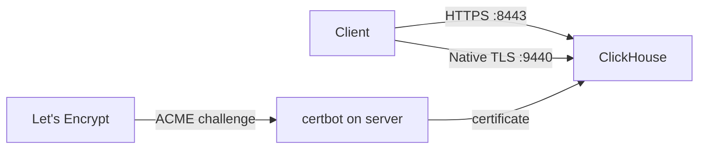

# How to Set Up ClickHouse with Let's Encrypt TLS

Author: [nawazdhandala](https://www.github.com/nawazdhandala)

Tags: ClickHouse, TLS, SSL, Let's Encrypt, Security, Certificate, HTTPS

Description: Obtain a free Let's Encrypt TLS certificate and configure ClickHouse to serve HTTPS and secure native TCP connections with automatic certificate renewal via certbot.

---

## Introduction

Let's Encrypt provides free, automatically renewing TLS certificates. You can use a Let's Encrypt certificate with ClickHouse to encrypt connections over HTTPS (port 8443) and the native TCP protocol (port 9440), without purchasing a commercial certificate.

## Architecture



## Prerequisites

- Public DNS A record pointing `clickhouse.example.com` to your server's IP.
- Port 80 reachable from the internet (for HTTP-01 challenge).
- `certbot` installed on the ClickHouse server.

## Step 1: Install certbot

```bash
# Debian/Ubuntu
apt-get install -y certbot

# RHEL/CentOS
dnf install -y certbot
```

## Step 2: Obtain a Certificate

Use the standalone mode (certbot binds to port 80 temporarily):

```bash
# Stop any web server on port 80 first, then:
certbot certonly \
    --standalone \
    --non-interactive \
    --agree-tos \
    --email admin@example.com \
    --domains clickhouse.example.com

# Certificates are placed in:
# /etc/letsencrypt/live/clickhouse.example.com/fullchain.pem
# /etc/letsencrypt/live/clickhouse.example.com/privkey.pem
```

## Step 3: Make Certificates Readable by ClickHouse

```bash
# Create ClickHouse cert directory
mkdir -p /etc/clickhouse-server/certs

# Copy certificates (certbot renews in /etc/letsencrypt/live/)
cp /etc/letsencrypt/live/clickhouse.example.com/fullchain.pem \
   /etc/clickhouse-server/certs/server.crt
cp /etc/letsencrypt/live/clickhouse.example.com/privkey.pem \
   /etc/clickhouse-server/certs/server.key

# Set ownership
chown clickhouse:clickhouse /etc/clickhouse-server/certs/*
chmod 600 /etc/clickhouse-server/certs/server.key
```

## Step 4: Configure ClickHouse TLS

Create `/etc/clickhouse-server/config.d/tls.xml`:

```xml
<clickhouse>
  <openSSL>
    <server>
      <certificateFile>/etc/clickhouse-server/certs/server.crt</certificateFile>
      <privateKeyFile>/etc/clickhouse-server/certs/server.key</privateKeyFile>
      <dhParamsFile></dhParamsFile>
      <verificationMode>none</verificationMode>    <!-- No client cert required -->
      <invalidCertificateHandler>
        <name>RejectCertificateHandler</name>
      </invalidCertificateHandler>
    </server>
  </openSSL>

  <!-- HTTPS interface -->
  <https_port>8443</https_port>

  <!-- Secure native protocol -->
  <tcp_port_secure>9440</tcp_port_secure>
</clickhouse>
```

## Step 5: Restart ClickHouse

```bash
systemctl restart clickhouse-server
```

## Step 6: Test the HTTPS Connection

```bash
# Test HTTPS with curl
curl "https://clickhouse.example.com:8443/?query=SELECT+version()"

# Test secure native protocol
clickhouse-client \
    --host clickhouse.example.com \
    --port 9440 \
    --secure \
    --query "SELECT version()"
```

## Step 7: Automate Certificate Renewal

certbot renews certificates automatically via a systemd timer or cron. After renewal, copy the updated files and reload ClickHouse:

```bash
# /etc/letsencrypt/renewal-hooks/post/clickhouse.sh
#!/bin/bash
cp /etc/letsencrypt/live/clickhouse.example.com/fullchain.pem \
   /etc/clickhouse-server/certs/server.crt
cp /etc/letsencrypt/live/clickhouse.example.com/privkey.pem \
   /etc/clickhouse-server/certs/server.key
chown clickhouse:clickhouse /etc/clickhouse-server/certs/*
chmod 600 /etc/clickhouse-server/certs/server.key
systemctl reload clickhouse-server
```

```bash
chmod +x /etc/letsencrypt/renewal-hooks/post/clickhouse.sh
```

Test renewal:

```bash
certbot renew --dry-run
```

## Step 8: Using Wildcard Certificates (DNS-01 Challenge)

For internal ClickHouse servers not exposed on port 80:

```bash
certbot certonly \
    --dns-route53 \
    --domains "*.example.com" \
    --email admin@example.com \
    --agree-tos \
    --non-interactive
```

Replace `--dns-route53` with your DNS provider plugin (e.g., `--dns-cloudflare`, `--dns-digitalocean`).

## Verifying TLS is Active

```sql
SELECT
    interface,
    user
FROM system.query_log
WHERE type = 'QueryStart'
ORDER BY event_time DESC
LIMIT 3;
```

Check the certificate expiry:

```bash
openssl s_client -connect clickhouse.example.com:8443 < /dev/null 2>/dev/null \
    | openssl x509 -noout -dates
```

## Summary

Setting up Let's Encrypt TLS in ClickHouse involves obtaining a certificate with certbot, copying it to a directory owned by the `clickhouse` user, and configuring the `<openSSL><server>` block with the cert and key paths. Enable `<https_port>` and `<tcp_port_secure>` in config, then restart. Use a post-renewal hook to copy updated certificates and reload ClickHouse after certbot renewals.
