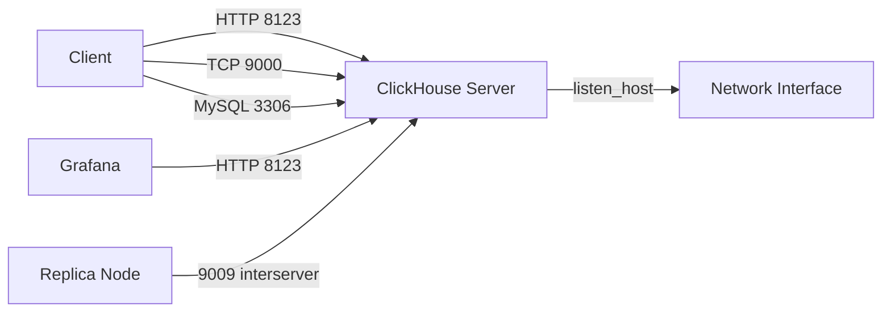

# How to Configure ClickHouse Server listen_host and Ports

Author: OneUptime Team

Tags: ClickHouse, Configuration, Networking, Security, Server

Description: Learn how to configure listen_host, TCP port, HTTP port, and interserver port in ClickHouse's config.xml to control network access.

---

By default ClickHouse listens only on `localhost`. In production you must explicitly configure which addresses and ports the server binds to. This post explains `listen_host`, the standard ports, and best practices for network exposure.

## Default Listener Behavior

Without any `listen_host` configuration ClickHouse binds to `127.0.0.1` (IPv4 localhost) and `::1` (IPv6 localhost). This means no remote connections are possible until you change the configuration.

## Configuration File Location

```text
/etc/clickhouse-server/config.xml          (main file)
/etc/clickhouse-server/config.d/*.xml      (drop-in overrides)
```

Use the `config.d` directory for changes so upgrades do not overwrite your settings.

## listen_host Setting

Add one or more `<listen_host>` elements inside `<clickhouse>`:

```xml
<!-- /etc/clickhouse-server/config.d/network.xml -->
<clickhouse>
    <!-- Listen on all IPv4 interfaces -->
    <listen_host>0.0.0.0</listen_host>

    <!-- Also listen on all IPv6 interfaces -->
    <listen_host>::</listen_host>
</clickhouse>
```

To bind only to a specific interface (e.g. a private network interface):

```xml
<clickhouse>
    <listen_host>10.0.0.5</listen_host>
</clickhouse>
```

## Standard Ports

| Port | Protocol | Purpose |
|---|---|---|
| 8123 | HTTP | HTTP interface and Prometheus metrics |
| 8443 | HTTPS | TLS HTTP interface |
| 9000 | TCP | Native ClickHouse protocol |
| 9440 | TCP+TLS | Native protocol over TLS |
| 9009 | HTTP | Interserver replication |
| 9010 | HTTPS | Interserver replication TLS |
| 3306 | TCP | MySQL-compatible protocol |
| 5432 | TCP | PostgreSQL-compatible protocol |
| 9100 | gRPC | gRPC interface |

## Configuring Port Numbers

```xml
<clickhouse>
    <http_port>8123</http_port>
    <https_port>8443</https_port>
    <tcp_port>9000</tcp_port>
    <tcp_port_secure>9440</tcp_port_secure>
    <interserver_http_port>9009</interserver_http_port>
    <mysql_port>3306</mysql_port>
    <postgresql_port>5432</postgresql_port>
    <grpc_port>9100</grpc_port>
</clickhouse>
```

To disable a port, remove the element or comment it out. Do not set it to `0` as that causes ClickHouse to use a random ephemeral port.

## Architecture Diagram



## Binding to a Specific Hostname

```xml
<clickhouse>
    <listen_host>clickhouse.internal.example.com</listen_host>
</clickhouse>
```

ClickHouse resolves the hostname at startup. Using a DNS name instead of an IP gives you flexibility to change the IP without restarting ClickHouse.

## listen_try Setting

If a specified `listen_host` cannot be bound (e.g. IPv6 is not available), ClickHouse logs an error and refuses to start by default. Set `listen_try` to avoid this:

```xml
<clickhouse>
    <listen_host>0.0.0.0</listen_host>
    <listen_host>::</listen_host>
    <listen_try>1</listen_try>
</clickhouse>
```

With `listen_try` set to `1`, failures to bind are logged as warnings and ClickHouse continues starting.

## Verifying Active Listeners

After restarting ClickHouse, confirm the ports are open:

```bash
ss -tlnp | grep clickhouse
```

Or from inside ClickHouse:

```sql
SELECT interface, port, protocol
FROM system.metrics
WHERE metric LIKE '%Listen%';
```

Actually, the more reliable check is:

```bash
clickhouse-client --query "SELECT * FROM system.build_options WHERE name = 'VERSION_FULL'"
ss -tlnp | grep -E '8123|9000|9009'
```

## Firewall Configuration Example

Allow only the HTTP and native ports from a trusted CIDR:

```bash
# Allow HTTP interface
ufw allow from 10.0.0.0/8 to any port 8123 proto tcp

# Allow native TCP interface
ufw allow from 10.0.0.0/8 to any port 9000 proto tcp

# Block all other access to ClickHouse ports
ufw deny 8123
ufw deny 9000
```

## Summary

Configure `listen_host` in a `config.d` drop-in file to control which network interfaces ClickHouse binds to. Use `0.0.0.0` and `::` for dual-stack listening, or a specific IP to restrict to one interface. Always pair open ports with firewall rules in production, and use TLS ports (`8443`, `9440`) when traffic crosses untrusted networks.
