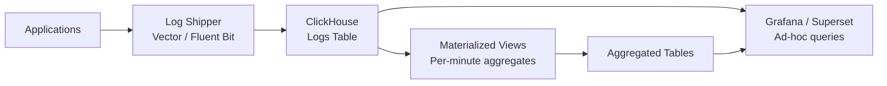

# How to Build a Log Analytics Pipeline with ClickHouse

Author: [nawazdhandala](https://www.github.com/nawazdhandala)

Tags: ClickHouse, Log, Analytics, Pipeline, Observability, MergeTree

Description: Learn how to build a production-ready log analytics pipeline with ClickHouse, covering schema design, ingestion, materialized views, and query patterns for log data.

---

ClickHouse is one of the most efficient databases for log storage and analytics. Its columnar storage, aggressive compression, and vectorized execution make it capable of scanning billions of log lines in seconds. This guide walks through building a complete log analytics pipeline: schema design, ingestion, aggregation with materialized views, and the query patterns needed for operational use.

## Architecture Overview



## Log Table Schema

Design the main logs table for high-throughput inserts and efficient time-range queries:

```sql
CREATE TABLE logs
(
    ts          DateTime64(3)          CODEC(DoubleDelta, LZ4),
    level       LowCardinality(String) CODEC(LZ4),
    service     LowCardinality(String) CODEC(LZ4),
    host        LowCardinality(String) CODEC(LZ4),
    trace_id    FixedString(32)        CODEC(LZ4),
    span_id     FixedString(16)        CODEC(LZ4),
    message     String                 CODEC(ZSTD(3)),
    attributes  Map(String, String)    CODEC(ZSTD(3))
)
ENGINE = MergeTree()
PARTITION BY toYYYYMMDD(ts)
ORDER BY (service, level, ts)
TTL toDateTime(ts) + INTERVAL 90 DAY
SETTINGS index_granularity = 8192;
```

Key decisions:
- `DateTime64(3)` for millisecond precision with DoubleDelta compression
- `LowCardinality(String)` for repeated fields like service and level (10-20x compression)
- `ZSTD(3)` for the message body (best ratio for text)
- Partition by day to enable fast partition drops for TTL
- Sort by `(service, level, ts)` to serve the most common filter patterns

## Ingestion with Vector

Vector is a popular log shipper with native ClickHouse output:

```toml
# vector.toml
[sources.app_logs]
type = "file"
include = ["/var/log/app/*.log"]

[transforms.parse]
type   = "remap"
inputs = ["app_logs"]
source = '''
  . = parse_json!(.message)
  .ts = now()
'''

[sinks.clickhouse]
type              = "clickhouse"
inputs            = ["parse"]
endpoint          = "http://clickhouse:8123"
database          = "default"
table             = "logs"
batch.max_events  = 10000
batch.timeout_secs = 5
```

## Ingestion via HTTP INSERT

For direct insertion without a shipper:

```bash
echo '{"ts":"2024-01-15 10:23:45.123","level":"ERROR","service":"api","host":"web-01","trace_id":"abc123","span_id":"def456","message":"connection timeout","attributes":{"code":"504","region":"us-east-1"}}' \
  | curl -s -X POST 'http://localhost:8123/?query=INSERT+INTO+logs+FORMAT+JSONEachRow' \
    --data-binary @-
```

## Materialized View for Per-Minute Error Counts

```sql
CREATE TABLE log_error_counts
(
    service LowCardinality(String),
    level   LowCardinality(String),
    minute  DateTime,
    count   UInt64
)
ENGINE = SummingMergeTree()
ORDER BY (service, level, minute);

CREATE MATERIALIZED VIEW log_error_counts_mv
TO log_error_counts
AS
SELECT
    service,
    level,
    toStartOfMinute(ts) AS minute,
    count()             AS count
FROM logs
GROUP BY service, level, minute;
```

## Querying Logs

Tail recent errors for a service:

```sql
SELECT ts, level, host, message
FROM logs
WHERE service = 'api'
  AND level = 'ERROR'
  AND ts >= now() - INTERVAL 1 HOUR
ORDER BY ts DESC
LIMIT 100;
```

Count errors by service over the last 24 hours:

```sql
SELECT
    service,
    count() AS error_count
FROM logs
WHERE level = 'ERROR'
  AND ts >= now() - INTERVAL 24 HOUR
GROUP BY service
ORDER BY error_count DESC
LIMIT 20;
```

Full-text search using `LIKE` or `hasToken`:

```sql
-- Fast token-based search on message
SELECT ts, service, message
FROM logs
WHERE hasToken(message, 'timeout')
  AND ts >= now() - INTERVAL 6 HOUR
ORDER BY ts DESC
LIMIT 50;
```

Extract from the attributes map:

```sql
SELECT
    ts,
    service,
    message,
    attributes['code'] AS http_code
FROM logs
WHERE attributes['region'] = 'us-east-1'
  AND ts >= now() - INTERVAL 1 HOUR
ORDER BY ts DESC
LIMIT 100;
```

## Aggregated Error Rate View

```sql
SELECT
    service,
    minute,
    sumIf(count, level = 'ERROR')  AS errors,
    sum(count)                      AS total,
    round(100.0 * errors / total, 2) AS error_pct
FROM log_error_counts
WHERE minute >= now() - INTERVAL 6 HOUR
GROUP BY service, minute
ORDER BY service, minute;
```

## Adding a Bloom Filter Index for Message Search

For frequent message searches, a bloom filter index reduces scan cost:

```sql
ALTER TABLE logs
    ADD INDEX idx_message message TYPE tokenbf_v1(32768, 3, 0) GRANULARITY 1;

ALTER TABLE logs MATERIALIZE INDEX idx_message;
```

After materialization, `hasToken(message, 'timeout')` queries will use the index to skip granules that cannot contain the term.

## Log Retention with TTL

The table already has a 90-day TTL. Adjust per service:

```sql
ALTER TABLE logs
    MODIFY TTL toDateTime(ts) + INTERVAL 30 DAY
    WHERE service = 'debug-service';
```

Or move old logs to slower storage:

```sql
ALTER TABLE logs
    MODIFY TTL
        toDateTime(ts) + INTERVAL 30 DAY TO DISK 'cold_disk',
        toDateTime(ts) + INTERVAL 90 DAY DELETE;
```

## Monitoring Pipeline Health

```sql
-- Rows inserted in last 5 minutes
SELECT count()
FROM logs
WHERE ts >= now() - INTERVAL 5 MINUTE;

-- Ingest lag per service
SELECT
    service,
    max(ts) AS latest_event,
    now() - max(ts) AS lag_seconds
FROM logs
GROUP BY service
ORDER BY lag_seconds DESC;
```

## Summary

A ClickHouse log analytics pipeline combines a MergeTree table with LowCardinality columns, ZSTD compression, and daily partitions to achieve high compression and fast time-range queries. Materialized views pre-aggregate error counts into SummingMergeTree tables for dashboard queries. Token bloom filter indexes accelerate full-text searches. TTL rules automate retention. This architecture handles hundreds of millions of log lines per day on modest hardware.
