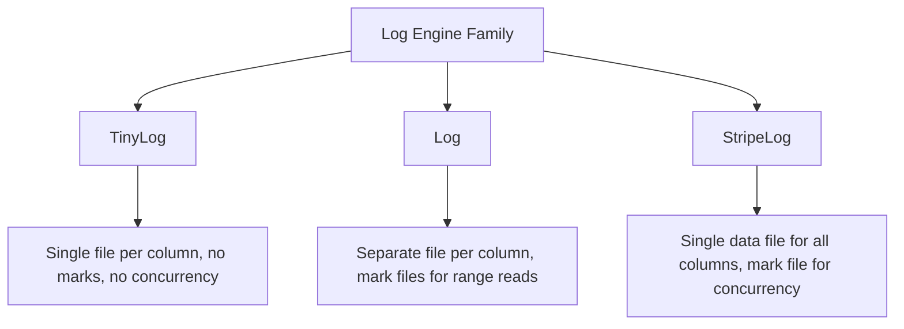

# How to Use Log and StripeLog Engines in ClickHouse

Author: [nawazdhandala](https://www.github.com/nawazdhandala)

Tags: ClickHouse, SQL, Log Engine, StripeLog, Engine, Storage, Temporary Data

Description: Learn how to use Log and StripeLog table engines in ClickHouse for lightweight, append-only storage ideal for temporary tables, small datasets, and ETL staging areas.

---

ClickHouse's Log engine family provides simple, append-only storage without the complexity of MergeTree's index structures, background merges, or replication. The family includes `Log`, `TinyLog`, and `StripeLog`. These engines are designed for small tables, temporary datasets, ETL staging, and scenarios where you need fast writes and occasional full scans without primary key lookups.

## Log Engine Family Overview



Key properties of the Log family:
- No primary index or sorting key
- No partitioning
- No background merges
- No TTL support
- Append-only (no `UPDATE` or `DELETE` without mutations)
- Suitable for small tables (up to a few million rows)

## Log Engine

`Log` stores each column in a separate file on disk, plus a mark file (`.mrk`) that enables seeks for reading specific row ranges. It supports concurrent reads and a single write at a time.

### Creating a Log Table

```sql
CREATE TABLE staging_log
(
    id          UInt32,
    event_type  String,
    payload     String,
    created_at  DateTime
)
ENGINE = Log;
```

### Inserting and Querying

```sql
INSERT INTO staging_log VALUES
    (1, 'click',    '{"button":"submit"}', now()),
    (2, 'pageview', '{"url":"/home"}',     now()),
    (3, 'purchase', '{"item_id":42}',       now());

SELECT * FROM staging_log ORDER BY id;
```

```text
id | event_type | payload               | created_at
---+------------+-----------------------+--------------------
1  | click      | {"button":"submit"}   | 2026-03-31 10:00:00
2  | pageview   | {"url":"/home"}       | 2026-03-31 10:00:01
3  | purchase   | {"item_id":42}        | 2026-03-31 10:00:02
```

## StripeLog Engine

`StripeLog` stores all columns interleaved in a single `data.bin` file, with a `index.mrk` mark file. This reduces the number of file handles needed and is more efficient when many tables are open simultaneously.

### Creating a StripeLog Table

```sql
CREATE TABLE temp_events
(
    session_id  String,
    user_id     UInt32,
    action      String,
    ts          DateTime
)
ENGINE = StripeLog;
```

### Insert and Query

```sql
INSERT INTO temp_events VALUES
    ('sess_a', 1001, 'login',    now()),
    ('sess_a', 1001, 'checkout', now() + 5),
    ('sess_b', 1002, 'login',    now() + 10);

SELECT user_id, count() AS actions
FROM temp_events
GROUP BY user_id
ORDER BY user_id;
```

```text
user_id | actions
--------+--------
1001    | 2
1002    | 1
```

## Complete Working Example: ETL Staging

A common use case is using StripeLog as an intermediate staging area during ETL processing.

```sql
-- Stage 1: land raw data in StripeLog
CREATE TABLE raw_orders_staging
(
    raw_json    String,
    received_at DateTime DEFAULT now()
)
ENGINE = StripeLog;

INSERT INTO raw_orders_staging (raw_json)
SELECT concat(
    '{"order_id":', toString(number),
    ',"amount":', toString(rand() % 1000 + 1),
    ',"status":"pending"}'
)
FROM numbers(1000);

-- Stage 2: transform and load into production MergeTree table
CREATE TABLE orders
(
    order_id    UInt64,
    amount      Float64,
    status      String,
    received_at DateTime
)
ENGINE = MergeTree()
ORDER BY (received_at, order_id);

INSERT INTO orders
SELECT
    JSONExtractUInt(raw_json, 'order_id')   AS order_id,
    JSONExtractFloat(raw_json, 'amount')    AS amount,
    JSONExtractString(raw_json, 'status')   AS status,
    received_at
FROM raw_orders_staging;

-- Clean up staging
TRUNCATE TABLE raw_orders_staging;

-- Verify load
SELECT count(), sum(amount) FROM orders;
```

## Comparison: Log vs StripeLog vs TinyLog

```text
Feature              | TinyLog      | Log           | StripeLog
---------------------+--------------+---------------+--------------
Storage layout       | 1 file/col   | 1 file/col    | 1 shared file
Mark files           | No           | Yes (.mrk)    | Yes (.mrk)
Concurrent reads     | No           | Yes           | Yes
Concurrent writes    | No           | No            | No
Range reads          | No           | Yes           | Yes
Open file handles    | Many         | Many          | Few
Best for             | Tiny tables  | Small tables  | Many tables
Max practical size   | ~1M rows     | ~5M rows      | ~5M rows
```

## Log vs MergeTree

```text
Feature            | Log / StripeLog        | MergeTree
-------------------+------------------------+-------------------
Primary key        | None                   | Required
Partitioning       | No                     | Yes
Background merges  | No                     | Yes
TTL                | No                     | Yes
Replication        | No                     | Yes (Replicated*)
Index              | No                     | Sparse primary
Best for           | Staging, temp tables   | Production workloads
Max size           | Millions of rows       | Billions of rows
```

## Use Cases

### Temporary Tables for Query Intermediates

```sql
CREATE TEMPORARY TABLE temp_result
(
    key   String,
    value Float64
)
ENGINE = Log;

INSERT INTO temp_result
SELECT product_id, sum(revenue)
FROM sales
GROUP BY product_id;

SELECT * FROM temp_result WHERE value > 1000;
```

### Log Buffering Before Batch Insert

```sql
CREATE TABLE ingest_buffer
(
    line       String,
    ingested   DateTime DEFAULT now()
)
ENGINE = StripeLog;

-- Application inserts individual lines here
-- Periodically flush to MergeTree:
INSERT INTO parsed_logs
SELECT parseLine(line), ingested FROM ingest_buffer;

TRUNCATE TABLE ingest_buffer;
```

## Limitations

- No support for primary key lookups; all queries require a full scan.
- `UPDATE` and `DELETE` require `ALTER TABLE ... DELETE/UPDATE` mutations, which are slow and not recommended.
- No partition pruning or bloom filter indexes.
- Not suitable for replication; use MergeTree family for distributed setups.

## Summary

`Log` and `StripeLog` are lightweight append-only table engines in ClickHouse suited for small datasets, ETL staging areas, and temporary tables where MergeTree's overhead is unnecessary. `Log` stores each column in a separate file with mark files enabling range reads. `StripeLog` stores all columns in one file, reducing file handle usage, making it preferable when many small tables exist. For production analytics workloads, always use MergeTree family engines; reserve Log and StripeLog for transient or small supporting tables.
