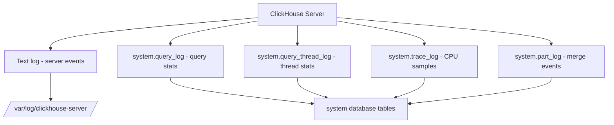

# How to Configure ClickHouse Logging Settings

Author: OneUptime Team

Tags: ClickHouse, Configuration, Logging, Observability, Server

Description: Learn how to configure ClickHouse server logs including log level, log file path, rotation, query log, and trace log settings.

---

ClickHouse has a rich logging subsystem with multiple independent log targets: the server text log, the query log, the query thread log, the trace log, and the part log. Understanding how to configure each one is essential for production observability and debugging.

## Server Text Log (logger)

The main server log is configured under the `<logger>` element in `config.xml`:

```xml
<!-- /etc/clickhouse-server/config.d/logging.xml -->
<clickhouse>
    <logger>
        <level>information</level>
        <log>/var/log/clickhouse-server/clickhouse-server.log</log>
        <errorlog>/var/log/clickhouse-server/clickhouse-server.err.log</errorlog>
        <size>1000M</size>
        <count>10</count>
        <compress>1</compress>
    </logger>
</clickhouse>
```

| Setting | Description | Default |
|---|---|---|
| `level` | Log verbosity | `information` |
| `log` | Path to main log file | `/var/log/clickhouse-server/clickhouse-server.log` |
| `errorlog` | Path to error-only log | Same directory |
| `size` | Max size before rotation | `100M` |
| `count` | Number of rotated files to keep | `1` |
| `compress` | Gzip rotated files | `1` |

## Log Levels

Available levels from most to least verbose:

```text
trace -> debug -> information -> warning -> error -> fatal
```

Use `information` in production. Switch to `debug` or `trace` temporarily for investigating issues:

```bash
# Change log level at runtime without restart
clickhouse-client --query "SET log_level='debug'"
```

Or via HTTP:

```bash
curl -s "http://localhost:8123/?query=SET+log_level%3D'debug'"
```

## Structured Logging to JSON

ClickHouse can emit structured JSON logs, useful for log aggregators like Elasticsearch or Loki:

```xml
<clickhouse>
    <logger>
        <level>information</level>
        <log>/var/log/clickhouse-server/clickhouse-server.log</log>
        <formatting>
            <type>json</type>
            <names>
                <date_time>timestamp</date_time>
                <level>severity</level>
                <message>message</message>
                <logger_name>logger</logger_name>
            </names>
        </formatting>
    </logger>
</clickhouse>
```

## Logging to syslog

```xml
<clickhouse>
    <logger>
        <use_syslog>1</use_syslog>
        <syslog_ident>clickhouse-server</syslog_ident>
        <syslog_facility>LOG_USER</syslog_facility>
        <level>information</level>
    </logger>
</clickhouse>
```

## system.query_log

The query log records every executed query. Configure it in `config.xml`:

```xml
<clickhouse>
    <query_log>
        <database>system</database>
        <table>query_log</table>
        <flush_interval_milliseconds>7500</flush_interval_milliseconds>
        <max_size_rows>1048576</max_size_rows>
        <reserved_size_rows>8192</reserved_size_rows>
        <buffer_size_rows_flush_threshold>524288</buffer_size_rows_flush_threshold>
        <ttl>event_date + INTERVAL 30 DAY</ttl>
    </query_log>
</clickhouse>
```

Query the log:

```sql
SELECT
    query_id,
    query_duration_ms,
    read_rows,
    memory_usage,
    query
FROM system.query_log
WHERE type = 'QueryFinish'
  AND event_time >= now() - INTERVAL 1 HOUR
ORDER BY query_duration_ms DESC
LIMIT 20;
```

## system.query_thread_log

Records per-thread execution metrics. More detailed than `query_log`:

```xml
<clickhouse>
    <query_thread_log>
        <database>system</database>
        <table>query_thread_log</table>
        <flush_interval_milliseconds>7500</flush_interval_milliseconds>
        <ttl>event_date + INTERVAL 7 DAY</ttl>
    </query_thread_log>
</clickhouse>
```

## system.trace_log

Enables sampling profiler traces. Useful for CPU profiling:

```xml
<clickhouse>
    <trace_log>
        <database>system</database>
        <table>trace_log</table>
        <flush_interval_milliseconds>7500</flush_interval_milliseconds>
        <ttl>event_date + INTERVAL 7 DAY</ttl>
    </trace_log>
</clickhouse>
```

## Log Architecture



## Disabling Logs You Do Not Need

Disable unused log tables to reduce overhead:

```xml
<clickhouse>
    <!-- Disable query_thread_log if not needed -->
    <query_thread_log remove="1"/>

    <!-- Disable trace_log if not profiling -->
    <trace_log remove="1"/>
</clickhouse>
```

## Summary

Configure the `<logger>` block for server text logs with appropriate rotation. Set `flush_interval_milliseconds` and TTL on `system.query_log` to balance durability and storage cost. Use JSON formatting if you ship logs to a centralized aggregator. Disable thread and trace logs in production unless you are actively profiling to reduce overhead.
