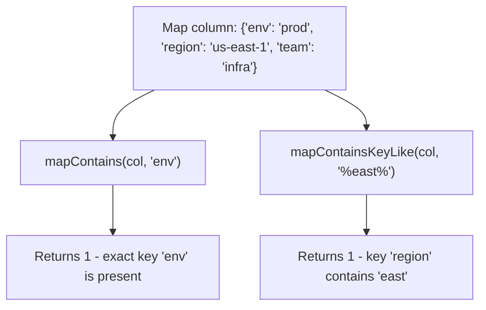

# How to Use mapContains() and mapContainsKeyLike() in ClickHouse

Author: [nawazdhandala](https://www.github.com/nawazdhandala)

Tags: ClickHouse, SQL, Map, Filtering, Query Optimization

Description: Learn how mapContains() checks for exact key presence and mapContainsKeyLike() matches keys by pattern in ClickHouse Map columns.

---

ClickHouse Map columns store key-value pairs, and two functions are available for key-based filtering: `mapContains()` checks whether a specific exact key is present, while `mapContainsKeyLike()` checks whether any key in the map matches a SQL LIKE pattern. Together they cover exact membership testing and wildcard key discovery - both common needs when working with dynamic metadata, labels, or tag maps.

## Function Signatures

```text
mapContains(map, key)           -> UInt8
mapContainsKeyLike(map, pattern) -> UInt8
```

Both functions return `1` when a match is found and `0` otherwise.

- `mapContains()` performs an exact equality check. The `key` argument must match the map's key type.
- `mapContainsKeyLike()` applies a SQL LIKE pattern (`%` matches any sequence of characters, `_` matches any single character) against every key in the map. It is only available for `Map(String, ...)` columns.

## How They Differ



## Basic Examples

Confirm behavior on literal map values before applying to table data.

```sql
SELECT
    mapContains(map('env', 'prod', 'region', 'us-east-1'), 'env')          AS has_env,
    mapContains(map('env', 'prod', 'region', 'us-east-1'), 'missing')      AS has_missing,
    mapContainsKeyLike(map('env', 'prod', 'region', 'us-east-1'), 'r%')    AS key_starts_r,
    mapContainsKeyLike(map('env', 'prod', 'region', 'us-east-1'), '%east%') AS key_contains_east;
```

## Setting Up a Sample Table

Create a table of infrastructure resources where each resource carries an arbitrary set of labels stored as a Map.

```sql
CREATE TABLE infra_resources
(
    resource_id   UInt64,
    resource_type String,
    created_at    DateTime,
    labels        Map(String, String)
)
ENGINE = MergeTree
ORDER BY (resource_type, resource_id);

INSERT INTO infra_resources VALUES
(1,  'server',   '2024-01-10 10:00:00', map('env', 'prod', 'region', 'us-east-1', 'team', 'infra')),
(2,  'server',   '2024-01-11 11:00:00', map('env', 'staging', 'region', 'eu-west-1', 'team', 'platform')),
(3,  'database', '2024-01-12 09:00:00', map('env', 'prod', 'db_engine', 'postgres', 'team', 'data')),
(4,  'database', '2024-01-13 14:00:00', map('env', 'prod', 'db_engine', 'clickhouse', 'team', 'data')),
(5,  'cache',    '2024-01-14 08:00:00', map('env', 'prod', 'cache_type', 'redis')),
(6,  'server',   '2024-01-15 12:00:00', map('region', 'ap-southeast-1', 'team', 'ml')),
(7,  'database', '2024-01-16 16:00:00', map('env', 'dev', 'db_engine', 'mysql')),
(8,  'cache',    '2024-01-17 07:00:00', map('env', 'staging', 'cache_type', 'memcached', 'region', 'us-west-2'));
```

## mapContains - Exact Key Filtering

Filter rows that have a specific label key. This is the correct way to test for key presence because bracket access (`labels['env']`) returns an empty string for absent keys, which is ambiguous when a key might legitimately hold an empty value.

```sql
-- All resources that carry an 'env' label
SELECT resource_id, resource_type, labels
FROM infra_resources
WHERE mapContains(labels, 'env') = 1;

-- Resources that have a 'region' label (some resources do not)
SELECT resource_id, resource_type, labels['region'] AS region
FROM infra_resources
WHERE mapContains(labels, 'region') = 1;
```

## mapContains - Counting Label Coverage

Measure what fraction of resources carry each expected label.

```sql
SELECT
    round(100 * avg(mapContains(labels, 'env')),    1) AS pct_with_env,
    round(100 * avg(mapContains(labels, 'region')), 1) AS pct_with_region,
    round(100 * avg(mapContains(labels, 'team')),   1) AS pct_with_team
FROM infra_resources;
```

## mapContains - Requiring Multiple Keys

Combine multiple `mapContains()` calls with AND to enforce that a resource has all required labels.

```sql
-- Fully labeled resources (env + region + team)
SELECT resource_id, resource_type
FROM infra_resources
WHERE
    mapContains(labels, 'env')    = 1
    AND mapContains(labels, 'region') = 1
    AND mapContains(labels, 'team')   = 1;

-- Under-labeled resources (missing at least one of the three)
SELECT resource_id, resource_type, labels
FROM infra_resources
WHERE
    mapContains(labels, 'env')    = 0
    OR mapContains(labels, 'region') = 0
    OR mapContains(labels, 'team')   = 0;
```

## mapContainsKeyLike - Pattern-Based Key Discovery

Use `mapContainsKeyLike()` to find rows where any key matches a LIKE pattern. This is useful when key names follow a prefix convention or when you want to locate all resources that carry any key in a family.

```sql
-- Resources with any key that starts with 'db_'
SELECT resource_id, resource_type, labels
FROM infra_resources
WHERE mapContainsKeyLike(labels, 'db_%') = 1;

-- Resources with any key that ends with '_type'
SELECT resource_id, resource_type, labels
FROM infra_resources
WHERE mapContainsKeyLike(labels, '%_type') = 1;

-- Resources with any key containing 'region' (matches 'region', 'sub_region', etc.)
SELECT resource_id, resource_type, labels
FROM infra_resources
WHERE mapContainsKeyLike(labels, '%region%') = 1;
```

## Combining Both Functions

Use `mapContains()` for mandatory exact keys and `mapContainsKeyLike()` for optional pattern-based grouping.

```sql
SELECT
    resource_id,
    resource_type,
    labels,
    mapContains(labels, 'env')             AS has_env_label,
    mapContainsKeyLike(labels, 'db_%')     AS has_any_db_label,
    mapContainsKeyLike(labels, 'cache_%')  AS has_any_cache_label
FROM infra_resources;
```

## Classifying Resources by Label Structure

Use both functions together in a CASE expression to assign a category based on which label families are present.

```sql
SELECT
    resource_id,
    resource_type,
    CASE
        WHEN mapContainsKeyLike(labels, 'db_%')    = 1 THEN 'database-resource'
        WHEN mapContainsKeyLike(labels, 'cache_%') = 1 THEN 'cache-resource'
        WHEN mapContains(labels, 'team')           = 1 THEN 'team-managed'
        ELSE 'unclassified'
    END AS resource_category
FROM infra_resources;
```

## Audit: Finding Resources Missing Required Labels

Report all resources that are missing any of a set of required labels, useful for compliance audits or labeling policy enforcement.

```sql
SELECT
    resource_id,
    resource_type,
    labels,
    NOT mapContains(labels, 'env')    AS missing_env,
    NOT mapContains(labels, 'team')   AS missing_team,
    NOT mapContains(labels, 'region') AS missing_region
FROM infra_resources
WHERE
    NOT mapContains(labels, 'env')
    OR NOT mapContains(labels, 'team')
    OR NOT mapContains(labels, 'region');
```

## Summary

`mapContains()` and `mapContainsKeyLike()` are complementary tools for key-based filtering on ClickHouse Map columns. Use `mapContains()` when you know the exact key name and want a precise membership test - it works with any Map key type and is the safe alternative to bracket access for testing key existence. Use `mapContainsKeyLike()` when key names follow naming conventions and you want to detect the presence of any key in a family, using standard SQL LIKE wildcards (`%` and `_`). Both functions return `UInt8` (`0` or `1`), making them composable with AND/OR logic, aggregate functions, and CASE expressions.
