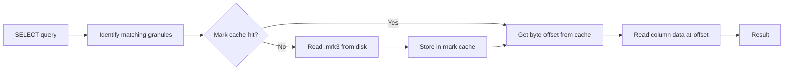

# How to Configure mark_cache_size in ClickHouse

Author: [nawazdhandala](https://www.github.com/nawazdhandala)

Tags: ClickHouse, Performance, Configuration, Cache, MergeTree, Tuning

Description: Learn how to configure mark_cache_size in ClickHouse to control the in-memory cache for MergeTree mark files, reducing disk I/O and improving query performance.

---

## Introduction

When ClickHouse reads data from a MergeTree table, it first reads "mark files" (`.mrk3`) that map each granule to a byte offset in the column data files. The `mark_cache_size` setting controls how much RAM is dedicated to caching these mark files. A well-sized mark cache eliminates repeated disk reads of marks and significantly improves query latency on large tables.

## How Mark Files Work



Every granule in a MergeTree part has one mark per column. For a table with 100 columns and 10 million rows with a granule size of 8192, each part has roughly 1220 marks per column -- and reading all marks from disk on every query would be expensive.

## Default and Maximum Values

```sql
SELECT name, value, description
FROM system.settings
WHERE name = 'mark_cache_size';
```

The `mark_cache_size` is a server-level setting (not a query-level setting). The default is `5368709120` (5 GiB).

## Configuring mark_cache_size

Set it in `config.xml` or a config drop-in:

```xml
<!-- /etc/clickhouse-server/config.d/mark_cache.xml -->
<clickhouse>
  <mark_cache_size>10737418240</mark_cache_size>   <!-- 10 GiB -->
</clickhouse>
```

Reload or restart:

```bash
sudo systemctl reload clickhouse-server
# or
clickhouse-client -q "SYSTEM RELOAD CONFIG"
```

## Checking Current Mark Cache Size and Usage

```sql
-- Check configured mark_cache_size from system.server_settings (22.x+)
SELECT name, value
FROM system.server_settings
WHERE name = 'mark_cache_size';
```

```sql
-- Check cache hit/miss metrics
SELECT
    metric,
    value
FROM system.metrics
WHERE metric IN (
    'MarkCacheBytes',
    'MarkCacheFiles'
);
```

```sql
-- Check cumulative hit/miss counters
SELECT
    event,
    value
FROM system.events
WHERE event IN (
    'MarkCacheHits',
    'MarkCacheMisses'
);
```

## Sizing Recommendations

Calculate the approximate mark cache requirement for a table:

```sql
-- Estimate total mark file size for a table
SELECT
    table,
    formatReadableSize(sum(marks_bytes)) AS marks_size
FROM system.parts
WHERE database = 'mydb'
  AND active = 1
GROUP BY table
ORDER BY marks_size DESC;
```

As a rule of thumb:
- Set `mark_cache_size` to hold the marks for your hottest tables.
- On a server with 128 GiB RAM, allocating 10-20 GiB to mark cache is common.
- Leave at least 50% of RAM for OS page cache and query memory.

## Clearing the Mark Cache

Force-evict all cached marks (useful after a major data operation):

```sql
SYSTEM DROP MARK CACHE;
```

## Verifying Performance Improvement

Run a benchmark before and after resizing:

```sql
-- Run without cache
SYSTEM DROP MARK CACHE;
SELECT count() FROM events WHERE event_time >= '2024-01-01';

-- Run again (should be faster -- marks now cached)
SELECT count() FROM events WHERE event_time >= '2024-01-01';
```

Compare query durations in `system.query_log`:

```sql
SELECT
    query,
    query_duration_ms,
    ProfileEvents['MarkCacheHits']   AS cache_hits,
    ProfileEvents['MarkCacheMisses'] AS cache_misses
FROM system.query_log
WHERE type = 'QueryFinish'
  AND query LIKE '%FROM events%'
ORDER BY event_time DESC
LIMIT 4;
```

## Summary

`mark_cache_size` is a server-level setting that controls how much RAM ClickHouse allocates for caching MergeTree mark files. Larger values reduce disk I/O when querying wide tables with many columns and parts. Size the cache to hold marks for your hottest tables, monitor hit rates via `system.events`, and drop the cache with `SYSTEM DROP MARK CACHE` when testing tuning changes.
