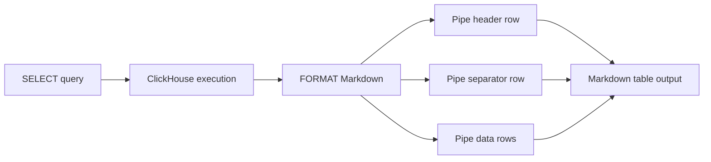

# How to Use Markdown Format in ClickHouse

Author: OneUptime Team

Tags: ClickHouse, Format, Markdown, Output, Reporting

Description: Learn how ClickHouse's Markdown output format renders query results as GitHub-flavored Markdown tables for documentation and reports.

---

ClickHouse includes a `Markdown` output format that renders SELECT results as a GitHub-flavored Markdown table. This is useful for embedding query output directly into documentation, READMEs, or Slack messages without manually formatting tables.

## What the Markdown Format Produces

Given a simple query, ClickHouse wraps the header and each data row in pipe-separated Markdown table syntax:

```sql
SELECT
    database,
    count()  AS tables,
    sum(total_rows) AS total_rows
FROM system.tables
WHERE database NOT IN ('system', 'information_schema')
GROUP BY database
ORDER BY total_rows DESC
FORMAT Markdown;
```

Sample output:

```text
| database | tables | total_rows |
|----------|--------|------------|
| analytics | 12 | 4823910 |
| raw_events | 5 | 19203041 |
| staging | 3 | 88210 |
```

## Rendering in GitHub and Docs Sites

Paste the output directly into any Markdown renderer:

| database | tables | total_rows |
|----------|--------|------------|
| analytics | 12 | 4823910 |
| raw_events | 5 | 19203041 |
| staging | 3 | 88210 |

The separator row with dashes and pipes is generated automatically by ClickHouse.

## Using FORMAT Markdown from the CLI

```bash
clickhouse-client \
  --query "SELECT name, engine, total_rows FROM system.tables WHERE database = 'default' ORDER BY total_rows DESC LIMIT 10 FORMAT Markdown"
```

Redirect to a file or pipe directly into a documentation build step:

```bash
clickhouse-client \
  --query "SELECT ... FORMAT Markdown" \
  >> docs/tables-overview.md
```

## Using FORMAT Markdown via HTTP Interface

```bash
curl -s "http://localhost:8123/?query=SELECT+name,total_rows+FROM+system.tables+WHERE+database='default'+FORMAT+Markdown"
```

## Limitations to Know

- Markdown is an output-only format. You cannot use it for INSERT or as an input source.
- Column widths are not padded for alignment; alignment is left to the Markdown renderer.
- NULL values are rendered as the string `\N`.
- Floating-point columns are rendered with ClickHouse's default precision.



## Practical Use: Generating Table Statistics

```sql
SELECT
    database,
    name            AS table_name,
    engine,
    formatReadableSize(total_bytes) AS size,
    total_rows
FROM system.tables
WHERE database NOT IN ('system', 'INFORMATION_SCHEMA', 'information_schema')
ORDER BY total_bytes DESC
LIMIT 20
FORMAT Markdown;
```

## Automating Documentation Refreshes

A small shell script can keep your documentation current:

```bash
#!/bin/bash

CH="clickhouse-client --host=localhost --user=default --password=$CH_PASSWORD"

$CH --query "
  SELECT database, name, engine, total_rows
  FROM system.tables
  WHERE database NOT IN ('system','information_schema')
  ORDER BY database, name
  FORMAT Markdown
" > /docs/schema/table-inventory.md

echo "Documentation refreshed at $(date)" >> /docs/schema/table-inventory.md
```

## Comparison with Other Human-Readable Formats

| Format | Alignment | Renderer needed | INSERT support |
|---|---|---|---|
| Pretty | Yes (ANSI) | Terminal | No |
| PrettyCompact | Yes (ANSI) | Terminal | No |
| Markdown | No | Any MD renderer | No |
| Vertical | N/A | Terminal | No |

## Summary

The `Markdown` format is a lightweight convenience format for exporting ClickHouse query results as renderable tables. Use it in CI pipelines, documentation generators, or quick reports where a Markdown-aware renderer is available. It is output-only and requires no configuration beyond appending `FORMAT Markdown` to your SELECT.
