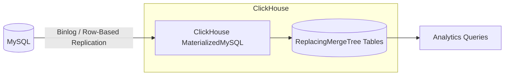

# How to Use ClickHouse with MySQL as Source via MaterializedMySQL

Author: [nawazdhandala](https://www.github.com/nawazdhandala)

Tags: ClickHouse, MySQL, Replication, CDC, Integration

Description: Learn how to replicate MySQL tables into ClickHouse in real time using the MaterializedMySQL database engine with binlog-based change data capture.

---

## Introduction

`MaterializedMySQL` is a ClickHouse database engine that replicates one or more MySQL databases into ClickHouse using MySQL binlog (binary log) replication. ClickHouse acts as a MySQL replica, consuming row-based change events and materializing them into `ReplacingMergeTree` tables. This enables low-latency analytics on operational MySQL data without a separate CDC pipeline.

## Architecture Overview



## Prerequisites on MySQL

### 1. Enable row-based binlog

In `/etc/mysql/mysql.conf.d/mysqld.cnf` (or `my.cnf`):

```ini
[mysqld]
server-id          = 1
log_bin            = /var/log/mysql/mysql-bin.log
binlog_format      = ROW
binlog_row_image   = FULL
expire_logs_days   = 7
```

Restart MySQL:

```bash
sudo systemctl restart mysql
```

### 2. Create a replication user

```sql
CREATE USER 'ch_replica'@'%' IDENTIFIED BY 'replication_secret';
GRANT REPLICATION SLAVE ON *.* TO 'ch_replica'@'%';
GRANT SELECT ON source_db.* TO 'ch_replica'@'%';
FLUSH PRIVILEGES;
```

### 3. Verify binlog is active

```sql
SHOW MASTER STATUS;
SHOW VARIABLES LIKE 'binlog_format';
```

## Creating the Materialized MySQL Database in ClickHouse

Enable the experimental feature flag first (required in most ClickHouse versions):

```sql
SET allow_experimental_database_materialized_mysql = 1;
```

Create the database:

```sql
CREATE DATABASE mysql_replica
ENGINE = MaterializedMySQL(
    'mysql-host:3306',
    'source_db',
    'ch_replica',
    'replication_secret'
);
```

ClickHouse will take an initial snapshot of all tables in `source_db`, then begin streaming binlog events.

## Replicating Specific Tables

```sql
CREATE DATABASE mysql_replica
ENGINE = MaterializedMySQL(
    'mysql-host:3306',
    'source_db',
    'ch_replica',
    'replication_secret'
)
SETTINGS materialized_mysql_tables_list = 'orders,customers,products';
```

## Checking Replication Status

```sql
-- List replicated tables
SHOW TABLES FROM mysql_replica;

-- View replication status (shows GTID position)
SELECT * FROM system.materialized_mysql_databases;
```

## Querying Replicated Data

```sql
SELECT
    status,
    count()        AS order_count,
    sum(total)     AS revenue
FROM mysql_replica.orders
GROUP BY status
ORDER BY revenue DESC;
```

## How Row Changes Are Applied

Each replicated table is backed by a `ReplacingMergeTree` with two hidden columns:

- `_sign`: `1` for live rows, `-1` for deleted rows
- `_version`: monotonically increasing row version

Use `FINAL` to get the latest version of each row and filter out deletes:

```sql
SELECT order_id, customer_id, total
FROM mysql_replica.orders FINAL
WHERE _sign = 1;
```

In newer ClickHouse versions (22.8+), `FINAL` is applied automatically for MaterializedMySQL tables.

## Schema Changes (DDL)

`MaterializedMySQL` supports a subset of DDL replication:

| DDL Operation | Supported |
|---|---|
| ADD COLUMN | Yes |
| DROP COLUMN | Yes |
| RENAME COLUMN | Yes |
| RENAME TABLE | Yes |
| TRUNCATE TABLE | Yes |
| DROP TABLE | Yes |
| CREATE TABLE | Yes |
| ALTER INDEX | No |

Example on MySQL:

```sql
ALTER TABLE orders ADD COLUMN discount DECIMAL(5,2) DEFAULT 0.00;
```

ClickHouse will replicate this schema change automatically.

## GTID-Based Replication

ClickHouse prefers GTID-based replication for reliability. Enable GTIDs in MySQL:

```ini
[mysqld]
gtid_mode              = ON
enforce_gtid_consistency = ON
```

Then recreate the `MaterializedMySQL` database in ClickHouse; it will use GTIDs automatically.

## Filtering Rows with WHERE (Skip Rows)

Use `materialized_mysql_replication_table_do_not_read_from_cache` to skip rows during snapshot:

```sql
CREATE DATABASE mysql_replica
ENGINE = MaterializedMySQL(
    'mysql-host:3306',
    'source_db',
    'ch_replica',
    'replication_secret'
)
SETTINGS
    materialized_mysql_tables_list = 'events',
    max_rows_in_buffer = 65536,
    max_bytes_in_buffer = 1073741824;
```

## Handling Large Initial Snapshots

For large tables, increase snapshot timeouts:

```sql
CREATE DATABASE mysql_replica
ENGINE = MaterializedMySQL(
    'mysql-host:3306',
    'source_db',
    'ch_replica',
    'replication_secret'
)
SETTINGS
    max_wait_time_when_mysql_unavailable = 10000,
    allows_query_when_mysql_lost = 1;
```

## Limitations

| Limitation | Notes |
|---|---|
| Primary key required | All replicated tables must have a primary key |
| binlog_format = ROW | Statement and mixed modes are not supported |
| No multi-source replication | One MySQL source per ClickHouse database |
| MySQL 5.6+ required | Older versions may lack required binlog features |
| Column type mapping | Not all MySQL types map cleanly to ClickHouse |

## Common MySQL to ClickHouse Type Mapping

| MySQL Type | ClickHouse Type |
|---|---|
| INT | Int32 |
| BIGINT | Int64 |
| VARCHAR, TEXT | String |
| DECIMAL(p,s) | Decimal(p,s) |
| DATETIME | DateTime |
| TIMESTAMP | DateTime |
| JSON | String |
| TINYINT(1) | UInt8 (boolean) |

## Dropping the Replica

```sql
DROP DATABASE mysql_replica;
```

This removes the ClickHouse database but does not affect MySQL. The MySQL binlog position is simply discarded.

## Summary

`MaterializedMySQL` lets you build a zero-ETL analytical layer on top of MySQL using binlog replication. Key points:
- Set `binlog_format = ROW` and create a replication user in MySQL before starting.
- Enable `allow_experimental_database_materialized_mysql` in ClickHouse settings.
- Use `FINAL` modifier when querying to get deduplicated, up-to-date rows.
- All replicated tables must have a primary key.
- A subset of DDL operations (ADD COLUMN, DROP TABLE, etc.) is automatically replicated.
