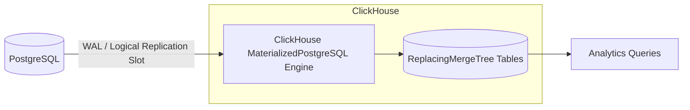

# How to Ingest Data from PostgreSQL with MaterializedPostgreSQL

Author: [nawazdhandala](https://www.github.com/nawazdhandala)

Tags: ClickHouse, PostgreSQL, Replication, CDC, Integration

Description: Learn how to use ClickHouse MaterializedPostgreSQL to replicate PostgreSQL tables into ClickHouse in real time using logical replication and WAL streaming.

---

## Introduction

`MaterializedPostgreSQL` is a ClickHouse database engine that replicates one or more PostgreSQL tables into ClickHouse using PostgreSQL logical replication (WAL). Once configured, ClickHouse continuously receives change events (INSERT, UPDATE, DELETE) from PostgreSQL and applies them to ReplacingMergeTree tables, enabling real-time analytics on your operational data without building a separate ETL pipeline.

## Architecture Overview



## Prerequisites on PostgreSQL

### 1. Enable logical replication

In `postgresql.conf`:

```
wal_level = logical
max_replication_slots = 10
max_wal_senders = 10
```

Restart PostgreSQL after changing these settings.

### 2. Create a replication user

```sql
CREATE USER ch_replication WITH REPLICATION LOGIN PASSWORD 'replication_secret';
GRANT SELECT ON ALL TABLES IN SCHEMA public TO ch_replication;
ALTER DEFAULT PRIVILEGES IN SCHEMA public GRANT SELECT ON TABLES TO ch_replication;
```

### 3. Verify the pg_hba.conf allows replication connections

```
host    replication    ch_replication    10.0.0.10/32    md5
```

## Creating the Materialized PostgreSQL Database in ClickHouse

```sql
CREATE DATABASE pg_replica
ENGINE = MaterializedPostgreSQL(
    'postgresql-host:5432',
    'source_db',
    'ch_replication',
    'replication_secret'
);
```

ClickHouse will immediately take an initial snapshot of all tables in `source_db` and begin streaming changes.

## Selecting Specific Tables

By default all tables are replicated. To replicate only specific tables:

```sql
CREATE DATABASE pg_replica
ENGINE = MaterializedPostgreSQL(
    'postgresql-host:5432',
    'source_db',
    'ch_replication',
    'replication_secret'
)
SETTINGS materialized_postgresql_tables_list = 'public.orders,public.customers';
```

## Checking Replication Status

```sql
-- List replicated tables
SHOW TABLES FROM pg_replica;

-- Check for replication errors
SELECT * FROM system.replication_queue WHERE database = 'pg_replica';

-- View current replication lag (approximate)
SELECT * FROM system.materialized_postgresql_tables;
```

## Querying Replicated Data

Once replication is running, query tables as normal:

```sql
SELECT
    customer_id,
    count()        AS order_count,
    sum(total)     AS revenue
FROM pg_replica.orders
WHERE status = 'completed'
GROUP BY customer_id
ORDER BY revenue DESC
LIMIT 10;
```

## How Updates and Deletes Work

`MaterializedPostgreSQL` stores rows in a `ReplacingMergeTree` table with a hidden `_sign` column (1 for live rows, -1 for deleted rows) and a `_version` column. The engine handles deduplication during merge operations.

When querying, you may need to filter out deleted rows explicitly in some ClickHouse versions:

```sql
SELECT *
FROM pg_replica.orders FINAL
WHERE _sign = 1;
```

The `FINAL` modifier forces deduplication. In newer ClickHouse versions, this is handled automatically.

## Schema Evolution

When a column is added to the PostgreSQL table:

```sql
-- On PostgreSQL
ALTER TABLE orders ADD COLUMN discount NUMERIC(5,2) DEFAULT 0;
```

ClickHouse will automatically detect and apply the schema change after the next DDL replication event.

## Replicating from Multiple Schemas

To replicate tables from non-public schemas, specify the schema in the tables list:

```sql
CREATE DATABASE pg_replica
ENGINE = MaterializedPostgreSQL(
    'postgresql-host:5432',
    'source_db',
    'ch_replication',
    'replication_secret'
)
SETTINGS materialized_postgresql_tables_list = 'billing.invoices,shipping.packages';
```

## Limitations

| Limitation | Notes |
|---|---|
| Primary key required | Every replicated table must have a primary key |
| No DDL for DROP/RENAME | DROP TABLE and column renames are not replicated |
| TRUNCATE not replicated | TRUNCATE is not captured via logical replication |
| Array types | Complex array types may require manual mapping |
| Partitioned tables | Each partition is replicated as a separate table |
| PostgreSQL version | Requires PostgreSQL 10+ with wal_level = logical |

## Stopping and Restarting Replication

To drop the replicated database:

```sql
DROP DATABASE pg_replica;
```

This also removes the replication slot on PostgreSQL. Verify with:

```sql
-- On PostgreSQL
SELECT slot_name, active FROM pg_replication_slots;
```

To restart replication from scratch, drop and recreate the database in ClickHouse.

## Monitoring Replication Lag

```sql
SELECT
    database,
    table,
    last_exception,
    last_exception_time
FROM system.materialized_postgresql_tables;
```

On PostgreSQL, check WAL lag:

```sql
SELECT
    slot_name,
    pg_size_pretty(pg_wal_lsn_diff(pg_current_wal_lsn(), confirmed_flush_lsn)) AS lag
FROM pg_replication_slots
WHERE slot_name LIKE '%clickhouse%';
```

## Summary

`MaterializedPostgreSQL` provides a zero-ETL path from PostgreSQL to ClickHouse using native logical replication. Key points:
- Set `wal_level = logical` and create a replication user in PostgreSQL before starting.
- Use `materialized_postgresql_tables_list` to limit which tables are replicated.
- Replicated tables use `ReplacingMergeTree`; use `FINAL` if you need strong deduplication guarantees.
- All replicated tables must have a primary key.
- Monitor replication health via `system.materialized_postgresql_tables` and PostgreSQL's `pg_replication_slots`.
